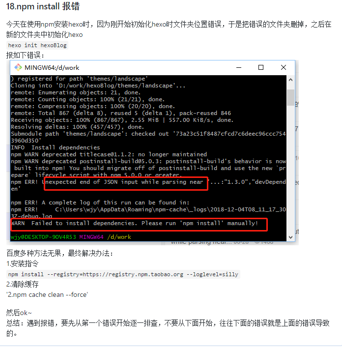

总体步骤：
- 安装Git Bash
- 安装NodeJs
- 安装hexo
- 生成SSH并添加到github
- 部署项目
- 上传到github
- 绑定个人域名
- 修改及配置主题
- 写文章部分

安装git、NodeJs，创建github账号-创建仓库userName.github.io-将本地git通过ssh和远程github关联等等不再赘述。

# 安装Hexo
Hexo官网地址：
https://hexo.io/zh-cn/docs/

在git和node安装完毕后，即可使用 npm 安装 Hexo
`$ npm install -g hexo-cli`

安装完之后，初始化Hexo
```
hexo init <folder>
cd <folder>
npm install
```

上边官网给出的指令，这里就比较坑逼了。因为不知道里填什么，实际应该是：你想安装Hexo博客文件的文件夹的路径。
所以建议使用git bush cd 到想存放博客文件的父目录，然后直接使用
`hexo init 文件夹名`
指令，就完成初始化了。

遇到的坑：
因为刚开始文件夹的名字写错了，所以直接将hexo初始化的文件夹删掉了。然后再次运行初始化指令报错。解决方法：


# 修改配置文件
用Notepad++打开hexo安装目录下的_config.yml文件
```
deploy:
  type: git
  repo: https://github.com/ayanamiq/ayanamiq.github.io
  branch: master
```

修改上面三项内容，repo和branch是没有的，写上就好了。
坑：
1.repo是在github上创建好的仓库地址，仓库名字必须是username.github.io
2.key和后面value之间必须有空格。

然后执行如下命令
```
hexo clean
hexo generate
hexo server
```

注：hexo 3.0把服务器独立成个别模块，需要单独安装：
`npm i hexo-server`
然后打开
http://localhost:4000
就可以看到hexo的默认页面了
注：关闭页面服务就会停止

# 上传到github
先安装：
`npm install hexo-deployer-git --save`
这样才能将你写好的文章部署到github服务器上并让别人浏览到。

执行命令
```
hexo clean
hexo generate
hexo deploy
```

如果执行第一个指令就报：
`Usage: hexo <command>`
原因：我认为是没有生成本地服务
解决：执行指令
`$ npm install hexo-server --save`
还是不行...为啥呢？
因为指令必须在hexo的安装目录下执行！！！

注意deploy的过程中要输入你github的username和password
然后打开：
https://ayanamiq.github.io/
就可以看到刚才在本地一样访问
http://localhost:4000
一样的页面了

坑：这里在deploy的时候报错了。
`HttpRequestException encountered`
问题：Github 禁用了TLS v1.0 and v1.1，必须更新Windows的git凭证管理器
https://github.com/Microsoft/Git-Credential-Manager-for-Windows/releases/
下载并安装第一个GCMW-1.18.3.exe文件(请注意版本迭代)。
然后再deploy就可以了。

# 修改及配置主题
官方主题地址：
https://hexo.io/themes/

我使用的是：next
http://theme-next.iissnan.com/
官网说的非常简单明了，请自行参考。

## 切换主题样式
```
# Schemes
scheme: Muse  //默认主题
#scheme: Mist
#scheme: Pisces
#scheme: Gemini
```
我比较喜欢MIst

## 设置Menu
默认只有两个首页和归档，还可以添加`关于、标签、搜索`
在主题配置文件_config.yml中搜索menu。
```
menu:
  home: / || home  //首页
  about: /about/ || user  //关于
  tags: /tags/ || tags  //标签
  categories: /categories/ || th   //分类
  archives: /archives/ || archive //归档
  schedule: /schedule/ || calendar   //日程表
  sitemap: /sitemap.xml || sitemap   //站点地图
```
将需要的标签前边的#号去掉。
需要的标签页tags、about、categories需要通过hexo指令单独创建。

## 设置动态背景
搜索`canvas_nest`，将flase改为ture

## 底部隐藏由Hexo强力驱动、主题--NexT.Mist
主题_config.yml中搜索`power`和`theme`，将下边的`enable`和`version`都改成false

## 更改底部图标
https://fontawesome.com/v4.7.0/icons/
在上边的地址找到喜欢的图标。
主题_config.yml中搜索`footer`，找到下面的icon，替换成自己想要的。
推荐`snowflake-o`和`heart`

## 修改动画速度
themes/next/source/js/src/motion.js
打开上边的js，搜索`duration`，动画速度，值越大速度越慢。
默认的都是200，建议修改为100，值太低会显得太突兀。

## 阅读全文
next默认将文章全部现实出来，可以添加阅读全文功能。
主题_config.yml中搜索`auto_excerpt`，改为true


## next主题版本升级(5.1.x-6.x)
参考官方文档：
https://github.com/theme-next/hexo-theme-next/blob/master/docs/zh-CN/UPDATE-FROM-5.1.X.md

https://github.com/theme-next/hexo-theme-next
上边的新版本的仓库地址，将源码下载解压到hexo的thems文件夹下，将之改名为`next-reloaded`
注意：之前的next文件夹不要删除，里面还留了很多需要的配置，而且如果新的主题出现问题，还可以及时切换回就版本。

在Hexo的_config.yml中配置新的主题：
`theme: next-reloaded`

更新语言配置：
从 v6.0.3版本起，zh-Hans改名为zh-CN，新版本需要显式修改_config.xml里的language配置，否则语言显示不正确。

然后可以参照之前配置好的next配置文件_config.xml，来配置新的_config.xml。

# 写文章
`hexo new 'blogName'`

其他指令参考官网：
https://hexo.io/zh-cn/docs/writing

然后可以在'source/_posts'下看到新建的文章了，生成的是.md文件，推荐使用markdown编译器。
markdown编译器有一堆，比较有名的是markdownPad，但是我懒，还是直接用nodePad++好了。

1.安装MarkdownViewer++
最近发现新版的nodepad 7.6.2，新增了plugins admin即插件中心,搜索markdown，选中markdownViewer++，点击右侧的install，等待nodepad++重启就安装好了。

备用方案：
自行安装plugin manager：
https://github.com/bruderstein/nppPluginManager/releases
下载对应自己nodePad版本的安装包，解压后得到两个文件夹，plugins和updater，
分别将文件夹中的文件粘贴到nodePad++安装路径下的plugins和updater文件夹下，
然后重启nodePad，就会在插件一栏的下面看到plugin manager，打开，找到MarkdownViewer++，
选择右下角的install，安装完之后根据提示重启。

2.导入自定义语言格式
为了设置符合markdown语言的显示效果，需要下载Markdown语言格式的xml配置文件
https://github.com/Edditoria/markdown-plus-plus
下载之后解压缩，然后打开nodePad，选择语言->自定义语言格式->导入->选择到刚才解压的文件夹的四个theme文件夹中的任意一个，
建议选择default，因为nodePad默认就是白底的，其他几个太扎眼。

# 添加“分类”选项
进入博客所在文件夹，打开gitbush,执行命令
`$ hexo new page categories`
成功后会提示：
`INFO Created: ~/Documents/blog/source/categories/index.md`

根据上面的路径，找到index.md这个文件，打开后默认内容是这样的：
```
---
title: 文章分类
date: 2017-05-27 13:47:40
---
```

添加type: "categories"到内容中，添加后是这样的：
```
---
title: 文章分类
date: 2019-05-27 13:47:40
type: "categories"
---
```

## 给文章添加“categories”属性
打开需要添加分类的文章，为其添加categories属性。
```
---
title: java基础
date: 2018-12-31 12:12:57
categories: - java
---
```

注意：hexo一篇文章只能属于一个分类
至此，成功给文章添加分类，点击首页的“分类”可以看到该分类下的所有文章。
当然，只有添加了categories: xxx的文章才会被收录到首页的“分类”中。

# 创建“标签”选项
进入博客所在文件夹，打开gitbush,执行命令
`$ hexo new page tags`
成功后会提示：
`INFO Created: ~/Documents/blog/source/tags/index.md`
根据上面的路径，找到index.md这个文件，打开后默认内容是这样的：
```
---
title: 标签
date: 2017-05-27 14:22:08
---
```

添加type: "tags"到内容中，添加后是这样的：
```
---
title: 文章分类
date: 2017-05-27 13:47:40
type: "tags"
---
```
保存并关闭文件。

## 给文章添加“tags”属性
打开需要添加标签的文章，为其添加tags属性。
```
---
title: java基础
date: 2017-05-26 12:12:57
categories: 
- java基础
tags:
- java
- 基础
---
```

至此，成功给文章添加分类，点击首页的“标签”可以看到该标签下的所有文章。
当然，只有添加了tags: xxx的文章才会被收录到首页的“标签”中。

细心的朋友可能已经发现，这两个的设置几乎一模一样！是的，没错，思路都是一样的。
所以我们可以打开scaffolds/post.md文件，在tages:上面加入categories:,
保存后，之后执行hexo new 文章名命令生成的文件，页面里就有categories:项了。

scaffolds目录下，是新建页面的模板，执行新建命令时，是根据这里的模板页来完成的，所以可以在这里根据你自己的需求添加一些默认值。

# 添加about标签
`hexo new page 'about'`
在安装位置下的source文件夹下会有about文件夹，打开，编辑里面的index.md

# 引用图片
总体来说有两种引用方式：
1.公网图片地址
2.将图片引入项目内，使用相对路径

公网地址总是不可靠的，又没有自己的服务器，只能传到别的地方，这样链接总有可能会失效。
可行的办法：
1.把图片上传到新浪图床
2.在github新建一个res，专门用来存放图片。

将图片引入项目内
1.修改项目的_config.yml，post_asset_folder:true
Hexo 提供了一种更方便管理 Asset 的设定：post_asset_folder
当您设置post_asset_folder为true参数后，在建立文件时，Hexo会自动建立一个与文章同名的文件夹，您可以把与该文章相关的所有资源都放到那个文件夹，如此一来，您便可以更方便的使用资源。

2.在hexo的目录下执行
`npm install https://github.com/CodeFalling/hexo-asset-image --save`
需要等待一段时间

3.完成安装后用hexo新建文章的时候会发现_posts目录下面会多出一个和文章名字一样的文件夹。图片就可以放在文件夹下面。结构如下：
```
本地图片测试
├── apppicker.jpg
├── logo.jpg
└── rules.jpg
本地图片测试.md
```
这样的目录结构（目录名和文章名一致），只要使用  就可以插入图片。
生成的结构为
```
public/2016/3/9/本地图片测试
├── apppicker.jpg
├── index.html
├── logo.jpg
└── rules.jpg
```

同时，生成的 html 是
``

而不是愚蠢的
``

# 多台电脑操作hexo博客
目的：在公司和家里都可以写博客。
思路：git分支
hexo生成的静态博客文件默认放在master分支上。
hexo的源文件（部署环境文件）可以都放在hexo分支上（可以新创建一个hexo分支），换新电脑时，直接：
`git clone git@github.com:ayanamiq/ayanamiq.github.io.git`

## 在已经安装好hexo博客的电脑上执行如下操作：
### hexo搭建博客原理
参考hexo本机安装目录结构：
```
.deploy_git：上传到github的文件
node_modules：hexo需要的模块，不需要上传github
public：生成的静态文件
scaffolds：hexo new 'name' 时的配置文件
source：博文的.md文件
themes：主题文件
_config.yml：全局配置文件
package.json：记录hexo需要的包信息
```
hexo帮助把博客发送到github，同时把md文件转换成网页文件。
hexo目录下的文件和github上的文件是不同的，public文件夹的文件通过hexo d 上传到github去了，其他的文件则留在本地目录下。

### 对username.github.io仓库新建hexo分支，并克隆
在Github的username.github.io仓库上新建一个xxx分支,并切换到该分支,并在该仓库
Settings->Branches->Default branch中将默认分支设为xxx,save保存；
然后将该仓库克隆到本地，进入该username.github.io文件目录。
`git clone git@github.com:ayanamiq/ayanamiq.github.io.git`
完成上面步骤后，在当前目录使用Git Bash执行git branch命令查看当前所在分支，应为新建的分支xxx：

### 将本地博客的部署文件拷贝进username.github.io文件目录
将本地博客的部署文件（Hexo目录下的全部文件）全部拷贝进username.github.io文件目录中去。
接下来，进入username.github.io文件目录下，将该目录下的全部文件提交到xxx分支，提交之前需注意：
```
1.将themes目录以内中的主题的.git目录删除（如果有），因为一个git仓库中不能包含另一个git仓库，提交主题文件夹会失败。
2.可能有人会问，删除了themes目录中的.git不就不能git pull更新主题了吗，很简单，需要更新主题时在另一个地方git clone下来该主题的最新版本，然后将内容拷到当前主题目录即可
```

### 提交hexo分支
执行git add .、git commit -m 'back up hexo files'（引号内容可改）、git push即可将博客的hexo部署环境提交到GitHub个人仓库的xxx分支。
现在可以在GitHub上的username.github.io仓库看到两个分支的差异了。

master分支和xxx分支各自保存着一个版本，master分支用于保存博客静态资源，提供博客页面供人访问；
xxx分支用于备份博客部署文件，供自己维护更新，两者在一个GitHub仓库内互不冲突，完美！

## 在新电脑上执行下列操作：
### 至此，博客已经可以在其他电脑上进行同步更新和维护了。
1.将新电脑的生成的ssh key添加到GitHub账户上
2.在新电脑上克隆username.github.io仓库的xxx分支到本地，此时本地git仓库处于xxx分支
`git clone git@github.com:ayanamiq/ayanamiq.github.io.git`
3.切换到username.github.io目录，执行npm install(由于仓库有一个.gitignore文件，里面默认是忽略掉 node_modules文件夹的，
也就是说仓库的hexo分支并没有存储该目录[也不需要]，所以需要install下)
4.在新电脑上安装hexo命令
`npm install -g hexo-cli`
注意：linux安装hexo后，还需要把hexo的命令添加到全局，否则hexo的指令是无法使用的。
`sudo ln -s /home/wjy/install/node-v10.15.3-linux-x64/lib/node_modules/hexo-cli/bin/hexo  /usr/local/bin/hexo`

到这里了就可以开始在新的电脑上写博客了！
1.编辑、撰写文章或其他博客更新改动
2.依次执行git add .、git commit -m 'back up hexo files'（引号内容可改）、git push指令，保证xxx分支版本最新
3.执行hexo d -g指令（在此之前，有时可能需要执行hexo clean），完成后就会发现，最新改动已经更新到master分支了，两个分支互不干扰！

如果使用了algolia，还需要在新电脑上安装并配置API-KEY
```
npm install --save hexo-algolia
export HEXO_ALGOLIA_INDEXING_KEY=你的API Key
hexo algolia
```

## 回到之前的电脑上更新并提交博客
注：每次换电脑进行博客更新时，不管上次在其他电脑有没有更新，最好先git pull

按照之前的方法写自己博客，
然后将目录切换下username.github.io下，此时需要安装一下npm install，
最后执行hexo g、hexo s、hexo d等命令即可提交成功

# 使用LeanCloud统计文章访问次数
官网：
https://leancloud.cn/
1.注册
2.登录
3.验证邮箱
4.创建应用-选择开发板
注：开发版免费使用，但是有请求次数限制
```
总请求数不超过每日 30,000 次
云端并发线程数低于 3 个
无自动备份
```

5.点击存储，进入到控制台页面
6.创建class，名字必须是Counter，其他全部默认，点击创建class
7.点击左侧设置--应用key，可以看到自己的App ID,App Key
8.找到next主题的_config.yml文件，搜索leancloud_visitors
enable改为true，然后写上LeanCloud的App ID,App Key
9.设置安全域名
设置--安全中心--Web安全域名，输入自己hexo博客地址的线上域名

然后即可执行正常的clean、g、d 操作

# 不蒜子统计访问人数、访问总量
官网：
http://busuanzi.ibruce.info/

1.找到next主题的_config.yml文件，搜索busuanzi_count
2.将配置做如下更改
```
  # count values only if the other configs are false
  enable: true
  # custom uv span for the whole site
  site_uv: true
  site_uv_header: <i class="fa fa-user"></i> 访问人数
  site_uv_footer: 次
  # custom pv span for the whole site
  site_pv: true
  site_pv_header: <i class="fa fa-eye"></i> 访问总量
  site_pv_footer: 次
  # custom pv span for one page only
  page_pv: true
  page_pv_header: <i class="fa fa-file-o"></i> 浏览
  page_pv_footer: 次
```
## 不蒜子统计无法显示问题
原因：不蒜子的域名过期
解决：
/theme/next/layout/_third-party/analytics/busuanzi-counter.swig
按照上边路径找到该文件，修改域名为：
https://busuanzi.ibruce.info/busuanzi/2.3/busuanzi.pure.mini.js

# 添加algolia搜索
目前版本5.1.4已经集成algolia搜索，只需在next主题的配置文件中修改即可。但是首先需要到官网注册：
https://www.algolia.com/
1.注册成功后，进入到hashboard，点击左侧的Indices
2.点击create index，名字随便起。
3.点击左侧的API keys，在根目录的站点配置文件_config.yml中加入如下配置，参照官网中的各种key值
```

#添加搜索
algolia:
    applicationID: '你的applicationID'
    apiKey: '你的apiKey'
    adminApiKey: '你的adminApiKey'
    indexName: '新建的index名字'
    chunkSize: 5000
    fields:
    - title
    - slug
    - path
    - content:strip
```
注意缩进！注意缩进！注意缩进！
4.在Hexo工程根目录下执行`npm install hexo-algolia --save`

5.执行`hexo algolia` 更新索引，这一步会把自己站点的索引数据上传到Algolia，如果上传成功可以在官网看到自己站点的索引数据。

6.启用配置搜索功能
修改主题配置文件，在其中找到algolia_search属性，将其enable子属性改为true，然后再看其labels子属性，修改相应的提示文本，使之更加适合自己的风格
```
input_placeholder: 输入关键字
hits_empty: "没有找到关于 ${query} 的文章"
hits_stats: "${hits} 相关记录，共耗时 ${time} ms"
```

最后，每次进行更新、删除文章等操作，都需要在提交前执行
`hexo algolia`
更新索引。

## next升级6.0导致的问题
next6.0之后，algolia需要其他配置。
https://github.com/theme-next/theme-next-algolia-instant-search

还有其他问题，如:
```
Refused to apply style from 'http://localhost:4000/lib/font-awesome/css/font-awesome.min.css?v=4.6.2' because its MIME type ('text/html') is not a supported stylesheet MIME type, and strict MIME checking is enabled.
localhost/:1 Refused to apply style from 'http://localhost:4000/lib/algolia-instant-search/instantsearch.min.css' because its MIME type ('text/html') is not a supported stylesheet MIME type, and strict MIME checking is enabled.
(index):2462 GET http://localhost:4000/lib/algolia-instant-search/instantsearch.min.js net::ERR_ABORTED 404 (Not Found)
(index):1 Refused to apply style from 'http://localhost:4000/lib/algolia-instant-search/instantsearch.min.css' because its MIME type ('text/html') is not a supported stylesheet MIME type, and strict MIME checking is enabled.
(index):2462 GET http://localhost:4000/lib/algolia-instant-search/instantsearch.min.js net::ERR_ABORTED 404 (Not Found)
algolia-search.js?v=7.1.0:14 Uncaught ReferenceError: instantsearch is not defined
    at HTMLDocument.<anonymous> (algolia-search.js?v=7.1.0:14)
    at j (index.js?v=2.1.3:2)
    at Object.fireWith [as resolveWith] (index.js?v=2.1.3:2)
    at Function.ready (index.js?v=2.1.3:2)
    at HTMLDocument.I (index.js?v=2.1.3:2)
```

参考官网解决问题：
https://theme-next.org/docs/third-party-services/search-services

## 遇到的问题
1. 数据上传到algolia后，发现搜索出来的文章地址是：
`yoursite.com/2018/12/20/map`
点击，自然是请求不到的，因为需要把yoursite.com替换成自己的站点地址。
解决：
找到根目录的站点配置文件_config.yml，将url：yoursite.com，替换成自己的站点地址。

2. Please provide an Algolia index name in your hexo _config.yml flle
根目录的站点配置文件中加入的内容 apiKey/adminApiKey 等等没有缩进，然后一直报上面这个错误...注意缩进,一个tab或四个空格

3.
```
ERROR [Algolia] Please set an HEXO_ALGOLIA_INDEXING_KEY environment variable t o enable content indexing. 
ERROR >> Read https://npmjs.com/hexo-algolia#api-key for more informations.
```
解决：
在执行`hexo algolia`前，先在git bush下执行：
`export HEXO_ALGOLIA_INDEXING_KEY=你的API Key`
就是你的  Search-Only API Key，网上一堆说在windows cmd下或powershell下执行set或export，然而都不行，必须在git bush下执行。

#  需要注意
- 文章名不要使用特殊符号，如冒号、下划线、逗号、问号、大于小于( /、\、？、*、:、""、| )等等
因为创建文章时，会创建同名的文件夹，linux文件夹、文件可以使用一些特殊符号，而windows中就不可以，这样会造成：在linux(我的公司电脑)写的文章，windows(家中电脑)无法拉取代码，因为windows无法创建带特殊符号的文件夹、文件，一定要注意。

#  在文章中引入视频
```

<video src='https://liaoxuefeng.gitee.io/git-resources/master-branch-forward.mp4' type='video/mp4' controls='controls'  width='100%' height='100%'></video>

```
