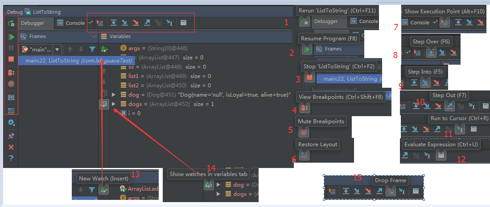
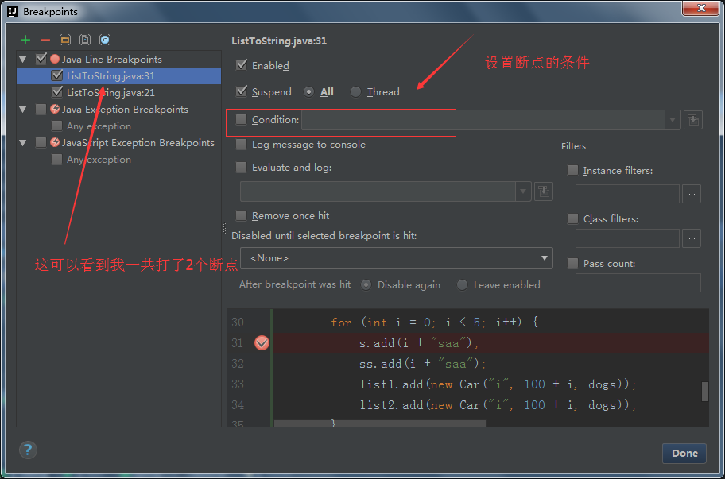
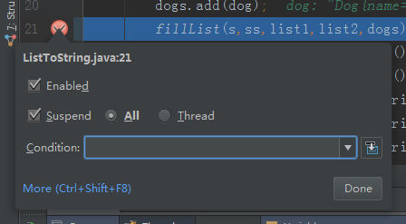
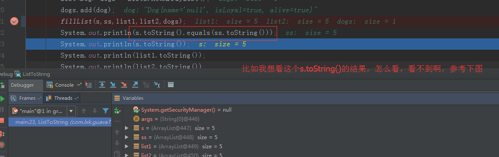
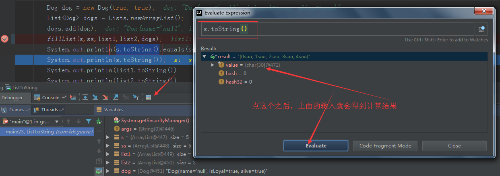

debug调试是程序员必备的技巧，请不要使用System.out.println()调试程序。

想要程序进入断点，项目的启动方式必须是debug启动，即绿色小甲虫启动。

# debug界面介绍

注：因idea版本迭代，上图中的图标会变，但是描述应该不会变。

1.rerun XXX，重新运行当前程序。

2.直接跑完，到下一个断点停下，没有就直接跑完程序

3.停止项目或者程序。
main方法：直接停止
web项目：点两下，服务器停止

4.查看所有的断点设置情况。下面有详细解释

5.让所有断点失效(断点还在，只不过没有作用)

6.重置debug界面布局

7.跳到当前断点位置(debug时点到其他类，或拉到类的其他地方，可以跳到断点位置)

8.一行行往下走，不会跳到方法中。

9.如果下一行调试代码是可执行方法，就可以f5进去，查看这个方法的运行详细情况。重点就是点进去执行

10.从详情跳出去，和step into相反。

11.跳转到光标所在位置，前提是路上没有断点拦截

12.计算表达式的值，点开后可以输入表达式，得出计算结果。
也可以在断点时，选中表达式，按住alt和鼠标左键，得出结果。

13.查看某个对象的值，或自定义对象

14.把自定义的查看对象的值，分开到另一个tab页

15.有时候当我们步入方法体之后，还想回退到方法体外，点这个按钮后，断点重新回到方法体之外。在继续还是可以再次进到方法内
注：这个很好的，假设你手快，跳过想断点的方法，然后这个drop frame，出去之后，就可以再次debug啦。这个很是着重介绍一下，就算你只打一个断点，一不小心跑了，不怕，点这个，推出，然后再执行，还是会再次进入断点的。这个很管用的，要是不知道的话，就的再从头到尾的执行一遍，很是麻烦哦。所以，再使劲的强调一下这个高科技按钮。

# 查看断点处某个对象的值
1.选中对象后，鼠标悬停在对象上2秒左右
2.在watch里面添加这个对象
3.下面列表会列出方法中定义的变量值
4.使用上面图上标注的12的那个按钮
5.alt+鼠标左键(可以选中一个表达式后再点击得到表达式的值)

# 查看断点详情(view breakpoint)
condition中可以设置断点的条件，当i==4的时候，才停下。

设置断点条件，还可以，直接在代码断点处，右键设置。

# 计算表达式的值(Evaluate Expression)
根据输出的值，计算想要的结果。

# debuging,实时修改表达式的值
在断点走过之后，可以在下面debug面板看到变量/表达式的值，右键set value就可以临时改变变量/表达式的值，下面代码的计算就可以用到改变的值了。
注：临时改变是一次性的
