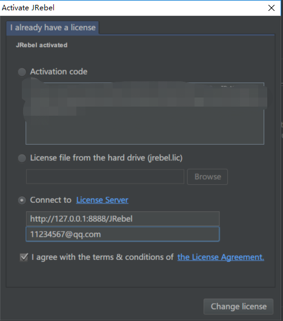
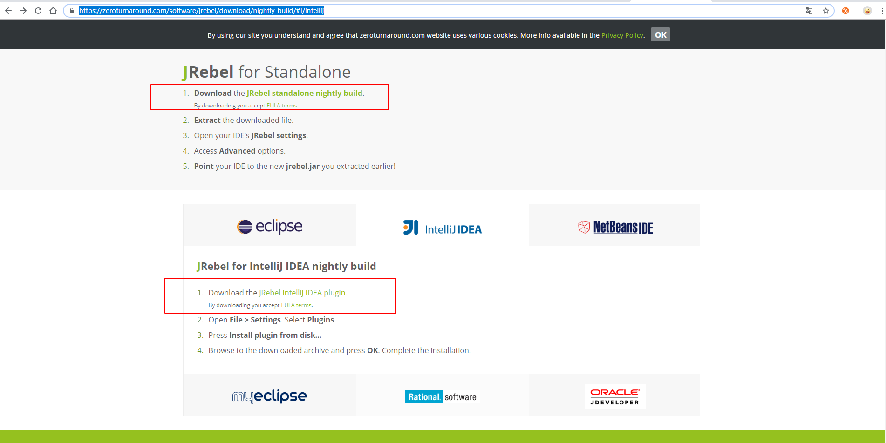

# 概述
热部署的作用是在不重启项目的情况下，使用类加载器重新加载修改过的.class文件到内存，避免花费时间在重启上。
目前比较常用的有两种热部署，分别为`spring-boot-devtools`和`JRebel`。[spring-boot-devtools官网](https://docs.spring.io/spring-boot/docs/current-SNAPSHOT/reference/htmlsingle/#using-boot-running-with-the-maven-plugin)

`spring-boot-devtools`使用方式是直接引入Maven插件或者Gradle插件即可。
maven：
```
<dependencies>
	<dependency>
		<groupId>org.springframework.boot</groupId>
		<artifactId>spring-boot-devtools</artifactId>
		<optional>true</optional>
	</dependency>
</dependencies>
```

gradle:
```
configurations {
	developmentOnly
	runtimeClasspath {
		extendsFrom developmentOnly
	}
}
dependencies {
	developmentOnly("org.springframework.boot:spring-boot-devtools")
}
```

官网说明如下：
Restart vs Reload
The restart technology provided by Spring Boot works by using two classloaders. Classes that do not change (for example, those from third-party jars) are loaded into a base classloader. Classes that you are actively developing are loaded into a restart classloader. When the application is restarted, the restart classloader is thrown away and a new one is created. This approach means that application restarts are typically much faster than “cold starts”, since the base classloader is already available and populated.
If you find that restarts are not quick enough for your applications or you encounter classloading issues, you could consider reloading technologies such as JRebelfrom ZeroTurnaround. These work by rewriting classes as they are loaded to make them more amenable to reloading.
解释过来就是：spring boot提供了两个类加载器来进行热部署，一个叫基础类加载器，用于加载不会变化的一些系统jar包和第三方jar包；另一个是重启类加载器，当项目发生更改时，重启类加载器会抛弃旧的类加载器，并重新创建一个重启类加载器（个人觉得spring boot这里用到了OSGI的模块化思想），这意味者这种热重启通常意义下是比冷重启是快很多的，因为基础类加载器一直是可用并且就绪。
如果你发现重启速度不够快或者发现了一些重启导致的问题，你可以使用ZeroTurnaround的产品JRebel，它通过重写class文件来使得class文件适合被重新加载。
在一般情况下，我们使用spring boot的热部署即可，然而我们的项目是需要通过RPC方式进行调用和通信的，这势必会导致一个问题，我们在远程发布服务并暴露通知到本地jvm，启动项目用的是v1 restart classLoader，当我们改了A.java某一行代码，原来v1 restart classLoader被抛弃，现在A.java是由v2 restart classLoader加载的。当你本地调用远程服务时，它会发现本地jvm里的A.java与远程A.java类信息不一致，于是会报 "A cannot cast to A"的错误。所以这里我们采用JRebel来进行重启。
JRebel并不是开源免费的，作为一个商业产品，它并不算便宜，有条件的请支持正版。

# JRebel集成
在idea得plugin的Marketplace中搜索`jrebel`，安装`JRebel for IntelliJ`，完成以后点击重启IDEA。再次进入到IDEA设置界面，此时已经多了JRebel的选项。


# windows激活
[激活需要反向代理工具](https://github.com/ilanyu)

选择ReverseProxy，再进入到Release页面：


选择对应版本下载，darwin代表Mac os的UNIX-like系统。`ReverseProxy_windows_amd64.exe`这个版本，代表windows64位。选择立刻激活，再选择I have license：


运行刚刚下载的反向代理：

代表监听本机的8888端口请求发往了作者提供的一个激活服务器，有条件的可以自己搭建一个类似的激活服务器避免lanyu的服务器被封。输入上图中类似的内容，除了`http://127.0.0.1:8888`不能改变以外，后面的内容可以随便填写，但是不能直接写明文，需要转换为GUID的形式。例如：`http://127.0.0.1:8888/wjy`
百度搜索GUID生成工具，输入wjy生成，则上图中正确的内容为：
`http://127.0.0.1:8888/e250f540-41e3-450b-aabb-0f376f83c241`
下面的邮箱可以随意填写，只要格式正确即可，然后可以看到激活成功，可以使用180天，这个时候一定、一定、一定要点击JRebel界面work offline，切换到离线模式，开始脱机工作，如果180天后还想继续使用，可以点击Renew ofline seat，重新获取180天使用时间。Renew ofline seat也要运行反代。注：以上步骤一定要保证反向代理程序一直运行。

接下来，找到idea上debug(小甲虫)启动旁边，

左边普通启动，右边debug启动。

还可以点击左下角的JRebel唤出panel勾选项目，它会自动在对应的项目下面的resource生成一个rebel.xml文件，可以根据官方来进行一些自定义配置。


前边一排(绿色小火箭下有JR两个字母)，表示本地jrebel热部署，jrebel会对勾选的模块进行热部署。貌似不勾选也可以热部署？
一直没发现勾不勾有什么区别。勾选之后会在模块的`resource`目录下生成`rebel.xml`文件，文件注释：`This is the JRebel configuration file. It maps the running application to your IDE workspace, enabling JRebel reloading for this project.`译：这是JRebel配置文件。它将运行中的应用程序映射到IDE工作区，从而为该项目启用JRebel重载。

文件内容：
```
<classpath>
	<dir name="D:/IdeaProjects/zjx_project/zjx_service_book/target/classes"></dir>
</classpath>
```
这应该是可以自定义项目启动后.class文件的位置，所以不勾选的话，会找默认位置？大概...

后边一排(绿色小火箭下有一朵云)，表示远程热部署，本地内容修改后，可以同步到服务器，因为我们使用了jenkins，所以暂时用不到这个配置。[远程部署方式](http://www.w3cbj.cn/Mblog/blog_detail/blog_id/235)

# JRebel-nightly(支持xml热部署)
其实不安装这个，xml也可以热部署，为啥？
以上的标准步骤所激活的JRebel是不支持Mybatis里的xml更新热部署的，如果你想更新了sql也能够热部署，[还需要到官网下载JRebel-nightly](https://zeroturnaround.com/software/jrebel/download/nightly-build/#!/intellij)


上面已经圈出来了两种方式：

1.下载上面那个红框里地址的压缩包，解压开，里面有一个JRebel.jar，记住其位置，然后在IDEA里面指定使用的代理jar包

使用刚刚解压的那个作为JRebel的代理类。

2.就是不使用IDEA自带的的plugin repository的插件，直接在JRebel-nightly的那个页面选择下载下面红框里的包，然后卸载原来的JRebel，
从磁盘安装你新下载的这个插件压缩包（无需解压）,然后重复上面的破解步骤即可。

# 其他配置
为方便开发，可以通过设置IDEA来实现完全的实时更新部署。

勾选上图中的自动编译：
然后按Ctrl + Shift + a，弹出万能搜索框，输入registry

再输入running，勾选运行时自动构建：


这样当你更新代码后，即会触发JRebel的热部署，但是同时也会增加IDEA的开销，如果代码报错还会导致报错，
所以推荐还是用手动编译吧，快捷键：Ctrl + F9 编译整个项目 Ctrl + Shift + F9，编译刚刚修改的类。