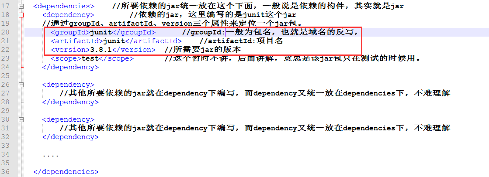
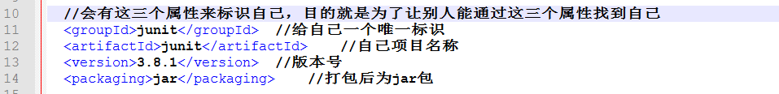
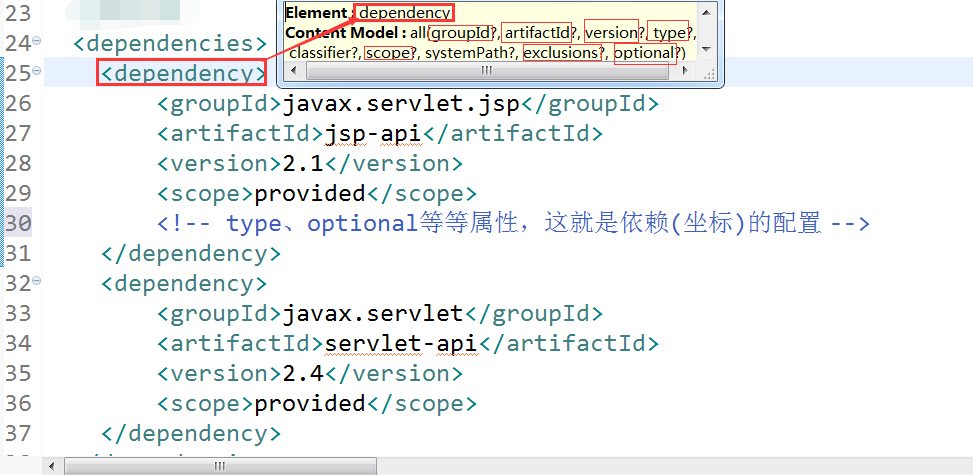

## 概念：
Maven用于叙述项目间的依赖关系。
通俗讲，就是通过pom.xml文件的配置获取jar包，而不用手动去添加jar包。
当然maven还有其他功能，如：构建项目

如果需要使用pom.xml来获取jar包，那么首先该项目就必须为maven项目，maven项目可以这样去想，就是在java项目和web项目的上面包裹了一层maven，
本质上java项目还是java项目，web项目还是web项目，但是包裹了maven之后，就可以使用maven提供的一些功能了(通过pom.xml添加jar包)。

如何通过pom.xml获取想要的jar包呢？
pom.xml获取junit的jar包的编写。

为什么通过groupId、artifactId、version三个属性就能定位一个jar包？

加入上面的pom.xml文件属于A项目，那么A项目肯定是一个maven项目，通过上面这三个属性能够找到junit对应版本的jar包，那么junit项目肯定也是一个maven项目，junit的maven项目中的pom.xml文件就会有三个标识符，比如像下图这样，然后别的maven项目就能通过这三个属性来找到junit项目的jar包了。所以，在每个创建的maven项目时都会要求写上这三个属性值的。


## 仓库概念
通过pom.xml中的配置，就能够获取到想要的jar包，这些jar包存放在**仓库**中。
仓库有三种：
1.本地仓库
2.第三方仓库
3.中央仓库

### 本地仓库
Maven会将工程中依赖的构建(jar包)从远程下载到本机的一个目录下管理，每台电脑默认的仓库在
`C:\Users\Administrator\.m2\repository`

可以通过修改setting.xml中的配置，来修改仓库的位置，以及jar包的下载源。
1.修改仓库位置：
找到localRepository标签，将路径修改为想要修改的路径。

2.修改jar包下载源：
找到mirror标签，修改为阿里的源
```
<mirror>
	  <id>alimaven</id>
	  <mirrorOf>central</mirrorOf>
	  <name>aliyun maven</name>
	  <url>http://maven.aliyun.com/nexus/content/groups/public/</url>
	</mirror>
```

idea是自带maven插件的，无需自行安装，也可以修改仓库位置以及镜像源。
`ctrl+alt+s -> maven `
最下面两行分别是setting.xml文件以及仓库位置。

### 第三方仓库
又称为内部仓库，也叫私服，一般是公司自己创建的，只内部使用，减少外部访问和下载的频率。
也就是一般公司都会创建这种第三方仓库，保证项目开发时，项目所需用的jar都从该仓库中拿，每个人的版本就都一样。

### 中央仓库
Maven内置了远程公用仓库：
http://repo1.maven.org/maven2
这个公共仓库是由Maven自己维护，里面有大量的常用类库，并包含了世界上大部分流行的开源项目构件。目前是以java为主。
工程依赖的jar包如果本地仓库没有，默认从中央仓库下载

jar包获取顺序总结：
本地 -> 私服(若有) ->中央仓库
中央仓库获取的Jar包后，会先下载到本地，然后还是从本地仓库获取

## 使用命令行管理maven项目
### 创建maven java项目
自己创建一个文件夹，在该文件夹下按shift+右击，点开使用命令行模式，这样创建的maven[java]项目就在该文件夹下了。
命令：
`mvn archetype:create -DgroupId=com.wuhao.maven.quickstart -DartifactId=simple -DarchetypeArtifactId=maven-archetype-quickstart`
mvn：核心命令
archetype:create：创建项目，现在maven高一点的版本都弃用了create命令而使用generate命令了。
-DgroupId=com.wuhao.maven.quickstart ：创建该maven项目时的groupId是什么，该作用在上面已经解释了。一般使用包名的写法。因为包名是用公司的域名的反写，独一无二
-DartifactId=simple：创建该maven项目时的artifactId是什么，就是项目名称
-DarchetypeArtifactId=maven-archetype-quickstart：表示创建的是[maven]java项目

运行的前提：需要联网，必须上网下载一个小文件

创建成功后会提示：build success！
在当前文件夹下会生成一个simple的文件夹，这就是maven java项目

### maven java项目结构
```
simple
---pom.xml：核心配置，根目录下
---src
------main　　　　　　
---------java：java源码目录
---------resources：java配置文件目录
------test
---------java：测试源码目录
---------resources：测试配置目录
---target：src/main/java下的源代码就会编译成.class文件放入target目录中，target就是输出目录
```

### 创建 maven javaWeb 项目
命令：
`mvn archetype:create -DgroupId=com.wuhao.maven.quickstart -DartifactId=myWebApp -DarchetypeArtifactId=maven-archetype-webapp -Dversion=0.0.1-snapshot`
其他都差不多，创建maven web项目的话 -DarchetypeArtifactId=maven-archetype-webapp 比创建java项目多了一个 -Dversion=0.01-snapshot， 在创建java项目的时候也可以加上这个，如果不写，会默认帮我们加上1.0-snapshot。

创建成功后会提示：build success！
在当前文件夹下会生成一个simple的文件夹，这就是maven javaWeb项目

### maven web项目结构
```
pom.xml：核心配置
src/main/java：java源码
src/main/resources：java配置
src/main/webapp：myeclipse web项目中 WebRoot目录
   |-- WEB-INF
       |-- web.xml
src/test：测试
target：输出目录
```
### 命令操作maven java或web项目
```
编译：mvn compile　　--src/main/java目录java源码编译生成class （target目录下）

测试：mvn test　　　　--src/test/java 目录编译

清理：mvn clean　　　 --删除target目录，也就是将class文件等删除

打包：mvn package　　--生成压缩文件：java项目#jar包；web项目#war包，也是放在target目录下

安装：mvn install　　　--将压缩文件(jar或者war)上传到本地仓库

部署|发布：mvn deploy　　--将压缩文件上传私服
```

### 例子:使用命令操作maven java项目
注意：使用命令时，必须在maven java项目的根目录下，及可以看到pom.xml
描述：将maven java项目打包上传到本地仓库供别人调用
使用 mvn install

在本地仓库中查看是否有该项目
D:\java\maven\repository\com\wuhao\maven\quickstart\simple\1.0-SNAPSHOT


通过在本地仓库中的目录可以发现为什么通过groupId、artifactId、version可以定位到仓库中得jar包，也可以知道为什么groupId要使用公司域名的反写(因为这样唯一，不会与别的项目重名导致查找到的内容不精确)

### maven项目的完整生命周期，当执行生命周期后面命令时，前面步骤的命令自动执行

红色标记字体的意思就是当我们直接使用mvn install命令对项目进行上传至本地仓库时，那么前面所有的步骤将会自动执行，比如源代码的编译，打包等等。

### 其他命令
```
maven java或web项目转换Eclipse工程
mvn eclipse:eclipse
mvn eclipse:clean　　清楚eclipse设置信息，又从eclipse工程转换为maven原生项目了　　　　
...转换IDEA工程
mvn idea:idea
mvn idea:clean　　同上　
```

## 使用Myeclipse创建maven自定义项目
略。。。

## pom.xml的依赖关系讲解(重点)
之前一直在使用pom.xml中找jar包最关键的三个属性，groupId、artifactId、version，应该有些印象了，也知道为什么通过这三个能找到对应的jar包。

### 如何获取坐标(也就是三个关键属性值)
#### 方式1：使用网站搜索[从中央仓库拿]
步骤一：百度搜索关键字“maven repository”
步骤二：输入关键字查询获得需要内容，确定需要版本
步骤三、获得坐标

#### 方式2、使用本地仓库，通过myeclipse获得坐标
略。。。

### 依赖(坐标)的常见配置
为了避免不知道说的哪些配置属性，看下面图就明白了，就是dependency下的属性配置，全部有9个，讲其中的7个。


type：依赖的类型，比如是jar包还是war包等，默认为jar，表示依赖的jar包
optional：标记依赖是否可选。默认值false
exclusions：排除传递依赖，解决jar冲突问题
依赖传递的意思就是，A项目 依赖 B项目，B项目 依赖 C项目，当使用A项目时，就会把B也给加载进来，这是传递依赖，依次类推，C也会因此给加载进来。
个有依赖传递有好处，也有坏处，坏处就是jar包的冲突问题，比如，A 依赖 B(B的版本为1)，C 依赖 B(B的版本为2)，如果一个项目同时需要A和C，那么A,C都会传递依赖将B给加载进来，问题就在这里，两个B的版本不一样，将两个都加载进去就会引起冲突，这时候就需要使用exclusions这个属性配置了。maven也会有一个机制避免两个都加载进去，maven 默认配置在前面的优先使用，但是我们还是需要使用exclusions来配置更合理，

scope：依赖范围，意思就是通过pom.xml加载进来的jar包，来什么范围内使用生效，范围包括编译时，运行时，测试时
compile：默认值，如果选择此值，表示编译、测试和运行都使用当前jar
test：表示只在测试时当前jar生效，在别的范围内就不能使用该jar包。
runtime，表示测试和运行时使用当前jar，编译时不用该jar包。例如：JDBC驱动。
provided，表示编译和测试时使用当前jar，运行时不在使用该jar了。例如：servlet-api、jsp-api等。【必须填写】

### 依赖调节原则
这个就是maven解决传递依赖时jar包冲突问题的方法，按照两种原则，上面已经介绍了一种了，就是下面的第二原则
1、第一原则：路径近者优先原则
A-->B-->C-->D-->X(1.6)
E-->D-->X(2.0)
使用X(2.0)，因为其路径更近

2、第二原则：第一声明者优先原则。就是如果路径相同，maven 默认配置在前面的优先使用
A-->B --> X(1.6)
C-->D--> X(2.0)
这样就是路径相同，那么如果A在前面，C在后面，则使用X(1.6)
maven会先根据第一原则进行选择，第一原则不成，则按第二原则处理。

## maven对父工程与子模块的拆分和聚合
具体可参考另一片博文：maven+dubbo+zk构建soa架构

完结。
参考文章：
https://www.cnblogs.com/whgk/p/7112560.html

111