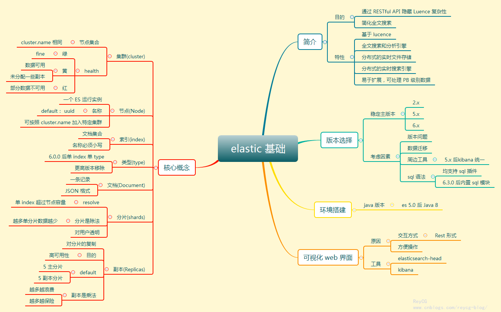
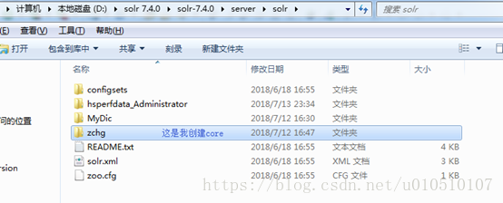
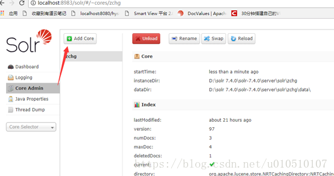
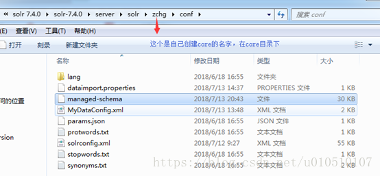
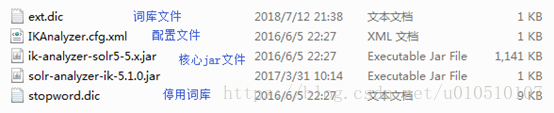
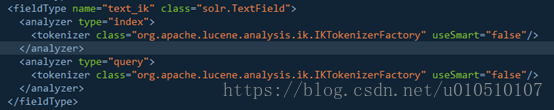
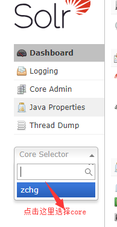
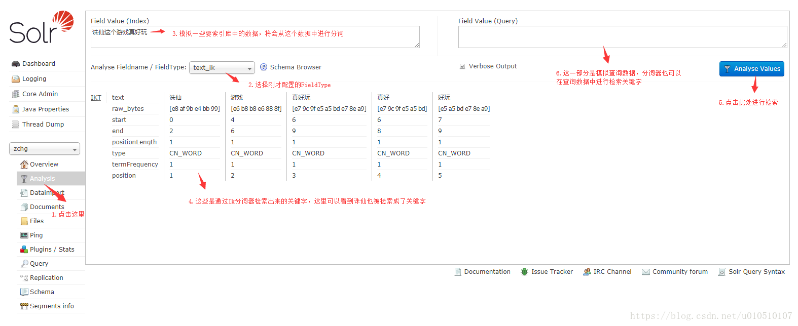
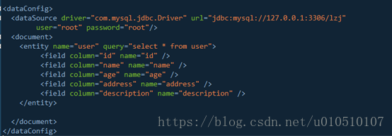

# 全文搜索引擎
全文搜索引擎是目前广泛应用的主流搜索引擎。它的工作原理是计算机索引程序通过扫描文章中的每一个词，对每一个词建立一个索引，指明该词在文章中出现的次数和位置，当用户查询时，检索程序就根据事先建立的索引进行查找，并将查找的结果反馈给用户的检索方式。这个过程类似于通过字典中的检索字表查字的过程。

我们生活中的数据总体分为两种：结构化数据 和 非结构化数据。
结构化数据： 指具有固定格式或有限长度的数据，如数据库，元数据等。
非结构化数据： 非结构化数据又可称为全文数据，指不定长或无固定格式的数据，如邮件，word文档等。
当然有的地方还会有第三种：半结构化数据，如XML，HTML等，当根据需要可按结构化数据来处理，也可抽取出纯文本按非结构化数据来处理。

根据两种数据分类，搜索也分为相应的两种：结构化数据搜索和非结构化数据搜索。
对于结构化数据，我们一般都是可以通过关系型数据库(mysql，oracle等)的 table 的方式存储和搜索，也可以建立索引。
对于非结构化数据，即对全文数据的搜索主要有两种方法：顺序扫描法、全文检索。
顺序扫描：通过文字名称也可了解到它的大概搜索方式，即按照顺序扫描的方式查询特定的关键字。
例如给你一张报纸，让你找到该报纸中“dota2”的文字在哪些地方出现过。你肯定需要从头到尾把报纸阅读扫描一遍然后标记出关键字在哪些版块出现过以及它的出现位置。
这种方式无疑是最耗时的最低效的，如果报纸排版字体小，而且版块较多甚至有多份报纸，等你扫描完你的眼睛也差不多了。

全文搜索：对非结构化数据顺序扫描很慢，我们是否可以进行优化？把我们的非结构化数据想办法弄得有一定结构不就行了吗？将非结构化数据中的一部分信息提取出来，重新组织，使其变得有一定结构，然后对此有一定结构的数据进行搜索，从而达到搜索相对较快的目的。这种方式就构成了全文检索的基本思路。这部分从非结构化数据中提取出的然后重新组织的信息，我们称之索引。
还以读报纸为例，我们想关注最近TI10的新闻，假如都是 PSG.LGD 的粉丝，如何快速找到 LGD 新闻的报纸和版块呢？全文搜索的方式就是，将所有报纸中所有版块中关键字进行提取，如"LGD"，"Liquid"，"FW"，"战队"，"DOTA2"等。然后对这些关键字建立索引，通过索引我们就可以对应到该关键词出现的报纸和版块。注意区别目录搜索引擎。

# 为何要用搜索引擎
之前，有同事问我，为什么要用搜索引擎？我们的所有数据在数据库里面都有，而且 Oracle、SQL Server 等数据库里也能提供查询检索或者聚类分析功能，直接通过数据库查询不就可以了吗？确实，我们大部分的查询功能都可以通过数据库查询获得，如果查询效率低下，还可以通过建数据库索引，优化SQL等方式进行提升效率，甚至通过引入缓存来加快数据的返回速度。如果数据量更大，就可以分库分表来分担查询压力。
那为什么还要全文搜索引擎呢？我们主要从以下几个原因分析：
- 数据类型
全文索引搜索支持非结构化数据的搜索，可以更好地快速搜索大量存在的任何单词或单词组的非结构化文本。
例如 Google，百度类的网站搜索，它们都是根据网页中的关键字生成索引，我们在搜索的时候输入关键字，它们会将该关键字即索引匹配到的所有网页返回；还有常见的项目中应用日志的搜索等等。对于这些非结构化的数据文本，关系型数据库搜索不是能很好的支持。
- 索引的维护
一般传统数据库，全文检索都实现的很鸡肋，因为一般也没人用数据库存文本字段。进行全文检索需要扫描整个表，如果数据量大的话即使对SQL的语法优化，也收效甚微。建立了索引，但是维护起来也很麻烦，对于 insert 和 update 操作都会重新构建索引。

什么时候使用全文搜索引擎：
搜索的数据对象是大量的非结构化的文本数据。
文件记录量达到数十万或数百万个甚至更多。
支持大量基于交互式文本的查询。
需求非常灵活的全文搜索查询。
对高度相关的搜索结果的有特殊需求，但是没有可用的关系数据库可以满足。
对不同记录类型、非文本数据操作或安全事务处理的需求相对较少的情况。

# Lucene，Solr，ElasticSearch
现在主流的搜索引擎大概就是：Lucene，Solr，ElasticSearch。
它们的索引建立都是根据倒排索引的方式生成索引，何谓倒排索引？
维基百科
倒排索引（英语：Inverted index），也常被称为反向索引、置入档案或反向档案，是一种索引方法，被用来存储在全文搜索下某个单词在一个文档或者一组文档中的存储位置的映射。它是文档检索系统中最常用的数据结构。

## Lucene
Lucene是一个Java全文搜索引擎，完全用Java编写。Lucene不是一个完整的应用程序，而是一个代码库和API，可以很容易地用于向应用程序添加搜索功能。
Lucene通过简单的API提供强大的功能：
**可扩展的高性能索引**
- 在现代硬件上超过150GB /小时
- 小RAM要求 - 只有1MB堆
- 增量索引与批量索引一样快
- 索引大小约为索引文本大小的20-30％

**强大，准确，高效的搜索算法**
- 排名搜索 - 首先返回最佳结果
- 许多强大的查询类型：短语查询，通配符查询，邻近查询，范围查询等
- 现场搜索（例如标题，作者，内容）
- 按任何字段排序
- 使用合并结果进行多索引搜索
- 允许同时更新和搜索
- 灵活的分面，突出显示，连接和结果分组
- 快速，内存效率和错误容忍的建议
- 可插拔排名模型，包括矢量空间模型和Okapi BM25
- 可配置存储引擎（编解码器）

**跨平台解决方案**
- 作为Apache许可下的开源软件提供 ，允许您在商业和开源程序中使用Lucene
- 100％-pure Java
- 可用的其他编程语言中的实现是索引兼容的

Apache软件基金会
在Apache软件基金会提供的开源软件项目的Apache社区的支持。
但是Lucene只是一个框架，要充分利用它的功能，需要使用JAVA，并且在程序中集成Lucene。需要很多的学习了解，才能明白它是如何运行的，熟练运用Lucene确实非常复杂。

## Solr
Apache Solr是一个基于名为Lucene的Java库构建的开源搜索平台。它以用户友好的方式提供Apache Lucene的搜索功能。作为一个行业参与者近十年，它是一个成熟的产品，拥有强大而广泛的用户社区。它提供分布式索引，复制，负载平衡查询以及自动故障转移和恢复。如果它被正确部署然后管理得好，它就能够成为一个高度可靠，可扩展且容错的搜索引擎。很多互联网巨头，如Netflix，eBay，Instagram和亚马逊（CloudSearch）都使用Solr，因为它能够索引和搜索多个站点。

主要功能列表包括：
- 全文搜索
- 突出
- 分面搜索
- 实时索引
- 动态群集
- 数据库集成
- NoSQL功能和丰富的文档处理（例如Word和PDF文件）

## ElasticSearch
Elasticsearch是一个开源（Apache 2许可证），是一个基于Apache Lucene库构建的RESTful搜索引擎。
Elasticsearch是在Solr之后几年推出的。它提供了一个分布式，多租户能力的全文搜索引擎，具有HTTP Web界面（REST）和无架构JSON文档。Elasticsearch的官方客户端库提供Java，Groovy，PHP，Ruby，Perl，Python，.NET和Javascript。
分布式搜索引擎包括可以划分为分片的索引，并且每个分片可以具有多个副本。每个Elasticsearch节点都可以有一个或多个分片，其引擎也可以充当协调器，将操作委派给正确的分片。
Elasticsearch可通过近实时搜索进行扩展。其主要功能之一是多​​租户。
主要功能列表包括：
- 分布式搜索
- 多租户
- 分析搜索
- 分组和聚合

## ElasticSearch vs solr
由于Lucene的复杂性，一般很少会考虑它作为搜索的第一选择，排除一些公司需要自研搜索框架，底层需要依赖Lucene。所以这里我们重点分析 Elasticsearch 和 Solr。
Elasticsearch vs. Solr。哪一个更好？他们有什么不同？你应该使用哪一个？

### 历史比较
Apache Solr是一个成熟的项目，拥有庞大而活跃的开发和用户社区，以及Apache品牌。Solr于2006年首次发布到开源，长期以来一直占据着搜索引擎领域，并且是任何需要搜索功能的人的首选引擎。它的成熟转化为丰富的功能，而不仅仅是简单的文本索引和搜索； 如分面，分组，强大的过滤，可插入的文档处理，可插入的搜索链组件，语言检测等。
Solr 在搜索领域占据了多年的主导地位。然后，在2010年左右，Elasticsearch成为市场上的另一种选择。那时候，它远没有Solr那么稳定，没有Solr的功能深度，没有思想分享，品牌等等。
Elasticsearch虽然很年轻，但它也自己的一些优势，Elasticsearch 建立在更现代的原则上，针对更现代的用例，并且是为了更容易处理大型索引和高查询率而构建的。此外，由于它太年轻，没有社区可以合作，它可以自由地向前推进，而不需要与其他人（用户或开发人员）达成任何共识或合作，向后兼容，或任何其他更成熟的软件通常必须处理。
因此，它在Solr之前就公开了一些非常受欢迎的功能(例如，接近实时搜索，英文：Near Real-Time Search)。从技术上讲，NRT搜索的能力确实来自Lucene，它是 Solr 和 Elasticsearch 使用的基础搜索库。具有讽刺意味的是，因为 Elasticsearch 首先公开了NRT搜索，所以人们将NRT搜索与Elasticsearch 联系在一起，尽管 Solr 和 Lucene 都是同一个 Apache 项目的一部分，因此，人们会首先期望 Solr 具有如此高要求的功能。

### 特征差异比较
这两个搜索引擎都是流行的，先进的的开源搜索引擎。它们都是围绕核心底层搜索库 - Lucene构建的 - 但它们又是不同的。像所有东西一样，每个都有其优点和缺点，根据您的需求和期望，每个都可能更好或更差。Solr和Elasticsearch都在快速发展，所以，话不多说，先来看下它们的差异清单：

|特征 | Solr/SolrCloud | Elasticsearch |
|-|-|-|
|社区和开发者 | Apache 软件基金和社区支持 | 单一商业实体及其员工
|节点发现 | Apache Zookeeper，在大量项目中成熟且经过实战测试 | Zen内置于Elasticsearch本身，需要专用的主节点才能进行分裂脑保护
|碎片放置 | 本质上是静态，需要手动工作来迁移分片，从Solr 7开始 - Autoscaling API允许一些动态操作 | 动态，可以根据群集状态按需移动分片
|高速缓存 | 全局，每个段更改无效 | 每段，更适合动态更改数据
|分析引擎性能 | 非常适合精确计算的静态数据	结果的准确性取决于数据放置
|全文搜索功能 | 基于Lucene的语言分析，多建议，拼写检查，丰富的高亮显示支持 | 基于Lucene的语言分析，单一建议API实现，高亮显示重新计算
|DevOps支持 | 尚未完全，但即将到来 | 非常好的API
|非平面数据处理 | 嵌套文档和父-子支持 | 嵌套和对象类型的自然支持允许几乎无限的嵌套和父-子支持
|查询DSL | JSON（有限），XML（有限）或URL参数 | JSON
|索引/收集领导控制 | 领导者安置控制和领导者重新平衡甚至可以节点上的负载 | 不可能
|机器学 | 内置 - 在流聚合之上，专注于逻辑回归和学习排名贡献模块 | 商业功能，专注于异常和异常值以及时间序列数据

[了解更多](http://solr-vs-elasticsearch.com/)

### 综合比较
另外，我们在从以下几个方面来分析下：
- 近几年的流行趋势
我们查看一下这两种产品的Google搜索趋势。谷歌趋势表明，与 Solr 相比，Elasticsearch具有很大的吸引力，但这并不意味着Apache Solr已经死亡。虽然有些人可能不这么认为，但Solr仍然是最受欢迎的搜索引擎之一，拥有强大的社区和开源支持。
- 安装和配置
与Solr相比，Elasticsearch易于安装且非常轻巧。此外，您可以在几分钟内安装并运行Elasticsearch。
但是，如果Elasticsearch管理不当，这种易于部署和使用可能会成为一个问题。基于JSON的配置很简单，但如果要为文件中的每个配置指定注释，那么它不适合您。
总的来说，如果您的应用使用的是JSON，那么Elasticsearch是一个更好的选择。否则，请使用Solr，因为它的schema.xml和solrconfig.xml都有很好的文档记录。
- 社区
Solr拥有更大，更成熟的用户，开发者和贡献者社区。ES虽拥有的规模较小但活跃的用户社区以及不断增长的贡献者社区。
Solr是真正的开源社区代码。任何人都可以为Solr做出贡献，并且根据优点选出新的Solr开发人员（也称为提交者）。Elasticsearch在技术上是开源的，但在精神上却不那么重要。任何人都可以看到来源，任何人都可以更改它并提供贡献，但只有Elasticsearch的员工才能真正对Elasticsearch进行更改。
Solr贡献者和提交者来自许多不同的组织，而Elasticsearch提交者来自单个公司。
- 成熟度
Solr更成熟，但ES增长迅速，我认为它稳定。
- 文档
Solr在这里得分很高。它是一个非常有据可查的产品，具有清晰的示例和API用例场景。 Elasticsearch的文档组织良好，但它缺乏好的示例和清晰的配置说明。

### 总结
那么，到底是Solr还是Elasticsearch？
有时很难找到明确的答案。无论您选择Solr还是Elasticsearch，首先需要了解正确的用例和未来需求。总结他们的每个属性。

- 由于易于使用，Elasticsearch在新开发者中更受欢迎。但是，如果您已经习惯了与Solr合作，请继续使用它，因为迁移到Elasticsearch没有特定的优势。
- 如果除了搜索文本之外还需要它来处理分析查询，Elasticsearch是更好的选择。
- 如果需要分布式索引，则需要选择Elasticsearch。对于需要良好可伸缩性和性能的云和分布式环境，Elasticsearch是更好的选择。
- 两者都有良好的商业支持（咨询，生产支持，整合等）
- 两者都有很好的操作工具，尽管Elasticsearch因其易于使用的API而更多地吸引了DevOps人群，因此可以围绕它创建一个更加生动的工具生态系统。
- Elasticsearch在开源日志管理用例中占据主导地位，许多组织在Elasticsearch中索引它们的日志以使其可搜索。虽然Solr现在也可以用于此目的，但它只是错过了这一想法。
- Solr仍然更加面向文本搜索。另一方面，Elasticsearch 通常用于过滤和分组 - 分析查询工作负载 - 而不一定是文本搜索。Elasticsearch 开发人员在 Lucene 和 Elasticsearch 级别上投入了大量精力使此类查询更高效(降低内存占用和CPU使用)。因此，对于不仅需要进行文本搜索，而且需要复杂的搜索时间聚合的应用程序，Elasticsearch是一个更好的选择。
- Elasticsearch更容易上手，一个下载和一个命令就可以启动一切。Solr传统上需要更多的工作和知识，但Solr最近在消除这一点上取得了巨大的进步，现在只需努力改变它的声誉。
- 在性能方面，它们大致相同。我说“大致”，因为没有人做过全面和无偏见的基准测试。对于95％的用例，任何一种选择在性能方面都会很好，剩下的5％需要用它们的特定数据和特定的访问模式来测试这两种解决方案。
- 从操作上讲，Elasticsearch使用起来比较简单 - 它只有一个进程。Solr在其类似Elasticsearch的完全分布式部署模式SolrCloud中依赖于Apache ZooKeeper。ZooKeeper是超级成熟，超级广泛使用等等，但它仍然是另一个活跃的部分。也就是说，如果您使用的是Hadoop，HBase，Spark，Kafka或其他一些较新的分布式软件，您可能已经在组织的某个地方运行ZooKeeper。
- 虽然Elasticsearch内置了类似ZooKeeper的组件Xen，但ZooKeeper可以更好地防止有时在Elasticsearch集群中出现的可怕的裂脑问题。公平地说，Elasticsearch开发人员已经意识到这个问题，并致力于改进Elasticsearch的这个方面。
- 如果您喜欢监控和指标，那么使用Elasticsearch，您将会进入天堂。这个东西比新年前夜在时代广场可以挤压的人有更多的指标！Solr暴露了关键指标，但远不及Elasticsearch那么多。

# 思维导图
## 全文搜索


## Elastic基础


[参考地址](https://www.cnblogs.com/jajian/p/9801154.html)
[参考地址](https://www.cnblogs.com/reycg-blog/p/10048815.html)

# solr学习
[solr官网](https://lucene.apache.org/solr/)
下载最新的`Binary releases`，解压得到


Solr的运行分为单机运行和集群运行，这里以单机为例。
进入到solr的bin目录执行命令：
`solr start`
提示`Started Solr server on port 8983 (pid=). Happy searching!`，说明启动成功。
然后在浏览器输入http://localhost:8983/solr 就会进入到solr的管理界面。
注意：一定要用windows的cmd启动，而且启动之后cmd窗口不能关闭，git的bash是不行的，虽然提示happy searching，但是无法访问web界面。
一些solr常用命令：
`solr start –p 端口号`：单机版启动solr服务
`solr restart –p 端口号`：重启solr服务
`solr stop –p 端口号`：关闭solr服务
`solr create –c name`：创建一个core实例(core概念后面介绍)
[更多命令参考官方文档](https://lucene.apache.org/solr/guide/7_4/solr-control-script-reference.html)

## 创建core实例
简单说core就是solr的一个实例，一个solr服务下可以有多个core，每个core下都有自己的索引库和与之相应的配置文件，所以在操作solr创建索引之前要创建一个core，因为索引都存在core下面。
- 在bin目录下执行solr create –c name，创建一个core，默认创建出来的位置如下图

- 第二种方式是直接使用AdminUI页面创建一个core，如下图

创建的时候报错：
`Can't find resource 'solrconfig.xml' in classpath orc`
找到`solr-8.2.0/server/configsets/sample_techproducts_configs/conf`
把这个conf文件夹copy到新建的文件夹中。

## 配置schema
### schema介绍
schema是用来告诉solr如何建立索引的，他的配置围绕着一个schema配置文件，这个配置文件决定着solr如何建立索引，每个字段的数据类型，分词方式等，老版本的schema配置文件的名字叫做schema.xml他的配置方式就是手工编辑，但是现在新版本的schema配置文件的名字叫做managed-schema，他的配置方式不再是用手工编辑而是使用schemaAPI来配置，官方给出的解释是使用schemaAPI修改managed-schema内容后不需要重新加载core或者重启solr更适合在生产环境下维护，如果使用手工编辑的方式更改配置不进行重加载core有可能会造成配置丢失，配置文件所在的路径如下图：


### schema主要成员：
- fieldType：为field定义类型，最主要作用是定义分词器，分词器决定着如何从文档中检索关键字。
- analyzer：他是fieldType下的子元素，这就是传说中的分词器，他由一组tokenizer和filter组成，如下图所示

- field：他是创建索引用的字段，如果想要这个字段生成索引需要配置他的indexed属性为true，stored属性为true表示存储该索引。如下所示每个field都要引用一种fieldType由type属性定义
`<field name="description" type="text_tr" indexed="true" stored="true">`
这里描述的只是最常用的三个元素，[关于更多schema的介绍请参考](http://lucene.apache.org/solr/guide/7_4/documents-fields-and-schema-design.html)

### Schema API
Schema API其实就是用post请求向solr服务器发送携带json参数的请求，所有操作内容都封装在json中，如果是linux系统直接使用curl工具，如果是windows系统推荐使用Postman

这里以添加一个field为例，下面列出其他API：
add-field: add a new field with parameters youprovide.
delete-field: delete a field.
replace-field: replace an existing field withone that is differently configured.
[更多api请参考](http://lucene.apache.org/solr/guide/7_4/schema-api.html)

### 中文分词器
solr自带了一些中文分词器，比较好用的是SmartChineseAnalyzer，但是扩展性比较差不能自定义扩展中文词库，所以这里选择使用IKAnalyzer，这是第三方的一个分词器可以很好的扩展中文词库，IKAnalyzer下载后解压会有如下文件

把核心jar文件复制到solr WEB应用的lib文件夹下，如下图

把配置文件和词库等文件复制到WEB应用的classes文件夹下，如果子WEB-INF下没有这个文件夹自己创建即可，如下图：

如果想要扩展词库可以在ext.dic文件中配置自定义的中文词组，例如：诛仙这个词组，这个分词器的算法是算不出来的但是通过我们自定义词库，分词器也可以把诛仙列出关键词。
注意编辑此文件时字符编码最好是UTF-8无BOM模式，这个可以通过EditPlus等文本编辑工具设置。下面开始在Schema中应用分词器如下图：

定义了一个text_ik这个字段类型并采用Ik分词器，接下来在field元素定义式指定type=text_ik就可以把这个分词器应用在这个field中。
接下来我们来验证下ik分词器，如下图：



## DIH导入索引数据
DIH全称是Data Import Handler 数据导入处理器，顾名思义这是向solr中导入数据的，我们的solr目的就是为了能让我们的应用程序更快的查询出用户想要的数据，而数据存储在应用中的各种地方如：xml、pdf、关系数据库中，那么solr首先就要能够获取这些数据并在这些数据中建立索引来达成快速搜索的目的，这里就列举我们最常用的从关系型数据库中向solr导入索引数据。

在我们自己建立的core的目录下有conf目录，这里面有着几个很重要的配置文件，之前我们用到的managed-schema(老版本是schema.xml)也在其中，另外还有一个solrconfig.xml文件，这是我们DIH配置的第一步，需要在此文件中配置数据导入文件的映射位置如下图：

第二步配置数据导入文件，这个文件可以在solr根目录下的示例文件中copy一份到core/conf目录下，也就是跟solrconfig.xml在一个目录下，因为solrconfig.xml中配置的相对路径就是这里，当然也可以写绝对路径。如下图：

Copy过去之后这个文件名可以自定义，我就改成了MyDataConfig.xml，下面开始配置如下图：

- 首先配置数据源关系型数据库基本四项，驱动类，url，用户名，密码。
- 配置document，可以把它当作与mysql中数据库一个层级的对象。
- 配置entity，可以把它当作与数据库中一个表对应，在query中书写查询sql。
- 配置field与表中的字段与之对应。
注意这里容易与schema中的配置混淆，我的理解是schema中配置的是创建索引的配置，而索引的创建需要有数据基础，而现在讲的数据导入文件就是建立索引的数据基础，他是创建索引的元数据。现在配置文件完成后可以用DIH命令执行了。

### DIH 命令
DIH命令就是用来执行数据导入的，命令种类繁多这里只列出简单常用。DIH命令采用的方式是URL的方式。
full-import：全部数据导入例如：


接下来验证下数据是否真的导入成功了，如下图

fq:过滤的字段，df：默认查询字段，start，rows：分页配置，sort：排序，[更多关于查询语句的介绍请参考](http://lucene.apache.org/solr/guide/7_4/searching.html)

## solrJ(java客户端)
solrJ是java访问solr的客户端工具包，solr也提供了其他语言访问的客户端，可以到官方文档查看，现在solr的索引和数据导入都已经有，但是作为项目中应用的一个组件，少不了java与solr的沟通。

导入solrJ依赖
```
<dependency>
	<groupId>org.apache.solr</groupId>
	<artifactId>solr-solrj</artifactId>
	<version>7.4.0</version>
</dependency>
```

从solr中查询索引


向solr添加更改索引，java实体对象与solr索引映射


向solr添加或更新索引，如果此实体在solr索引库中已有则作为更新操作

[参考地址](https://blog.csdn.net/u010510107/article/details/81051795)

如果是springb boot项目，只需要导入starter即可。
```
<dependency>
	<groupId>org.springframework.boot</groupId>
	<artifactId>spring-boot-starter-data-solr</artifactId>
</dependency>
```
在配置文件`application.properties`中加入如下配置：
`spring.data.solr.host=http://localhost:8983/solr/new_core`
路径`solr/`后面的内容，是新建的core的名字。这里可以理解为数据库的概念。在操作的时，如果有多个core，可以切换数据库，也就是切换 core。

#### solr操作
```java
@RestController
@RequestMapping("solr")
public class SolrController {

    @Autowired
    private SolrClient client;

    /**
     * 新增/修改 索引
     * 当id存在的时候, 此方法是修改
     * @return
     */
    @RequestMapping("add")
    public String add() {
        try {
            SolrInputDocument doc = new SolrInputDocument();
            doc.setField("id", uuid);
            doc.setField("content_ik", "我是中国人, 我爱中国");
            //如果spring.data.solr.host 里面配置core了, 那么这里就不需要传 collection1 这个参数
            client.add("collection1", doc);
            //client.commit();
            client.commit("collection1");
            return 1;
        } catch (Exception e) {
            e.printStackTrace();
        }
        return "error";
    }

    /**
     * 根据id删除索引
     * @param id
     * @return
     */
    @RequestMapping("delete")
    public String delete(String id)  {
        try {
            client.deleteById("collection1",id);
            client.commit("collection1");
            return id;
        } catch (Exception e) {
            e.printStackTrace();
        }


        return "error";
    }

    /**
     * 删除所有的索引
     * @return
     */
    @RequestMapping("deleteAll")
    public String deleteAll(){
        try {
            client.deleteByQuery("collection1","*:*");
            client.commit("collection1");
            return "success";
        } catch (Exception e) {
            e.printStackTrace();
        }
        return "error";
    }

    /**
     * 根据id查询索引
     * @return
     * @throws Exception
     */
    @RequestMapping("getById")
    public String getById() throws Exception {
        SolrDocument document = client.getById("collection1", "536563");
        System.out.println(document);
        return document.toString();
    }

    /**
     * 综合查询: 在综合查询中, 有按条件查询, 条件过滤, 排序, 分页, 高亮显示, 获取部分域信息
     * @return
     */
    @RequestMapping("search")
    public Map<String, Map<String, List<String>>> search(){
        try {
            SolrQuery params = new SolrQuery();
            //查询条件, 这里的 q 对应 下面图片标红的地方
            params.set("q", "手机");
            //过滤条件
            params.set("fq", "product_price:[100 TO 100000]");
            //排序
            params.addSort("product_price", SolrQuery.ORDER.asc);
            //分页
            params.setStart(0);
            params.setRows(20);
            //默认域
            params.set("df", "product_title");
            //只查询指定域
            params.set("fl", "id,product_title,product_price");
			
            //高亮
            //打开开关
            params.setHighlight(true);
            //指定高亮域
            params.addHighlightField("product_title");
            //设置前缀
            params.setHighlightSimplePre("<span style='color:red'>");
            //设置后缀
            params.setHighlightSimplePost("</span>");
            //执行查询
            QueryResponse queryResponse = client.query(params);
            //获取查询结果
            SolrDocumentList results = queryResponse.getResults();
            //结果条数
            System.out.println(results.getNumFound());

　　　　　　//获取高亮显示的结果, 高亮显示的结果和查询结果是分开放的
            Map<String, Map<String, List<String>>> highlight = queryResponse.getHighlighting();

            for (SolrDocument result : results) {
                System.out.println(result.get("id"));
                System.out.println(result.get("product_title"));
                //System.out.println(result.get("product_num"));
                System.out.println(result.get("product_price"));
                //System.out.println(result.get("product_image"));

                Map<String, List<String>> map = highlight.get(result.get("id"));
                List<String> list = map.get("product_title");
                System.out.println(list.get(0));

                System.out.println("------------------");
                System.out.println();
            }
            return highlight;
        } catch (Exception e) {
            e.printStackTrace();
        }
        return null;
    }
}
```

新增索引时发现报错：
`solr Expected mime type application/octet-stream but got text/html`
解决：
在代码中，重复指定了core
`client.commit("test_core");`
commit中就不要带参数了。

[参考一](https://www.cnblogs.com/elvinle/p/8149256.html)
[参考二](https://www.jianshu.com/p/05a161add1a6)
[参考三](https://blog.csdn.net/qixiang_chen/article/details/82562410)

### solr查询参数
|参数|意义|
|-|-|-|
|q	| 查询的关键字，此参数最为重要，例如，q=id:1，默认为q=:，|
|fl | 指定返回哪些字段，用逗号或空格分隔，注意：字段区分大小写，例如，fl= id,title,sort|
|start | 返回结果的第几条记录开始，一般分页用，默认0开始|
|rows | 指定返回结果最多有多少条记录，默认值为 10，配合start实现分页|
|sort | 排序方式，例如id desc 表示按照 “id” 降序|
|wt | (writer type)指定输出格式，有 xml, json, php等|
|fq | （filter query）过虑查询，提供一个可选的筛选器查询。返回在q查询符合结果中同时符合的fq条件的查询结果，例如：q=id:1&fq=sort:[1 TO 5]，找关键字id为1 的，并且sort是1到5之间的。|
|df | 默认的查询字段，一般默认指定。|
|qt | （query type）指定那个类型来处理查询请求，一般不用指定，默认是standard。|
|indent | 返回的结果是否缩进，默认关闭，用 indent=true|
|version | 查询语法的版本，建议不使用它，由服务器指定默认值。|

[参考](https://www.cnblogs.com/cuihongyu3503319/p/9875628.html)
[参考](https://blog.csdn.net/zuihongyan518/article/details/90060175)
[参考](https://www.cnblogs.com/zhangweizhong/p/5056884.html)

问题：
现在有四条数据的标题分别是`标题1`、`标题2`、`t3`、`t4`。

