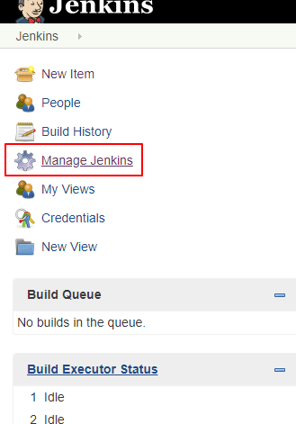
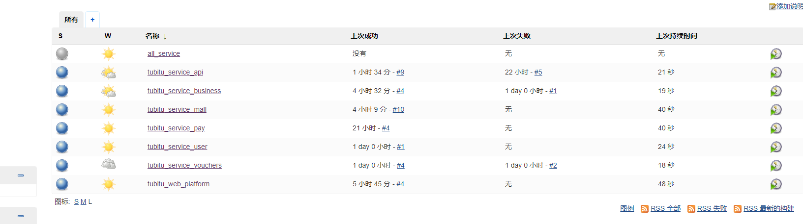
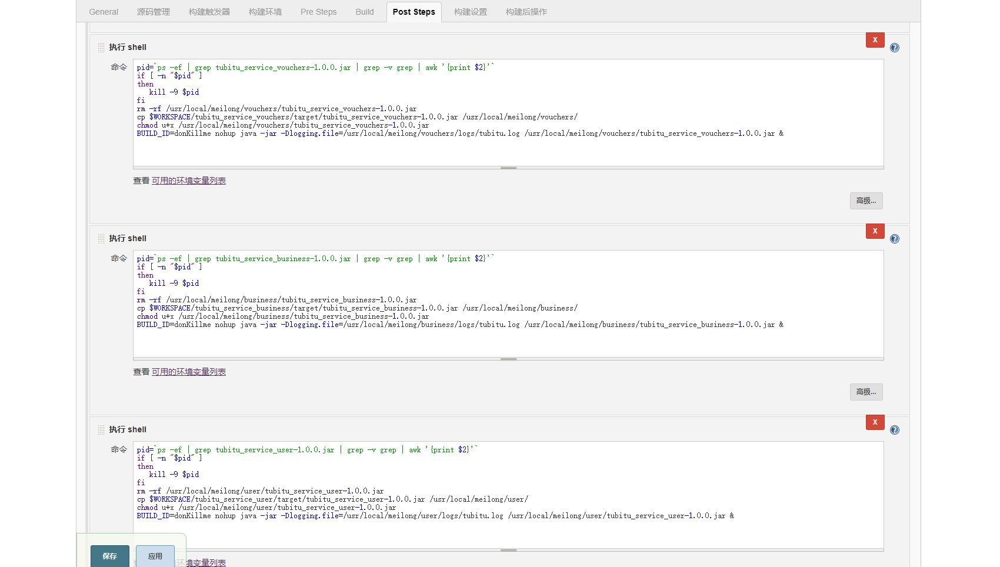
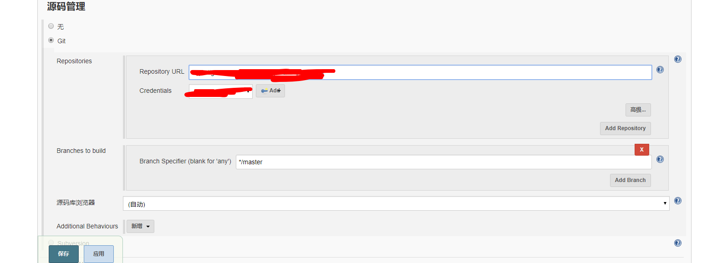
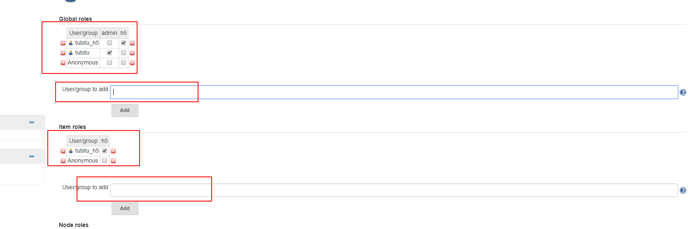

# 简介
Jenkins是一个开源的自动部署服务器，提供了上百个插件用于自动构建、部署、发布任意项目。本文描述的是Jenkins本地部署以及远程部署等功能的实现。
[这是jenkins中文网](https://jenkins.io/zh/)

# 安装部署
Jenkins主要有三种安装方式，yum安装、使用官方docker镜像和官方war包，放到tomcat中直接运行。我们采用比较熟悉的方式进行安装，即将Jenkins部署在Tomcat容器中，无需任何配置，直接启动tomcat即可。

安装tomcat和jdk这里不再赘述。
[官网下载](https://jenkins.io/download/)
左侧列表是稳定版，右侧是开发版，这里我们下载左侧列表的稳定版。找到适合自己系统的版本下载，这里我下载`Generic Java package (.war)`，通用的java-war包。
下载并上传到tomcat的webapps目录下，将war包更名为`ROOT.war`，然后启动tomcat，`./startup.sh`

# docker版的Jenkins
要使用docker镜像，首先安装docker，本文默认已经安装docker。我们可以到[Jenkins官网](https://jenkins.io/download/)寻找docker镜像地址。
注意：官方jenkins镜像本身自带openjdk。
找到`Download jenkins xxx for`下边的`docker`，点击后会跳转到docker hub，该网站是docker的官方镜像仓库，就像github是代码仓库一个道理。

网页右侧可以看到Jenkins的docker下载命令：
`docker pull jenkins/jenkins`

等待下载完成，输入命令查看下载完成的镜像：
`docker images`

可以看到jenkins已经被下载到服务器。镜像下载完成，下面就要开始启动容器了。
启动容器前，建议大家仔细阅读前面寻找镜像时[Docker Hub上关于jenkins镜像的详细说明](https://github.com/jenkinsci/docker/blob/master/README.md)。
启动之前，我们还需要在宿主机创建一个目录，一会方便镜像挂载。
`mkdir /home/jenkins`
还要给创建的目录赋予权限，这一步是必须的，否则启动镜像会报错：
`chmod 777 /home/jenkins`
在镜像文档里，我们知道Jenkins访问的默认端口号是8080，这里我改成9999，另外还需要暴露一个tcp的端口号50000。我们使用如下命令启动Jenkins镜像。
```
docker run --name jenkins -d \
-v /usr/local/src:/share \
-v /home/jenkins:/var/jenkins_home \
-v /etc/localtime:/etc/localtime \
-p 9999:8080 -p 50000:50000 \
jenkins
```

这里逐条解释下各参数的意义。
- `-d`后台运行镜像
- `-p 9999:8080` 将镜像的8080端口映射到服务器的9999端口
- `-p 50000:50000` 将镜像的50000端口映射到服务器的50000端口
- `-v /usr/local/src:/share` 将`/usr/local/src`目录作为共享文件夹，方便向docker容器中传输安装包等。
- `-v /home/jenkins:/var/jenkins_home` /var/jenkins_home目录为jenkins工作目录，我们将硬盘上的一个目录挂载到这个位置，方便后续更新镜像后继续使用原来的工作目录。
- `-v /etc/localtime:/etc/localtime` 让容器使用和服务器同样的时间设置。
- `--name jenkins` 给容器起一个别名
- `jenkins` 指定一个镜像，这个必须，否则会报错，建议直接填写`IMAGE`，就是类似`f32b4bb22e4d`，而不是名字。

启动后输入命令docker ps -a查看所有容器，可以看到jenkins已成功启动。
在浏览器输入ip+端口进入Jenkins登录页面。页面会提示你到服务器的指定位置获取初始化密码。
进入jenkins容器：`docker exec -it jenkins /bin/bash`
查看密码：`cat /var/jenkins_home/secrets/initialAdminPassword`
把密码复制到浏览器，然后和正常安装步骤一致。

## 生成SSHKey
这里再补充一章说明如何生成SSHKey。容器从github上面下载代码的时候需要用到。因为咱们这个Jenkins是基于docker的，不是直接安装在服务器上，这里有很大的不同。
要生成容器的SSHKey，首先要先进入容器
`docker exec -it jenkins /bin/bash`
进入容器后生成sshkey
`ssh-keygen -t rsa -C "123@qq.com"`
在容器内输入exit离开容器，使用如下命令获取公钥
`tail /var/lib/docker/volumes/jenkins/_data/.ssh/id_rsa.pub`
[参考地址](https://www.jianshu.com/p/0391e225e4a6)

## 后续步骤
因为这里jenkins的环境是独立的，也就是说无法使用宿主机的jdk/maven等环境，所以如果我们想通过jenkins部署服务，还需要其他的配置。
[据说可以将宿主机的目录挂载到jenkins镜像](https://blog.csdn.net/weixin_43577800/article/details/84844438)，然后在镜像里可以使用宿主机的环境，如jdk,maven等，有时间尝试一下。

- 必须已root方式进入容器
`docker exec -it --user root <container id> /bin/bash`

- 也可以普通进入，再切换root，不过也需要提前再root用户下设置好密码。
root用户进入容器之后，设置密码：
`sudo passwd`
连续输入两次密码就可以了。

- 先查看容器是什么操作系统，直接试指令，`yum`或`apt-get`，哪个说`command not found`，就不用哪个。
发现`apt-get可用`，那么必须先升级`apt-get`：`apt-get update`，反之要升级`yum`：`yum update`

- 安装vim
`apt-get install vim`

- 安装sudo
`apt-get install sudo`

- 安装maven，参考`linux`中的maven安装。
因为前边挂载了宿主机的`/usr/local/src`文件夹，我们可以把maven的安装包和jdk的安装包都上传到宿主机，然后在容器中直接就可以看到，然后采用普通方式安装。

- 可选是否卸载自带的openjdk，不卸载Openjdk也可以直接安装oracle的jdk，然后修改`/etc/profile`的环境变量。

# Jenkins配置
访问Jenkins地址，初次进入会要求输入密码，密码已经显示在页面中。
一般情况下，Linux上存储密码的位置：
`/root/.jenkins/secrets/initialAdminPassword`
windows下密码的位置：
`C:\Users\59923\.jenkins\secrets\initialAdminPassword`

找到该文件复制里面的内容，进入到初始化页面，然后安装插件，这里不推荐`Install suggested plugins(安装推荐插件)`，因为会安装很多我们用不到的插件，而且巨慢。
按照提示输入内容，管理员的用户名密码等要牢记。最后点击完成，就进入到了jenkins的控制台。长时间没反应，请重启jenkins。

# 安装插件
- 选择左侧列表的`Manage Jenkins`
- 然后在右侧列表找到`Manage Plugins`
- 在右侧可以看到上边有四个选项卡，我们选择`Avaliable`
	这里我们需要安装三个插件：
	- maven集成插件：Maven Integration
	- Jenkins语言插件（可选）：Locale
	- 远程部署插件：Publish Over SSH

然后选择`install without restart`。
如果安装了语言插件，还配置成中文才可以，点击左上角的Jenkins图标返回主页，再次进入Jenkins配置页面，选择系统设置Configure System，找到local配置，输入：ZH_cn
简体中文为ZH_cn，英文为EN_us，然后勾选Ignore brower preference and force this language to all users。

## 安装插件提速
看到好多加速Jenkins安装插件速度的文章，大多数教程中都是在插件配置里使用
`https://mirrors.tuna.tsinghua.edu.cn/jenkins/updates/update-center.json`
替换原来的官方的json，我们来看看清华源拉下来的是什么 这里使用官方的下载插件的url全局搜索。
这里我们发现，每个插件下载路径依旧没有改变，变的只是这个json是从清华源下来的，其内写死的插件下载地址是没有变的，还是从官网下载！
所以无论是更换还是没更换镜像json，下载插件的速度其实是没有变的！这真是令人心痛！💔​
以上的配置Json其实在Jenkins的工作目录中。
进入更新配置位置
`cd /root/.jenkins/updates`

`vim default.json`
这个Json文件与上边的配置文件是相同的

这里wiki和github的文档不用改，我们就可以成功修改这个配置
使用vim的命令，如下，替换所有插件下载的url
`:1,$s/http:\/\/updates.jenkins-ci.org\/download/https:\/\/mirrors.tuna.tsinghua.edu.cn\/jenkins/g`
替换连接测试url
`:1,$s/http:\/\/www.google.com/https:\/\/www.baidu.com/g`
进入vim先输入：然后再粘贴上边的：后边的命令，注意不要写两个冒号！
保存退出，并重启jenkins。

方式二：使用sed
`$ sed -i 's/http:\/\/updates.jenkins-ci.org\/download/https:\/\/mirrors.tuna.tsinghua.edu.cn\/jenkins/g' default.json && sed -i 's/http:\/\/www.google.com/https:\/\/www.baidu.com/g' default.json`
这是直接修改的配置文件，如果前边Jenkins用sudo启动的话，那么这里的两个sed前均需要加上sudo。
重启Jenkins，安装插件试试，简直超速。

[安装插件提速参考](https://www.cnblogs.com/hellxz/p/jenkins_install_plugins_faster.html)

# 持续集成配置
服务器需要安装：jdk、git、maven，安装好之后，需要在jenkins中进行配置。

系统管理 ->全局工具配置
Manage Jenkins -> Global Tool Configuration

然后填入本机git/maven/jdk的安装路径。
jdk:
不要勾选自动安装，因为我们已经手动安装好，这里只需要填写`JAVA_HOME`即可，别名可不填。
`/usr/local/jdk1.8.0_211`

git:
不勾选自动安装，只填写`Path to Git executable`
`git`

maven:
不勾选自动安装，只填写`MAVEN_HOME`
`/usr/local/maven`

## 本地部署
本地部署是指：部署运行在本机的服务，若项目部署在其他服务器，则需要远程部署。

在主页选择新建任务，选择构建一个自由风格的软件项目。需要说明的是，由于公司项目结构为父子项目

所有的子项目都在tubitu_project一个代码仓库里，如果配置了webhook(作用是接收远程仓库push的提交信息)的话，任何一个子项目的代码推送，
都会导致所有服务的自动重启，而由于公司没有正规的代码提交审查流程，所以如果提交错误代码，会导致所有服务一同崩溃，
因此，推荐每一个服务都是一个单独的部署任务，提交代码后只需要更新提交代码的服务即可。最终结果如下：


配置流程：
首先新建一个任务，选择`构建maven项目`，输入名称，然后进入配置页面。
注意，如果没有安装上边提到的maven插件，这里是看不到`构建maven项目`选项的。

也可以选`一个自由风格的软件`

1. General选项卡：
勾选`丢弃旧的构建`，策略只能默认。
	- 保持构建天数
	- 保持构建的最大个数
Jenkins会自动删除第一项之前的安装包，节约服务器空间。

2. 源码管理：
勾选git，`Repository URL`输入远程仓库地址，`Credentials`添加个人远程仓库的账户密码。
(注：这里建议使用公司公用的账户密码，避免员工离职或更改密码带来不必要的麻烦)

3. 构建触发器
勾选：Build whenever a SNAPSHOT dependency is built（触发远程构建 (例如,使用脚本)）

4. 构建环境
勾选：Add timestamps to the Console Output（非必选）

注意：`构建maven项目`和`构建自由风格的软件`，这里的选项是不一样的。
5. Pre Steps
不用选

6. Build(构建)
Root POM：默认

Goals and options：`clean install -pl tubitu_service_api -am`
注意更改模块的名称。其中-pl 代表打包指定module，可以`-pl module_name -pl module_name`指定打包多个项目，-am 代表自动打包指定module所依赖的模块。

7. Post Steps
勾选Run only if build succeeds

8. 点击Add post-build step，然后选择执行shell，这里一步是重中之重。
可以先随便用个指令实验一下：
`ifconfig`

然后点击保存，点击构建，看jenkins控制台是否输入了服务器的ip地址。

完整的更新项目shell脚本：
```bash
#首先停止项目
pid=`ps -ef | grep zjx_admin-1.0.0.jar | grep -v grep | awk '{print $2}'`
if [ -n "$pid" ]
then
   kill -9 $pid
fi

#删除旧的项目，注意更改此处的jar包名称
rm -rf /usr/local/zjx/admin/zjx_admin-0.0.1-SNAPSHOT.jar

#清除并打包指定项目，-am表示连同依赖模块一同打包
cd $WORKSPACE
mvn clean package -pl zjx_admin -am

#复制Jenkins工作空间里的项目(打包好)到指定目录下
cp $WORKSPACE/zjx_admin/target/zjx_admin-0.0.1-SNAPSHOT.jar /usr/local/zjx/admin/

#授权，该步骤可以省略
chmod u+x /usr/local/zjx/admin/zjx_admin-0.0.1-SNAPSHOT.jar

#指定log日志位置，并通过java -jar启动项目
BUILD_ID=donKillme nohup java -jar -Dspring.profiles.active=dev >/usr/local/zjx/service/logs/zjx.log /usr/local/zjx/admin/zjx_admin-0.0.1-SNAPSHOT.jar &
```
两种打印日志的设置
`>/usr/local/zjx/service/logs/zjx.log`
下边这种死活打不出日志，不知道为啥。
`-Dlogging.file=/usr/local/zjx/admin/logs/zjx.log`

2019/12/13更新：
终于知道为啥不能打印日志了。其实上述两种方式都可以打印日志，只不过我是分布式应用，提供者有多个，但是同时向一个日志文件中写日志。
所以造成了死锁问题，多个程序都在争抢日志文件的锁，然后导致谁都无法写入。
解决办法：
每个服务，单独配置日志文件。

这个-D是 java命令的参数-D。意指加入全局属性，比如-Djdbc.driver=<jdbc driver classpath>表示在程序里可用System.getProperty("jdbc.driver")获得<jdbc driver classpath>，以此类推。
`-Dspring.profiles.active=dev`：指定启动配置文件，可以用来区分测试环境和生产环境。

`BUILD_ID=dontKillme`：指的是不要杀死最后一步启动项目产生的子进程。
[官网说明](https://wiki.jenkins.io/display/JENKINS/ProcessTreeKiller)
```
To reliably kill processes spawned by a job during a build, Jenkins contains a bit of native code to list up such processes and kill them. 
This is tested on several platforms and architectures, but if you find a show-stopper problem because of this, 
you can disable this feature by setting a Java property named "hudson.util.ProcessTree.disable" to the value "true".
```
译：为了可靠地终止构建过程中滋生出来的进程，Jenkins包含了一系列的本地代码去查出这些子进程并且杀死它们。这个已经在一些平台上进行了测试，如果你发现由此引发的停止显示的问题，你可以设置名为“hudson.util.ProcessTree.disable" 的java property为true来禁止使用ProcessTreeKiller自动杀死。
通常情况下，我们保持官方默认配置，所以推荐使用BUILD_ID=dontKillme 表示该进程不是由Jenkins来生成，也就不会被ProcessTreeKiller杀死。

然后回到首页，点击任务列表项右侧的图标：表盘上有个绿色小箭头，或者点击模块名旁的小箭头，点击立即构建。点击`#1`，1这个数字每次构建都会+1，代表该模块的构建次数。
鼠标悬浮在该项上，点击向下的小箭头，点击控制台输出，可以看到正在构建或已经完成构建的linux控制台信息。

构建过程中可以看到构建进度：

`#10`代表第十次构建，鼠标移到10旁边，即可查看控制台输入的构建和启动信息。看到`Finshed：SUCCESS`，表示构建完成。

此时返回到Jenkins主页，可以看到S下的一列圆形图标，
蓝色：成功
灰色：尚未构建
红色：构建失败
黄色：不稳定构建(Jenkins不确定状态)

W下有天气图标，代表近期构建状态：
小太阳：近期成功
多云：少数失败，以此类推

## 远程部署
远程部署是由于项目所有的服务并不都部署在本机，有可能部署在其他服务器，所以需要远程部署。

远程部署需要配置远程服务器的ip地址和用户凭证。
返回主页，点击系统管理，然后点击系统设置，在Publish over SSH下找到SSH Servers，点击新增，分别配置好IP地址和用户名密码：


这里Remote Directory为Jenkins默认远程根目录，点击高级，勾选使用用户密码，并输入密码，然后点击Test Configuration测试是否连接成功：


新建一个任务tubitu_service_mall，前面基本保持一致，但是在Post Steps时，不再选择执行脚本，而是选择send files or execute commands over SSH。

name选择上一步配置好的远程服务器，Source files默认会以本地当前任务的Jenkins工作空间+任务名为根路径，所以Source files只能配置相对路径，而Jenkins每一个任务默认的工作空间为/root/.jenkins/workspace/任务名，所以高i任务在本文中的工作空间全路径即为：/root/.jenkins/workspace/tubitu_service_mall，而由于构建依赖的pom文件又是父项目的pom文件，所以Source files为tubitu_service_mall/target/*.jar，*代表所有的jar包。

Remove prefix代表传输到远程时需要移除的前缀：即移除到远程时会自动移除tubitu_service_mall/target/，只保留文件名。Remote directory代表传输到的目标路径。

注意：这个目标路径也是相对路径，相对的是你在一开始配置SSH server时Remote Directory的目录，由于本文配置的是/，所以实际传输的远程目录为/usr/local/meilong/mall，如果一开始配置的是/usr/local/meilong，那么这里只需要配置Remote directory为mall。 

Exec command执行的脚本内容为：
```bash
#restart.sh
#!/bin/bash
APP_PATH=/usr/local/meilong/mall
APP_NAME=tubitu_service_mall-1.0.0.jar
LOG_FILE=$APP_PATH/logs/tubitu.log
echo "Restarting $APP_NAME SpringBoot Application"
pid=`ps -ef | grep $APP_NAME | grep -v grep | awk '{print $2}'`
source /etc/profile
if [ -n "$pid" ]
then
   kill -9 $pid
   echo "关闭进程："$pid
fi
 
echo "授予当前用户权限"
chmod u+x $APP_PATH/$APP_NAME
echo "执行....."
nohup java -jar -Dlogging.file=$LOG_FILE $APP_PATH/$APP_NAME >> /dev/null &
respid=`ps -ef | grep $APP_NAME | grep -v grep | awk '{print $2}'`
if [ -n "$respid" ]
then
    echo "启动成功，进程号：$respid"
    exit 0
else
    echo "启动失败"
    exit 1
fi
done
```

需要注意的是第8行，之所以要执行第8行，是因为Jenkins在执行远程脚本时，它是不会携带本机环境变量的，所以执行java会报command not found的错导致构建失败，解决办法有两个：

执行java命令时输入java的全路径，本文为/usr/local/jdk1.8.0_161/bin/java;
执行该脚本时，脚本内调用source /etc/profile，当然前提是在profile里配置java的环境变量。
如果没有遇到command not found的错，那么可以不加第8行。

推荐在Transfers里的高级选项里勾选[Flatten files]，代表扁平化传输文件，即只传输文件而不建立远程目录，避免创建一堆杂乱目录，前提是远程目录自己已经手动创建。

3.综合部署
综合部署：建立一个公共服务，其中包括项目中所有的模块，实现一键部署、启动所有模块。
本地部署+远程部署，基本步骤与前面两种应用一致，不再赘述，只贴出配置。



# 权限分配
考虑到Jenkins中的模块可能需要交给不同的人去维护，例如h5、后台系统、api等等，我们可以给不同的账号分配不同的角色，实现权限分配。

安装插件：Role-based Authorization Strategy
进入到全局安全配置，启用该插件：


然后进入到系统管理，此时出现了Manage And Assign Roles的选项，首先选择manage roles。比如我想新增一个前端的角色，这个前端角色只能看到前端的构建任务，输入h5，点击新增，然后勾选全部/overall里的Read选项，该选项必选，否则会提示该角色没有所有的读取权限。

然后新增一个项目权限，也命名为h5，Pattern里写正则，h5_.*代表显示所有以h5_开头的构建项目，选择任务里的Build，Configure，Read，启用该角色对于任务的构建，配置和读权限，点击save。

然后在Jenkins的用户管理里新建一个用户，命名为h5，我这里的全名为tubitu_h5：


最后返回到Manage And Assign Roles主界面，选择Assign roles分配角色。


User/group to add框里输入h5（不需要输入全名，Jenkins会根据userId来找，userId=h5），然后点击Add，并勾选刚刚新建的h5的角色。

注销当前用户，使用h5用户登录，只能看到h5_的任务。

如果不小心分配错了权限，可以到jenkins的主目录下，例如Linux上的/root/.jenkins/目录下有一个config.xml文件，修改authorizationStrategy为hudson.security.FullControlOnceLoggedInAuthorizationStrategy，即可禁用基于角色的权限策略：
```
<useSecurity>true</useSecurity>
  <authorizationStrategy class="hudson.security.FullControlOnceLoggedInAuthorizationStrategy">
    <denyAnonymousReadAccess>true</denyAnonymousReadAccess>
  </authorizationStrategy>
  <securityRealm class="hudson.security.HudsonPrivateSecurityRealm">
    <disableSignup>true</disableSignup>
    <enableCaptcha>false</enableCaptcha>
  </securityRealm>
```

# jenkins卸载
因为我们使用的是tomcat运行jenkins.war的方式，所以：
1. 停止tomcat
`./shutdown.sh`

2. 删除ROOT
`rm -rf ROOT`

3. 删除jenkins工作空间
`cd /root`

查看jenkins是否在root下面
`ls`

发现有，直接删除
`rm -rf .jenkins`

4. 清除缓存


# 错误处理
```
Jenkins detected that you appear to be running more than one instance of Jenkins that share the same home directory '/root/.jenkins’. This greatly confuses Jenkins and you will likely experience strange behaviors, so please correct the situation.
```
译：Jenkins检测到，您似乎正在运行多个Jenkins实例，这些实例共享相同的主目录“/root/. Jenkins”。这让jenkins非常困惑，你可能会经历奇怪的行为，所以请纠正这种情况。

解决：重装

# jenkins占用服务器硬盘过大
jenkins在服务器跑了一个月了，8个服务，每天都要构建几次，今天发现mysql不能插入数据了，报磁盘空间不足。第一反应就是jenkins的问题。
先查看linux服务器的磁盘使用状况：`df -h`

jenkins的文件都存储在`/root/.jenkins`，使用指令查看文件夹大小`du -sh`，发现占了86G，天哪...我硬盘一共才95G，再加上其他程序占用的内存，直接就100%使用了。

解决：
先把`.jenkins/jobs`文件夹直接删掉，就这个文件夹占了85G，然后再mkdir一个。
然后删掉`.jenkins/workspace`删掉，mkdir一个，这个也占了1G多。
在配置时，一定要选择`丢弃旧的构建`，并且`保持构建的天数`和`保持构建的最大个数`一定要写，反正我都写1。

# 自动化脚本错误
## cannot create regular file xxx，Permission denied
- 查看自己是谁`whoami`
- 如果不是root用户，需要在cp前加上`sudo`，注意这里我已经提前安装了sudu。

# We trust you have received the usual lecture from the local System
不是root用户，使用`sudo`时，出现该问题。
编辑/etc/sudoers文件
`vim /etc/sudoers`
找到这行：
`root ALL=(ALL) ALL`
在起下面添加`xxx ALL=(ALL) ALL`(这里的xxx是你的用户名)，然后强制保存退出，因为该文件是只读文件，也可以在修改之前更改该文件的读写权限。

然而还是不行，迷之错误，改变思路，给jenkins-workspace下的jar包赋予权限：
`chmod u+x $WORKSPACE/target/archive-1.0.jar`
然后就可以直接使用`cp`指令，然而只是Terminal可以使用，jenkins的脚本还是无法使用，我日...
暂时放弃，使用tomcat安装jenkins...

# 重装jenkins
删除安装jenkins用户的主目录（~）下的（.jenkins）文件夹，然后重启，就可以重新配置jenkins

# jenkins指定spring boot的配置文件
在启动脚本加如下代码：
`-Dspring.profiles.active=dev`

# jenkins配置分布式应用时日志文件问题。
现在分布式应用结构为：
admin和api为消费者，其他user、video等提供者。提供者有多个，但是同时向一个日志文件中写入日志。
所以造成了死锁问题，多个程序都在争抢日志文件的锁，然后导致谁都无法写入。
解决办法：
每个服务，单独配置日志文件。