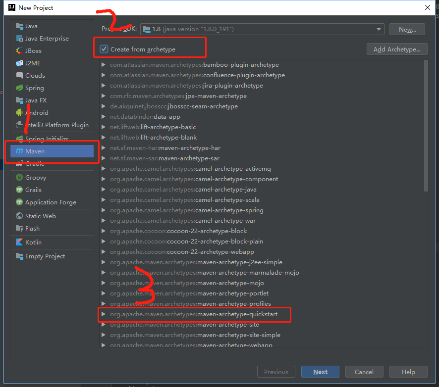
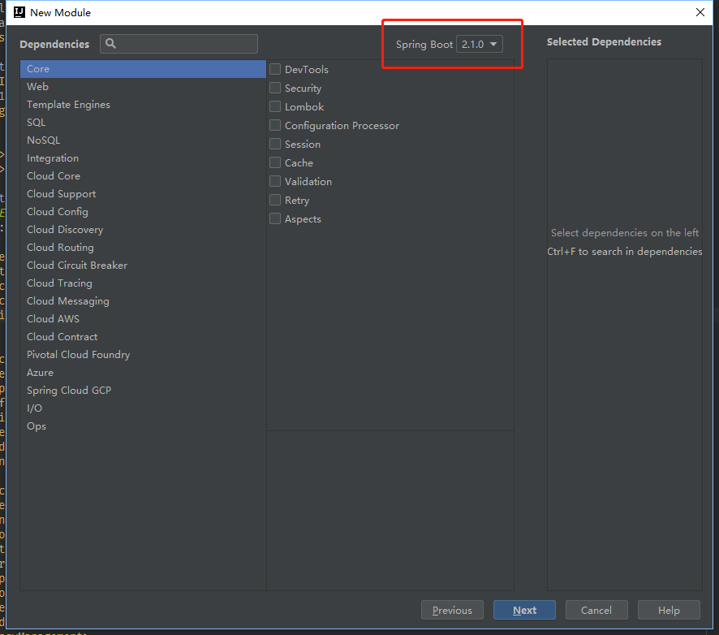
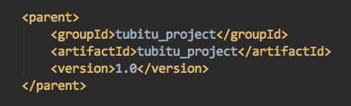

## 概述
dubbo是目前国内最广泛的rpc框架，官网：
http://dubbo.apache.org/zh-cn/index.html
dubbo常用于soa架构，soa架构和微服务架构均是分布式系统的两种实践，从某种程度而言，soa架构是微服务架构的超集，或者说微服务是soa的一个变种。

SOA | 微服务
-- | --
应用程序服务的可重用性的最大化 | 专注于解耦
系统性的改变需要修改整体 | 系统性的改变是创建一个新的服务
DevOps和持续交付正在变得流行，但还不是主流 | 强烈关注DevOps和持续交付
专注于业务功能重用 | 更重视“上下文边界，服务粒度”的概念
通信使用企业服务总线ESB | 对于通信而言，使用较少精细和简单的消息系统
支持多种消息协议 | 使用轻量级协议，例如HTTP，REST或Thrift API
对部署到它的所有服务使用通用平台 | 应用程序服务器不是真的被使用，通常使用云平台
容器（如Docker）的使用不太受欢迎 | 容器在微服务方面效果很好
SOA服务共享数据存储 | 每个微服务可以有一个独立的数据存储
共同的治理和标准 | 轻松的治理，更加关注团队协作和选择自由

### 项目搭建：准备工作
1.idea
2.jdk


dubbo 2.6.2 + spring boot 1.5.10.RELEASE
#### 1.搭建父项目
File->New->Project
类型选择maven，然后勾选Create from archetype，选择maven-archetype-quickstart，
生成一个普通的maven项目，填写maven仓库坐标即可一路点击完成.

idea已经集成了maven的环境，默认的jar包存放目录在
C:\Users\wjy\.m2

如果有src目录，可以直接删除，因为我们搭建的是父项目，不需要存放源码。
然后打开父项目的pom文件，新建packaging标签，内容为pom，表示父项目只提供pom依赖。

#### 2.搭建spring boot子模块
注意：
common模块：存放实体类、dao接口、mapper文件；
service模块：存放service接口；
util模块：存放工具类；
上面三个模块，只需要建成普通的maven模块就好，不需要spring initializer。
即New->module，选择Maven,勾选右侧的Create from archetype，选择maven-archetype-quickstart，artifactId填写子模块名称，然后一路next直到finsh。
如果不小心建错了，需要将启动类和配置文件以及对应的文件夹，以及pom中的boot相关的jar包删除。

在父项目上右键
New->module，选择spring initializer，点击next，
在new module窗口上，Group需要与父项目的groupId保持一致，artifact为项目名，即子模块的名字。
并填写好name和packge(应该在填好artifact之后自动填好了，无需变更)，packaging根据需要可以填写jar、war等包类型，推荐使用jar包。全部填好后，点击next。


然后无需勾选任何组件，因为我们的子模块是依赖父项目的，我们会将依赖配置在父项目的pom文件中。
注意本页面右上角的spring boot的版本，目前最新版是2.1.0，这个版本后续可以在pom文件中修改。


然后点击下一步，点击Finsh.


#### 3.父子关联
重复第二步，创建自己需要的各个模块，结构如下：


在父项目的pom文件中增加modules标签，然后将module与子项目的artifactId一一关联。


然后，分别在子模块的pom文件中，与父项目关联。



此时会发现，子模块的parent标签不再依赖spring boot的pom文件了，因为我们将依赖指向了父项目。
原来的子模块pom文件依赖：

现在还需要在父项目的pom文件中，加入如下代码：
```
<dependencyManagement>
    <dependencies>
      <dependency>
        <groupId>org.springframework.boot</groupId>
        <artifactId>spring-boot-dependencies</artifactId>
        <version>1.5.10.RELEASE</version>
        <type>pom</type>
        <scope>import</scope>
      </dependency>
    </dependencies>
  </dependencyManagement>
```

#### 4.依赖统一管理
在父项目的pom文件中定义公共jar包或框架的统一版本，只定义而不引入，在子模块中引入。
例如：
在父项目的pom文件中配置统一属性：
properties标签下：
```
<properties>
        <tubitu.version>1.0</tubitu.version>
        <project.build.sourceEncoding>UTF-8</project.build.sourceEncoding>
        <project.reporting.outputEncoding>UTF-8</project.reporting.outputEncoding>
        <java.version>1.8</java.version>
        <mybatis.version>3.4.6</mybatis.version>
        <spring.version>4.3.14.RELEASE</spring.version>
        <!--项目基本依赖-->
        <slf4j.version>1.7.7</slf4j.version>
        <log4j.version>1.2.12</log4j.version>
        <aspectj.version>1.7.2</aspectj.version>
        <mysql-connector-java.version>5.1.38</mysql-connector-java.version>
        <rocketmq.version>4.3.0</rocketmq.version>
        <fasterxml.jackson.version>2.5.0</fasterxml.jackson.version>
        <javax.servlet.version>3.1.0</javax.servlet.version>
        <!--分布式配置中心-->
        <apollo.client.version>1.0.0</apollo.client.version>
        <!--dubbo依赖-->
        <curator.version>2.12.0</curator.version>
        <zookeeper.version>3.4.10</zookeeper.version>
        <dubbo.version>2.6.2</dubbo.version>
        <!--spring boot所需依赖-->
        <mybatis.starter.version>1.3.2</mybatis.starter.version>
        <pagehelper.starter.version>1.2.3</pagehelper.starter.version>
        <druid.starter.version>1.1.0</druid.starter.version>
        <spring.data.version>1.8.10.RELEASE</spring.data.version>
</properties>
```
定义依赖：
dependencyManagement标签下：
```
<dependencyManagement>
        <!--定义全局公用的一些依赖，此处只定义依赖而不引入-->
        <dependencies>
            <dependency>
                <groupId>org.springframework.boot</groupId>
                <artifactId>spring-boot-dependencies</artifactId>
                <version>1.5.10.RELEASE</version>
                <type>pom</type>
                <scope>import</scope>
            </dependency>


            <dependency>
                <groupId>org.mybatis.spring.boot</groupId>
                <artifactId>mybatis-spring-boot-starter</artifactId>
                <version>${mybatis.starter.version}</version>
            </dependency>

        </dependencies>
    </dependencyManagement>
```
在子模块中，直接引入，无需定义版本
dependencies标签下
```
<dependencies>

        <dependency>
            <groupId>mysql</groupId>
            <artifactId>mysql-connector-java</artifactId>
        </dependency>

        <dependency>
            <groupId>javax.servlet</groupId>
            <artifactId>javax.servlet-api</artifactId>
        </dependency>
        
        <dependency>
            <groupId>org.mybatis.spring.boot</groupId>
            <artifactId>mybatis-spring-boot-starter</artifactId>
        </dependency>

        <dependency>
            <groupId>com.alibaba</groupId>
            <artifactId>dubbo</artifactId>
        </dependency>

    </dependencies>
```

### 集成dubbo或cloud
#### dubbo集成
dubbo的配置方式有四种，分别是xml配置、api配置和注解配置，现简单介绍注解配置。
使用方式请移步官网：http://dubbo.apache.org/zh-cn/docs/user/configuration/properties.html
不推荐使用xml配置。

首先在父项目pom中引入dubbo。
properties
`<dubbo.version>2.6.2</dubbo.version>`

dependencyManagement->dependencies
```
<dependency>
  <groupId>com.alibaba</groupId>
  <artifactId>dubbo</artifactId>
  <version>${dubbo.version}</version>
</dependency>
```
然后在子项目中具体引入
```
<dependency>
    <groupId>com.alibaba</groupId>
    <artifactId>dubbo</artifactId>
</dependency>
```

提供者(provider)配置：
```
@Configuration
public class DubboConfig {
    @ApolloConfig
    private Config config;

    /**
     *@Author: 刘会俊
     *@Description: dubbo.application配置
     *@Params []
     *@Return com.alibaba.dubbo.config.ApplicationConfig
     */
    @Bean
    public ApplicationConfig applicationConfig() {
        ApplicationConfig applicationConfig = new ApplicationConfig();
        applicationConfig.setId(config.getProperty("dubbo.application.id","provider_mall"));
        applicationConfig.setName(config.getProperty("dubbo.application.name","provider_mall"));
        applicationConfig.setQosEnable(config.getBooleanProperty("dubbo.application.qos.enable",false));
        applicationConfig.setQosPort(config.getIntProperty("dubbo.application.qos.port",22222));
        return applicationConfig;

    }

    /**
     *@Author: 刘会俊
     *@Description: dubbo.registry配置
     *@Params []
     *@Return com.alibaba.dubbo.config.RegistryConfig
     */
    @Bean
    public RegistryConfig registryConfig() {
        RegistryConfig registryConfig = new RegistryConfig();
        registryConfig.setAddress(config.getProperty("dubbo.registry.address","zookeeper://127.0.0.1:2181"));
        registryConfig.setCheck(config.getBooleanProperty("dubbo.registry.check",true));
        return registryConfig;
    }

    /**
     *@Author: 刘会俊
     *@Description: dubbo.protocol配置
     *@Params []
     *@Return com.alibaba.dubbo.config.ProtocolConfig
     */
    @Bean
    public ProtocolConfig protocolConfig() {
        ProtocolConfig protocolConfig = new ProtocolConfig();
        protocolConfig.setId(config.getProperty("dubbo.protocol.id","dubbo"));
        protocolConfig.setName(config.getProperty("dubbo.protocol.name","dubbo"));
        protocolConfig.setPort(config.getIntProperty("dubbo.protocol.port",20880));
        return protocolConfig;
    }

    /**
     *@Author: 刘会俊
     *@Description: dubbo.provider配置
     *@Params []
     *@Return com.alibaba.dubbo.config.ProviderConfig
     */
    @Bean
    public ProviderConfig providerConfig(){
        ProviderConfig providerConfig = new ProviderConfig();
        providerConfig.setVersion(config.getProperty("dubbo.provider.version", "1.0.0"));
        return providerConfig;
    }
    
}
```
同时修改启动类如下：
```
@MapperScan("com.tubitu.mapper")
@SpringBootApplication
@EnableTransactionManagement
@EnableAspectJAutoProxy
public class ProviderUserApplication {
public static void main(String[] args) {
new SpringApplicationBuilder(ProviderUserApplication.class).web(false).run(args);
}
}
```

消费者(consumer)配置：
```
@Configuration
public class DubboConfig {
    @ApolloConfig
    private Config config;

    /**
     * @Author: 刘会俊
     * @Description: dubbo.application配置
     * @Params []
     * @Return com.alibaba.dubbo.config.ApplicationConfig
     */
    @Bean
    public ApplicationConfig applicationConfig() {
        ApplicationConfig applicationConfig = new ApplicationConfig();
        applicationConfig.setId(config.getProperty("dubbo.application.id", "consumer_api"));
        applicationConfig.setName(config.getProperty("dubbo.application.name", "consumer_api"));
        applicationConfig.setQosEnable(config.getBooleanProperty("dubbo.application.qos.enable", false));
        applicationConfig.setQosPort(config.getIntProperty("dubbo.application.qos.port", 22222));
        return applicationConfig;

    }

    /**
     * @Author: 刘会俊
     * @Description: dubbo.registry配置
     * @Params []
     * @Return com.alibaba.dubbo.config.RegistryConfig
     */
    @Bean
    public RegistryConfig registryConfig() {
        RegistryConfig registryConfig = new RegistryConfig();
        registryConfig.setAddress(config.getProperty("dubbo.registry.address", "zookeeper://127.0.0.1:2181"));
        registryConfig.setCheck(config.getBooleanProperty("dubbo.registry.check", true));
        return registryConfig;
    }

    /**
     * @Author: 刘会俊
     * @Description: dubbo.protocol配置
     * @Params []
     * @Return com.alibaba.dubbo.config.ProtocolConfig
     */
    @Bean
    public ProtocolConfig protocolConfig() {
        ProtocolConfig protocolConfig = new ProtocolConfig();
        protocolConfig.setId(config.getProperty("dubbo.protocol.id", "dubbo"));
        protocolConfig.setName(config.getProperty("dubbo.protocol.name", "dubbo"));
        protocolConfig.setPort(config.getIntProperty("dubbo.protocol.port", 20880));
        return protocolConfig;
    }

    /**
     * @Author: 刘会俊
     * @Description: dubbo.consumer配置
     * @Params []
     * @Return com.alibaba.dubbo.config.ConsumerConfig
     */
    @Bean
    public ConsumerConfig consumerConfig() {
        ConsumerConfig consumerConfig = new ConsumerConfig();
        consumerConfig.setTimeout(config.getIntProperty("dubbo.consumer.timeout", 3000));
        consumerConfig.setCheck(config.getBooleanProperty("dubbo.consumer.check", true));
        consumerConfig.setVersion(config.getProperty("dubbo.consumer.version", "1.0.0"));
        return consumerConfig;
    }

}
```

要注意，我们的配置的具体参数是从ApolloConfig中拉取下来的。
请参考博客中applo的文章。

#### cloud集成
首先在父项目pom中引入cloud，
1.properties标签下指定版本号，截至2019/2/19，版本号为：Greenwich.RELEASE
`<spring-cloud.version>Greenwich.RELEASE</spring-cloud.version>`
```

2.dependencyManagement->dependencies标签下，定义cloud依赖
<dependency>
	<groupId>org.springframework.cloud</groupId>
	<artifactId>spring-cloud-dependencies</artifactId>
	<version>${spring-cloud.version}</version>
	<type>pom</type>
	<scope>import</scope>
</dependency>
```

3.然后在子模块中具体引入cloud
```
<dependency>
	<groupId>org.springframework.cloud</groupId>
	<artifactId>spring-cloud-starter</artifactId>
</dependency>
```

4.服务注册发现中心，我们使用的是consul，由于eureka2.x之后官方说明已经不再开源，所以我不想用。
直接在需要注册服务的子模块中引入consul：
```
<!-- Spring Cloud Consul 的支持 -->
<dependency>
	<groupId>org.springframework.cloud</groupId>
	<artifactId>spring-cloud-starter-consul-discovery</artifactId>
</dependency>

<!--  健康检查依赖于此包 -->
<dependency>
	<groupId>org.springframework.boot</groupId>
	<artifactId>spring-boot-starter-actuator</artifactId>
	<scope>compile</scope>
</dependency>
```

5.修改启动器类，添加 @EnableDiscoveryClient 注解，开启服务发现支持
`@EnableDiscoveryClient`

6.编写配置文件
spring boot生成的是application.properties，这里我们将后缀改为.yml，这种风格更加有层次。
配置如下：
```
server:
  port: 8510  #当前服务的端口号
spring:
  application:
    name: yuan_service_api
  cloud:
    consul:
      host: localhost
      port: 8500  #Consul监听端口8500
      enabled: true
      discovery:
        register: true #配置服务注册到Consul上
        health-check-path: /actuator/health #配置服务健康检测地址  供Consul 调用
        health-check-interval: 15s        # consul 健康检测频率
        enabled: true
        instance-id: ${spring.application.name}:${server.port}  #配置注册到consul 服务的id
        #指注册到 Consul 的服务名称，后期客户端会根据这个名称来进行服务调用，为确保Consul实例ID的唯一性，采用如下方式
        serviceName: ${spring.application.name}:${vcap.application.instance_id:${spring.application.instance_id:${random.value}}}
```
需要注意：
.冒号后边必须跟一个空格，不是tab
.注意缩进，稍有不慎就会报错

7.官网下载consul客户端
https://www.consul.io/downloads.html
下载好解压到理想的位置(只有一个.exe文件)，然后设置环境变量，在系统变量的path下添加解压好consul的位置

8.启动consul
需要cmd启动，直接双击.exe都是闪退的。
启动指令：
`consul agent -dev`

结束指令：
`consul leave`
这些指令在linux,mac上同样有效

为了方便，我们在存放consul的根目录新建一个bat脚本，脚本内容如下：
```
consul agent -dev
pause
```
然后将脚本快捷方式发送到桌面，这样就省了每次都去cmd启动consul了。
控制台会提示：
```
Starting Consul agent...
Consul agent running!
```
这样就是启动成功了。然后浏览器访问localhost:8500，8500为consul的默认端口，就可以看到consul的控制面板了。
注：consul服务会占用8502接口，所以不要用8501、8502端口。

9.启动配置好的子模块的启动类。
如果启动成功，刷新consul的控制台，就可以看到我们的服务已经注册到consul上了。

10.测试
在提供者的模块中新建 HelloController，提供 hello 接口， 返回 hello consul 字符串。
```
@RestController
public class HelloController {
    @RequestMapping("/hello")
    public String hello() {
        return "hello consul.";
    }
}
```
服务注册发现中心有了，服务提供者也有了，现在我们来开发服务消费者。

11.Consul 消费者

### 2.事务配置
启用事务需要使用cglib的方式实现aop代理：
`spring.aop.proxy-target-class=true`
在启动类加入下面两个注解：
```
@EnableTransactionManagement
@EnableAspectJAutoProxy
```
在实现类上加上注解：
`@Transactional(rollbackFor = Exception.class)`

