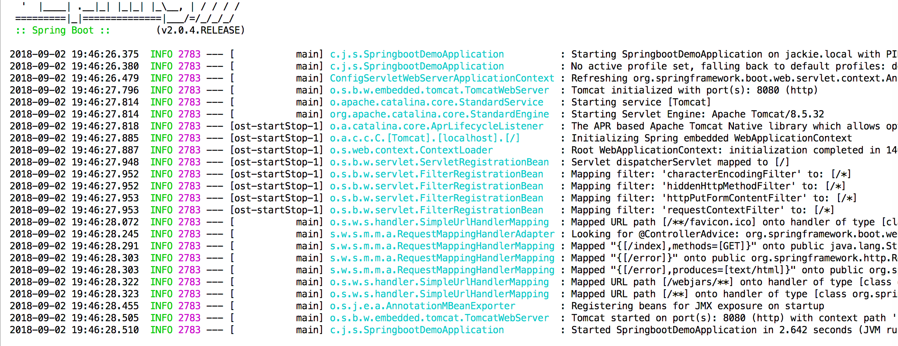

# 文件上传功能
## 创建一个简单的包含WEB依赖的SpringBoot项目
```xml
<!-- Spring Boot web启动器 -->
<dependency>
    <groupId>org.springframework.boot</groupId>
    <artifactId>spring-boot-starter-web</artifactId>
</dependency>

<!-- jsp -->
<dependency>
    <groupId>javax.servlet</groupId>
    <artifactId>jstl</artifactId>
</dependency>
<dependency>
    <groupId>org.apache.tomcat.embed</groupId>
    <artifactId>tomcat-embed-jasper</artifactId>
    <!--<scope>provided</scope>-->
</dependency>
```

## 配置文件上传的文件大小限制
```
# 上传文件总的最大值
spring.servlet.multipart.max-request-size=10MB
# 单个文件的最大值
spring.servlet.multipart.max-file-size=10MB

## jsp
spring.mvc.view.prefix=/WEB-INF/jsp/
spring.mvc.view.suffix=.jsp

#配置外部访问文件（把上传的图片视频文件放到E盘下的fileUpload文件夹下，linux需要更改为linux路径）
cbs.imagesPath=file:/E:/fileUpload/
```

## 单文件上传示例
```java
package com.songguoliang.springboot.controller;

import org.slf4j.Logger;
import org.slf4j.LoggerFactory;
import org.springframework.stereotype.Controller;
import org.springframework.web.bind.annotation.GetMapping;
import org.springframework.web.bind.annotation.PostMapping;
import org.springframework.web.bind.annotation.RequestParam;
import org.springframework.web.bind.annotation.ResponseBody;
import org.springframework.web.multipart.MultipartFile;
import org.springframework.web.multipart.MultipartHttpServletRequest;

import javax.servlet.http.HttpServletRequest;
import java.io.File;
import java.io.IOException;
import java.util.List;

/**
 * @Description
 * @Author sgl
 * @Date 2018-05-15 14:04
 */
@Controller
public class UploadController {
    private static final Logger LOGGER = LoggerFactory.getLogger(UploadController.class);

    @GetMapping("/upload")
    public String upload() {
        return "upload";
    }

    @PostMapping("/upload")
    @ResponseBody
    public String upload(@RequestParam("file") MultipartFile file) {
        if (file.isEmpty()) {
            return "上传失败，请选择文件";
        }

        String fileName = file.getOriginalFilename();
		//String filePath = "D:/fileUpload/";   这是windows的路径
        String filePath = "/Users/itinypocket/workspace/temp/";
        File dest = new File(filePath + fileName);
        try {
            file.transferTo(dest);
            LOGGER.info("上传成功");
            return "上传成功";
        } catch (IOException e) {
            LOGGER.error(e.toString(), e);
        }
        return "上传失败！";
    }

    
}
```

### 创建upload.jsp文件
只有一个表单，选择文件，form的enctype为multipart/form-data:
```html
<%@ page contentType="text/html;charset=UTF-8" pageEncoding="UTF-8" %>
<!DOCTYPE html>
<html>
<head>
    <meta http-equiv="Content-type" content="text/html; charset=UTF-8">
    <meta http-equiv="X-UA-Compatible" content="IE=edge,chrome=1"/>
    <title>单文件上传</title>
</head>
<body>
<form method="post" action="/upload" enctype="multipart/form-data">
    <input type="file" name="file"><br>
    <input type="submit" value="提交">
</form>
</body>
</html>
```

### 通过springboot插件启动项目
浏览器输入`http://localhost:8080/upload`跳转到刚写的jsp页面。
选择文件点击提交按钮返回成功信息，我们上传的文件保存在/Users/itinypocket/workspace/temp路径下，然后上传成功。

## 多文件上传
创建多文件上传的jsp页面，多文件上传页面只是比单文件上传多了file选择的input而已，multiUpload.jsp内容如下：
```html
<%@ page contentType="text/html;charset=UTF-8" pageEncoding="UTF-8" %>
<!DOCTYPE html>
<html>
<head>
    <meta http-equiv="Content-type" content="text/html; charset=UTF-8">
    <meta http-equiv="X-UA-Compatible" content="IE=edge,chrome=1"/>
    <title>多文件上传</title>
</head>
<body>
<form method="post" action="/multiUpload" enctype="multipart/form-data">
    <input type="file" name="file"><br>
    <input type="file" name="file"><br>
    <input type="file" name="file"><br>
    <input type="submit" value="提交">
</form>
</body>
</html>
```

### 在UploadController里添加多文件上传的方法
```java
@GetMapping("/multiUpload")
public String multiUpload() {
    return "multiUpload";
}

@ResponseBody
@PostMapping("/multiUpload")
public String multiUpload(MultipartFile[] files) {
	//String filePath = "D:/fileUpload/";   这是windows的路径
    String filePath = "/Users/itinypocket/workspace/temp/";
    for (int i = 0; i < files.size(); i++) {
        MultipartFile file = files.get(i);
        if (file.isEmpty()) {
            return "上传第" + (i++) + "个文件失败";
        }
        String fileName = file.getOriginalFilename();

        File dest = new File(filePath + fileName);
		System.out.println( "文件大小是：" +files[i].getSize() + "byte");
        try {
            file.transferTo(dest);
            LOGGER.info("第" + (i + 1) + "个文件上传成功");
        } catch (IOException e) {
            LOGGER.error(e.toString(), e);
            return "上传第" + (i++) + "个文件失败";
        }
    }
    return "上传成功";
}
```
重启服务，浏览器输入`http://localhost:8080/multiUpload`然后选择要上传的文件，点击提交按钮，得到成功信息。
我们选择的三个文件已被成功上传到/Users/itinypocket/workspace/temp路径下。

多文件上传的方法只是最基础的版本，没有加入文件存在判断，文件夹不存在判断等，可以根据自己的需求改造。
其实只需要一个多文件上传就足够了，毕竟多文件包含了单文件，另外上面的多文件上传方法还可以当作文件上传接口使用，下面就用postman来测试这个接口。

`file.getSize()`方法可以直接获取到文件的大小， 单位是字节，可以转换成自己想要的单位。
下面转换成mb，保留两位小数：
`new BigDecimal(files[i].getSize()).divide(BigDecimal.valueOf(1024*1024),2,BigDecimal.ROUND_HALF_UP)`

配置外部访问服务器资源的。不配置的话，访问不了图片或视频等文件。
```java
import org.slf4j.LoggerFactory;
import org.springframework.beans.factory.annotation.Value;
import org.springframework.boot.web.servlet.MultipartConfigFactory;
import org.springframework.context.annotation.Bean;
import org.springframework.context.annotation.Configuration;
import org.springframework.web.servlet.config.annotation.*;
 
import javax.servlet.MultipartConfigElement;
 
//上传配置类
//图片放到/F:/fileUpload/后，从磁盘读取的图片数据scr将会变成images/picturename.jpg的格式
@Configuration
public class WebAppConfig extends WebMvcConfigurerAdapter {
//public class WebAppConfig extends WebMvcConfigurationSupport {
    /**
     * 在配置文件中配置的文件保存路径
     */
    @Value("${cbs.imagesPath}")
    private String mImagesPath;
 
    @Bean
    public MultipartConfigElement multipartConfigElement(){
        MultipartConfigFactory factory = new MultipartConfigFactory();
        //文件最大KB,MB
        factory.setMaxFileSize("1024MB");
        //设置总上传数据总大小
        factory.setMaxRequestSize("1024MB");
        return factory.createMultipartConfig();
    }
 
    @Override
    public void addResourceHandlers(ResourceHandlerRegistry registry) {
        if(mImagesPath.equals("") || mImagesPath.equals("${cbs.imagesPath}")){
            String imagesPath = WebAppConfig.class.getClassLoader().getResource("").getPath();
            System.out.print("1.上传配置类imagesPath=="+imagesPath+"\n");
            if(imagesPath.indexOf(".jar")>0){
                imagesPath = imagesPath.substring(0, imagesPath.indexOf(".jar"));
            }else if(imagesPath.indexOf("classes")>0){
                imagesPath = "file:"+imagesPath.substring(0, imagesPath.indexOf("classes"));
            }
            imagesPath = imagesPath.substring(0, imagesPath.lastIndexOf("/"))+"/images/";
            mImagesPath = imagesPath;
        }
        System.out.print("imagesPath============="+mImagesPath+"\n");
        //LoggerFactory.getLogger(WebAppConfig.class).info("imagesPath============="+mImagesPath+"\n");
        registry.addResourceHandler("/images/**").addResourceLocations(mImagesPath);
        // TODO Auto-generated method stub
        System.out.print("2.上传配置类mImagesPath=="+mImagesPath+"\n");
        super.addResourceHandlers(registry);
    }
 
}
```

[参考地址1](https://blog.csdn.net/gnail_oug/article/details/80324120)
[参考地址2](https://blog.csdn.net/qq_37164847/article/details/81668242)

## postMan测试文件上传
- 选择post请求方式，输入请求地址

- 填写Headers
Key：Content-Type
Value：multipart/form-data

- 填写body
选择form-data，然后鼠标悬浮在输入框的末尾，默认Text，这里我们选择File。

注意：form-data的key值，一定要和controller参数的名字一致。

# 导出excel
- 添加maven
```
<dependency>
    <groupId>org.apache.poi</groupId>
    <artifactId>poi</artifactId>
    <version>3.13</version>
</dependency>
<dependency>
    <groupId>org.apache.poi</groupId>
    <artifactId>poi-ooxml</artifactId>
    <version>3.13</version>
</dependency>
```

- 自定义实体类所需要的bean：ExcelColumn
```java
@Target({ElementType.FIELD})
@Retention(RetentionPolicy.RUNTIME)
@Documented
public @interface ExcelColumn {

    String value() default "";

    int col() default 0;
}
```

- ExcelUtils编写
```java
import org.apache.commons.collections.CollectionUtils;
import org.apache.commons.lang3.BooleanUtils;
import org.apache.commons.lang3.CharUtils;
import org.apache.commons.lang3.StringUtils;
import org.apache.commons.lang3.math.NumberUtils;
import org.apache.poi.hssf.usermodel.HSSFDateUtil;
import org.apache.poi.hssf.usermodel.HSSFWorkbook;
import org.apache.poi.ss.usermodel.*;
import org.apache.poi.xssf.usermodel.XSSFWorkbook;
import org.slf4j.Logger;
import org.slf4j.LoggerFactory;
import org.springframework.http.MediaType;
import org.springframework.web.multipart.MultipartFile;

import javax.servlet.http.HttpServletResponse;
import java.io.File;
import java.io.FileOutputStream;
import java.io.IOException;
import java.io.InputStream;
import java.lang.reflect.Constructor;
import java.lang.reflect.Field;
import java.math.BigDecimal;
import java.net.URLEncoder;
import java.util.*;
import java.util.concurrent.atomic.AtomicInteger;
import java.util.stream.Collectors;
import java.util.stream.Stream;

/**
 * @author Abbot
 * @description
 * @date 2018/9/12 15:27
 **/
public class ExcelUtils {

    private final static Logger log = LoggerFactory.getLogger(ExcelUtils.class);

    private final static String EXCEL2003 = "xls";
    private final static String EXCEL2007 = "xlsx";

    public static <T> List<T> readExcel(String path, Class<T> cls,MultipartFile file){

        String fileName = file.getOriginalFilename();
        if (!fileName.matches("^.+\\.(?i)(xls)$") && !fileName.matches("^.+\\.(?i)(xlsx)$")) {
            log.error("上传文件格式不正确");
        }
        List<T> dataList = new ArrayList<>();
        Workbook workbook = null;
        try {
            InputStream is = file.getInputStream();
            if (fileName.endsWith(EXCEL2007)) {
//                FileInputStream is = new FileInputStream(new File(path));
                workbook = new XSSFWorkbook(is);
            }
            if (fileName.endsWith(EXCEL2003)) {
//                FileInputStream is = new FileInputStream(new File(path));
                workbook = new HSSFWorkbook(is);
            }
            if (workbook != null) {
                //类映射  注解 value-->bean columns
                Map<String, List<Field>> classMap = new HashMap<>();
                List<Field> fields = Stream.of(cls.getDeclaredFields()).collect(Collectors.toList());
                fields.forEach(
                        field -> {
                            ExcelColumn annotation = field.getAnnotation(ExcelColumn.class);
                            if (annotation != null) {
                                String value = annotation.value();
                                if (StringUtils.isBlank(value)) {
                                    return;//return起到的作用和continue是相同的 语法
                                }
                                if (!classMap.containsKey(value)) {
                                    classMap.put(value, new ArrayList<>());
                                }
                                field.setAccessible(true);
                                classMap.get(value).add(field);
                            }
                        }
                );
                //索引-->columns
                Map<Integer, List<Field>> reflectionMap = new HashMap<>(16);
                //默认读取第一个sheet
                Sheet sheet = workbook.getSheetAt(0);

                boolean firstRow = true;
                for (int i = sheet.getFirstRowNum(); i <= sheet.getLastRowNum(); i++) {
                    Row row = sheet.getRow(i);
                    //首行  提取注解
                    if (firstRow) {
                        for (int j = row.getFirstCellNum(); j <= row.getLastCellNum(); j++) {
                            Cell cell = row.getCell(j);
                            String cellValue = getCellValue(cell);
                            if (classMap.containsKey(cellValue)) {
                                reflectionMap.put(j, classMap.get(cellValue));
                            }
                        }
                        firstRow = false;
                    } else {
                        //忽略空白行
                        if (row == null) {
                            continue;
                        }
                        try {
                            T t = cls.newInstance();
                            //判断是否为空白行
                            boolean allBlank = true;
                            for (int j = row.getFirstCellNum(); j <= row.getLastCellNum(); j++) {
                                if (reflectionMap.containsKey(j)) {
                                    Cell cell = row.getCell(j);
                                    String cellValue = getCellValue(cell);
                                    if (StringUtils.isNotBlank(cellValue)) {
                                        allBlank = false;
                                    }
                                    List<Field> fieldList = reflectionMap.get(j);
                                    fieldList.forEach(
                                            x -> {
                                                try {
                                                    handleField(t, cellValue, x);
                                                } catch (Exception e) {
                                                    log.error(String.format("reflect field:%s value:%s exception!", x.getName(), cellValue), e);
                                                }
                                            }
                                    );
                                }
                            }
                            if (!allBlank) {
                                dataList.add(t);
                            } else {
                                log.warn(String.format("row:%s is blank ignore!", i));
                            }
                        } catch (Exception e) {
                            log.error(String.format("parse row:%s exception!", i), e);
                        }
                    }
                }
            }
        } catch (Exception e) {
            log.error(String.format("parse excel exception!"), e);
        } finally {
            if (workbook != null) {
                try {
                    workbook.close();
                } catch (Exception e) {
                    log.error(String.format("parse excel exception!"), e);
                }
            }
        }
        return dataList;
    }

    private static <T> void handleField(T t, String value, Field field) throws Exception {
        Class<?> type = field.getType();
        if (type == null || type == void.class || StringUtils.isBlank(value)) {
            return;
        }
        if (type == Object.class) {
            field.set(t, value);
            //数字类型
        } else if (type.getSuperclass() == null || type.getSuperclass() == Number.class) {
            if (type == int.class || type == Integer.class) {
                field.set(t, NumberUtils.toInt(value));
            } else if (type == long.class || type == Long.class) {
                field.set(t, NumberUtils.toLong(value));
            } else if (type == byte.class || type == Byte.class) {
                field.set(t, NumberUtils.toByte(value));
            } else if (type == short.class || type == Short.class) {
                field.set(t, NumberUtils.toShort(value));
            } else if (type == double.class || type == Double.class) {
                field.set(t, NumberUtils.toDouble(value));
            } else if (type == float.class || type == Float.class) {
                field.set(t, NumberUtils.toFloat(value));
            } else if (type == char.class || type == Character.class) {
                field.set(t, CharUtils.toChar(value));
            } else if (type == boolean.class) {
                field.set(t, BooleanUtils.toBoolean(value));
            } else if (type == BigDecimal.class) {
                field.set(t, new BigDecimal(value));
            }
        } else if (type == Boolean.class) {
            field.set(t, BooleanUtils.toBoolean(value));
        } else if (type == Date.class) {
            //
            field.set(t, value);
        } else if (type == String.class) {
            field.set(t, value);
        } else {
            Constructor<?> constructor = type.getConstructor(String.class);
            field.set(t, constructor.newInstance(value));
        }
    }

    private static String getCellValue(Cell cell) {
        if (cell == null) {
            return "";
        }
        if (cell.getCellType() == Cell.CELL_TYPE_NUMERIC) {
            if (DateUtil.isCellDateFormatted(cell)) {
                return HSSFDateUtil.getJavaDate(cell.getNumericCellValue()).toString();
            } else {
                return new BigDecimal(cell.getNumericCellValue()).toString();
            }
        } else if (cell.getCellType() == Cell.CELL_TYPE_STRING) {
            return StringUtils.trimToEmpty(cell.getStringCellValue());
        } else if (cell.getCellType() == Cell.CELL_TYPE_FORMULA) {
            return StringUtils.trimToEmpty(cell.getCellFormula());
        } else if (cell.getCellType() == Cell.CELL_TYPE_BLANK) {
            return "";
        } else if (cell.getCellType() == Cell.CELL_TYPE_BOOLEAN) {
            return String.valueOf(cell.getBooleanCellValue());
        } else if (cell.getCellType() == Cell.CELL_TYPE_ERROR) {
            return "ERROR";
        } else {
            return cell.toString().trim();
        }

    }

    public static <T> void writeExcel(HttpServletResponse response, List<T> dataList, Class<T> cls){
        Field[] fields = cls.getDeclaredFields();
        List<Field> fieldList = Arrays.stream(fields)
                .filter(field -> {
                    ExcelColumn annotation = field.getAnnotation(ExcelColumn.class);
                    if (annotation != null && annotation.col() > 0) {
                        field.setAccessible(true);
                        return true;
                    }
                    return false;
                }).sorted(Comparator.comparing(field -> {
                    int col = 0;
                    ExcelColumn annotation = field.getAnnotation(ExcelColumn.class);
                    if (annotation != null) {
                        col = annotation.col();
                    }
                    return col;
                })).collect(Collectors.toList());

        Workbook wb = new XSSFWorkbook();
        Sheet sheet = wb.createSheet("Sheet1");
        AtomicInteger ai = new AtomicInteger();
        {
            Row row = sheet.createRow(ai.getAndIncrement());
            AtomicInteger aj = new AtomicInteger();
            //写入头部
            fieldList.forEach(field -> {
                ExcelColumn annotation = field.getAnnotation(ExcelColumn.class);
                String columnName = "";
                if (annotation != null) {
                    columnName = annotation.value();
                }
                Cell cell = row.createCell(aj.getAndIncrement());

                CellStyle cellStyle = wb.createCellStyle();
                cellStyle.setFillForegroundColor(IndexedColors.WHITE.getIndex());
                cellStyle.setFillPattern(CellStyle.SOLID_FOREGROUND);
                cellStyle.setAlignment(CellStyle.ALIGN_CENTER);

                Font font = wb.createFont();
                font.setBoldweight(Font.BOLDWEIGHT_NORMAL);
                cellStyle.setFont(font);
                cell.setCellStyle(cellStyle);
                cell.setCellValue(columnName);
            });
        }
        if (CollectionUtils.isNotEmpty(dataList)) {
            dataList.forEach(t -> {
                Row row1 = sheet.createRow(ai.getAndIncrement());
                AtomicInteger aj = new AtomicInteger();
                fieldList.forEach(field -> {
                    Class<?> type = field.getType();
                    Object value = "";
                    try {
                        value = field.get(t);
                    } catch (Exception e) {
                        e.printStackTrace();
                    }
                    Cell cell = row1.createCell(aj.getAndIncrement());
                    if (value != null) {
                        if (type == Date.class) {
                            cell.setCellValue(value.toString());
                        } else {
                            cell.setCellValue(value.toString());
                        }
                        cell.setCellValue(value.toString());
                    }
                });
            });
        }
        //冻结窗格
        wb.getSheet("Sheet1").createFreezePane(0, 1, 0, 1);
        //浏览器下载excel
        buildExcelDocument("abbot.xlsx",wb,response);
        //生成excel文件
//        buildExcelFile(".\\default.xlsx",wb);
    }

    /**
     * 浏览器下载excel
     * @param fileName
     * @param wb
     * @param response
     */

    private static  void  buildExcelDocument(String fileName, Workbook wb,HttpServletResponse response){
        try {
            response.setContentType(MediaType.APPLICATION_OCTET_STREAM_VALUE);
            response.setHeader("Content-Disposition", "attachment;filename="+URLEncoder.encode(fileName, "utf-8"));
            response.flushBuffer();
            wb.write(response.getOutputStream());
        } catch (IOException e) {
            e.printStackTrace();
        }
    }

    /**
     * 生成excel文件
     * @param path 生成excel路径
     * @param wb
     */
    private static  void  buildExcelFile(String path, Workbook wb){

        File file = new File(path);
        if (file.exists()) {
            file.delete();
        }
        try {
            wb.write(new FileOutputStream(file));
        } catch (Exception e) {
            e.printStackTrace();
        }
    }
}
```

- 定义导出实体类
```java
public class BusClick {

    @ExcelColumn(value = "cityCode", col = 1)
    private String cityCode;

    @ExcelColumn(value = "markId", col = 2)
    private String markId;

    @ExcelColumn(value = "toaluv", col = 3)
    private String toaluv;

    @ExcelColumn(value = "date", col = 4)
    private String date;

    @ExcelColumn(value = "clientVer", col = 5)
    private String clientVer;

    //省略getter and setter 方法
```

- Controller层代码编写
```java
@RestController
@RequestMapping("/excel")
@Api(value = "excel导入导出", tags = "excel导入导出", description = "excel导入导出")
public class ExcelController extends BaseController {

    @Autowired
    ExcelService excelService;

    @RequestMapping(value = "/exportExcel", method = RequestMethod.GET)
    public void exportExcel()  throws IOException {
        HttpServletResponse response = getHttpResponse();

        List<BusClick> resultList = excelService.getBusClick();

        long t1 = System.currentTimeMillis();
        ExcelUtils.writeExcel(response, resultList, BusClick.class);
        long t2 = System.currentTimeMillis();
        System.out.println(String.format("write over! cost:%sms", (t2 - t1)));
    }

    @RequestMapping(value = "/readExcel", method = RequestMethod.POST)
    public void readExcel(MultipartFile file){

        long t1 = System.currentTimeMillis();
        List<BusClick> list = ExcelUtils.readExcel("", BusClick.class, file);
        long t2 = System.currentTimeMillis();
        System.out.println(String.format("read over! cost:%sms", (t2 - t1)));
        list.forEach(
                b -> System.out.println(JSON.toJSONString(b))
        );
    }
}
```
[参考地址](https://www.cnblogs.com/linjiqin/p/10975761.html)

# 记录一次折腾spring boot配置文件
之前老M弃用`application.properties`，自己写配置文件，搞了一大堆配置，现在因为要搭集群，遂把配置文件改回`application.properties`。

首先删除`configure`模块，然后删除各个模块中的config配置文件，并在各个模块加入`application.properties`。

然后启动报错：
`java.lang.IllegalStateException: No such application config! Please add <dubbo:application name="..." /> to your spring config.`
解决：
在`controller`或`service`同级创建config文件夹，在下面创建dubbo的配置文件：
```java
package com.zjx.api.config;

import com.alibaba.dubbo.config.ApplicationConfig;
import com.alibaba.dubbo.config.ConsumerConfig;
import com.alibaba.dubbo.config.ProtocolConfig;
import com.alibaba.dubbo.config.RegistryConfig;
import org.springframework.context.annotation.Bean;
import org.springframework.context.annotation.Configuration;

/**
 * @Author: wjy
 * @Description: dubbo配置
 */
@Configuration
public class DubboConfig {

    /**
     * @Author: wjy
     * @Description: dubbo.application配置
     * @Params []
     * @Return com.alibaba.dubbo.config.ApplicationConfig
     */
    @Bean
    public ApplicationConfig applicationConfig() {
        ApplicationConfig applicationConfig = new ApplicationConfig();
        applicationConfig.setId("zjx_api");
        applicationConfig.setName("zjx_api");
        applicationConfig.setQosEnable(true);
        applicationConfig.setQosPort(20002);
        return applicationConfig;
    }

    /**
     * @Author: wjy
     * @Description: dubbo.protocol配置
     * @Params []
     * @Return com.alibaba.dubbo.config.ProtocolConfig
     */
    @Bean
    public ProtocolConfig protocolConfig() {
        ProtocolConfig protocolConfig = new ProtocolConfig();
        protocolConfig.setId("dubbo");
        protocolConfig.setName("dubbo");
        protocolConfig.setPort(20882);
        return protocolConfig;
    }

    /**
     * @Author: wjy
     * @Description: dubbo.registry配置
     * @Params []
     * @Return com.alibaba.dubbo.config.RegistryConfig
     */
    @Bean
    public RegistryConfig registryConfig() {
        RegistryConfig registryConfig = new RegistryConfig();
        registryConfig.setAddress("zookeeper://127.0.0.1:2181");
        registryConfig.setCheck(true);
        return registryConfig;
    }

    /**
     * @Author: wjy
     * @Description: dubbo.consumer配置
     * @Params []
     * @Return com.alibaba.dubbo.config.ConsumerConfig
     */
    @Bean
    public ConsumerConfig consumerConfig() {
        ConsumerConfig consumerConfig = new ConsumerConfig();
        consumerConfig.setTimeout(3000);
        consumerConfig.setCheck(true);
        consumerConfig.setVersion("1.0.0");
        return consumerConfig;
    }
}
```
启动成功。

# 日志
日志，通常不会在需求阶段作为一个功能单独提出来，也不会在产品方案中看到它的细节。但是，这丝毫不影响它在任何一个系统中的重要的地位。
为了保证服务的高可用，发现问题一定要即使，解决问题一定要迅速，所以生产环境一旦出现问题，预警系统就会通过邮件、短信甚至电话的方式实施多维轰炸模式，确保相关负责人不错过每一个可能的bug。
预警系统判断疑似bug大部分源于日志。比如某个微服务接口由于各种原因导致频繁调用出错，此时调用端会捕获这样的异常并打印ERROR级别的日志，当该错误日志达到一定次数出现的时候，就会触发报警。

Spring Boot默认日志系统
Spring Boot默认使用LogBack日志系统，如果不需要更改为其他日志系统如Log4j2等，则无需多余的配置，LogBack默认将日志打印到控制台上。
如果要使用LogBack，原则上是需要添加dependency依赖的
```
<groupId>org.springframework.boot</groupId>
<artifactId>spring-boot-starter-logging</artifactId></pre>
```
但是因为新建的Spring Boot项目一般都会引用spring-boot-starter或者spring-boot-starter-web，而这两个起步依赖中都已经包含了对于spring-boot-starter-logging的依赖，所以，无需额外添加依赖。
我们基于《没做过大项目，但我会建大项目》中创建的项目，启动springboot-demo项目，可以看到打印的日志信息如下。


以上至默认配置启动下的日志显示情况，如果需要做一些定制的日志配置比如将日志存储到文件等应该如何配置，下面就通过几个小问题来看看Spring Boot下是如何解决这些问题的。

## 如何在项目中打印日志
新建一个配置类LogConfig，注入一个Bean，并在方法中打印日志
```java
package com.jackie.springbootdemo.config;

import com.jackie.springbootdemo.model.Person;
import org.slf4j.Logger;
import org.slf4j.LoggerFactory;
import org.springframework.context.annotation.Bean;
import org.springframework.context.annotation.Configuration;

@Configuration public class LogConfig {
    private static final Logger LOG = LoggerFactory.getLogger(LogConfig.class);

    @Bean
 public Person logMethod() {
        LOG.info("==========print log==========");
        return new Person();
    }
}
```
运行SpringBootDemoApplication，可以看到控制台的日志

Spring Boot默认的日志级别为INFO，这里打印的是INFO级别的日志所以可以显示。
很多开发者在日常写private static final Logger LOG = LoggerFactory.getLogger(LogConfig.class);总觉得后面的LogConfig.class可有可无，因为随便写个其他类也不会报错，但是准确编写class信息能够提供快速定位日志的效率。
我们看到打印的日志内容左侧就是对应的类名称，这个是通过private static final Logger LOG = LoggerFactory.getLogger(LogConfig.class);实现的。
如果将LogConfig.class换成xxx.class，输出日志就会显示对应的xxx类名。这样声明的好处就是方便定位日志。

## 如何将日志信息存储到文件
在本机环境，我们习惯在控制台看日志，但是线上我们还是要通过将日志信息保存到日志文件中，查询日志文件即可。
那么应该如何配置才能将日志信息保存到文件呢？
在我们创建的springboot-demo项目中，resources目录下有个application.properties文件（如果是application.yml文件也是同样的道理，只是采用的不同的编写风格而已）。添加如下配置
```
logging.path=/Users/jackie/workspace/rome/ 
logging.file=springbootdemo.log
```
logging.path：该属性用来配置日志文件的路径
logging.file：该属性用来配置日志文件名，如果该属性不配置，默认文件名为spring.log
运行SpringBootDemoApplication

可以看到在指定路径下生成了springbootdemo.log文件，该文件内容和控制台打印内容一致。
如果注释logging.file=springbootdemo.log则生成默认文件名spring.log


## 如何设置日志级别
日志级别总共有TARCE < DEBUG < INFO < WARN < ERROR < FATAL ，且级别是逐渐提供，如果日志级别设置为INFO，则意味TRACE和DEBUG级别的日志都看不到。
上例中我们打印了一个INFO级别的日志，因为Spring Boot默认级别就是INFO，如果我们改为WARN，是否还能看到这行日志信息。

**logging.level**
该属性用于配置日志级别。在applicaition.properties中添加
`logging.level.root=warn`
这里是用的root级别，即项目的所有日志，我们也可以使用package级别，即指定包下使用相应的日志级别，下面再看。
启动SpringBootDemoApplication

你没看错，这个项目是成功启动了，但是几乎没有内容，这是因为之前打印的日志级别都是INFO，这里设置为WARN，所以INFO级别的日志都不显示。
这里我们可以改动root还是INFO级别，将指定包下的日志级别设置为WARN
```
logging.level.root=INFO
logging.level.com.jackie.springbootdemo.config=WARN
```
启动SpringBootDemoApplication

可以看到除了LogConfig类中的INFO级别的日志没有打印出来，其他的INFO级别的日志都正常输出了。

## 如何定制自己的日志格式
在application.properties中添加
```
logging.pattern.console=%d{yyyy/MM/dd-HH:mm:ss} [%thread] %-5level %logger- %msg%n 
logging.pattern.file=%d{yyyy/MM/dd-HH:mm} [%thread] %-5level %logger- %msg%n
```
logging.pattern.console：该属性用于定制日志输出格式。
上述配置的编码中，对应符号的含义如下
```
%d{HH:mm:ss.SSS}——日志输出时间
%thread——输出日志的进程名字，这在Web应用以及异步任务处理中很有用
%-5level——日志级别，并且使用5个字符靠左对齐
%logger- ——日志输出者的名字
%msg——日志消息
%n——平台的换行符
```
启动SpringBootDemoApplication


# SpringBoot中获取ApplicationContext的三种方式
ApplicationContext是什么？
简单来说就是Spring中的容器，可以用来获取容器中的各种bean组件，注册监听事件，加载资源文件等功能。

- 直接使用Autowired注入
```
@Component
public class Book1 {

    @Autowired
    private ApplicationContext applicationContext;

    public void show (){
        System.out.println(applicationContext.getClass());
    }
}
```

- 利用 spring4.3 的新特性
使用spring4.3新特性但是存在一定的局限性，必须满足以下两点：
构造函数只能有一个，如果有多个，就必须有一个无参数的构造函数，此时，spring会调用无参的构造函数。
构造函数的参数，必须在spring容器中存在。
```
@Component
public class Book2 {

    private ApplicationContext applicationContext;

    public Book2(ApplicationContext applicationContext){
        System.out.println(applicationContext.getClass());
        this.applicationContext=applicationContext;
    }

    public void show (){
        System.out.println(applicationContext.getClass());
    }

}
```

- 实现spring提供的接口 ApplicationContextAware
spring 在bean 初始化后会判断是不是ApplicationContextAware的子类，调用setApplicationContext（）方法， 会将容器中ApplicationContext传入进去
```
@Component
public class Book3 implements ApplicationContextAware {

    private ApplicationContext applicationContext;

    public void show (){
        System.out.println(applicationContext.getClass());
    }

    @Override
    public void setApplicationContext(ApplicationContext applicationContext) throws BeansException {
        this.applicationContext = applicationContext;
    }
}
```

# 在工具类中使用redisTemplate
- 启动类加上组件扫描
`@ComponentScan(basePackages = {"com.zjx.util","com.zjx.api"})`

- 工具类需要实现spring提供的接口
`public class TokenUtil implements ApplicationContextAware`

- 类上加注解
`@Component`

- 
```java
private static RedisTemplate redisTemplate;

private static ApplicationContext applicationContext;

@Override
public synchronized void setApplicationContext(ApplicationContext applicationContext) throws BeansException {
	if(this.applicationContext == null){
		this.applicationContext = applicationContext;
		if(redisTemplate == null){
			Object o = applicationContext.getBean("redisTemplate");
			if(o instanceof RedisTemplate){
				redisTemplate = (RedisTemplate)o;
			}
		}
	}
}
```

- 然后启动服务，直接使用就好了
`redisTemplate.opsForValue().set("test","1");`

# 单用户登录
单用户登录区别于单点登录。
单点登录：单点登录（Single Sign On），简称为 SSO，是目前比较流行的企业业务整合的解决方案之一。SSO的定义是在多个应用系统中，用户只需要登录一次就可以访问所有相互信任的应用系统。
单用户登录：也叫单设备登录(Single device login)，互斥登录。即同一个账号的下，后一个登录的把前一个踢掉。比如，微信，钉钉。

一直没在网上找到这个机制的实现方法，只能自己琢磨。
前后端分离的系统，该功能需要前后端配合实现。我决定使用redis+token来实现该功能。思路：
- 一个设备登录时，app端传递一个code，uuid就行，保存在app本地，每次登录都传递相同的code。为什么不用设备码？考虑到可能获取不到设备码，iphone现在好像也没有设备码这一说了。
将userId作为key，code作为value存到redis中，同时将userId、mobile、ip、code等参数des加密成token，并返回给前端。
- 用户请求接口时，会携带token，解密token，将token中取到的code，同redis中的code对比，如果相同，就是同一设备，不同，就给前端返回错误码，然后前端让将用户踢下线。