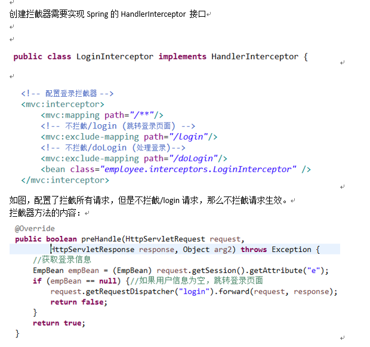

# 注解
## @Controller
在SpringMVC中，控制器Controller 负责处理由DispatcherServlet 分发的请求，它把用户请求的数据经过业务处理层处理之后封装成一个Model ，然后再把该Model 返回给对应的View 进行展示。

在SpringMVC 中提供了一个非常简便的定义Controller 的方法，你无需继承特定的类或实现特定的接口，只需使用@Controller 标记一个类是Controller ，然后使用@RequestMapping 和@RequestParam 等一些注解用以定义URL 请求和Controller 方法之间的映射，这样的Controller 就能被外界访问到。

此外Controller 不会直接依赖于HttpServletRequest 和HttpServletResponse 等HttpServlet 对象，它们可以通过Controller 的方法参数灵活的获取到。

@Controller 用于标记在一个类上，使用它标记的类就是一个SpringMVC Controller 对象。
分发处理器将会扫描使用了该注解的类的方法，并检测该方法是否使用了@RequestMapping 注解。
@Controller 只是定义了一个控制器类，而使用@RequestMapping 注解的方法才是真正处理请求的处理器。
单单使用@Controller 标记在一个类上还不能真正意义上的说它就是SpringMVC 的一个控制器类，因为这个时候Spring 还不认识它。那么要如何做Spring 才能认识它呢？这个时候就需要我们把这个控制器类交给Spring 来管理。有两种方式：
- 在SpringMVC 的配置文件中定义MyController 的bean 对象。
- 在SpringMVC 的配置文件中告诉Spring 该到哪里去找标记为@Controller 的Controller 控制器。

```
<!--方式一-->
<bean class="com.host.app.web.controller.MyController"/>
<!--方式二-->
< context:component-scan base-package = "com.host.app.web" />//路径写到controller的上一层(扫描包详解见下面浅析)
```

## @RequestMapping
```
/**
 * 设置处理方法的请求方式
 * 假如将处理方法的请求方式设置成get，那么只能用get方式进行请求
 * get之外的任何请求方式都不好用
 */
@RequestMapping(value="/testGet",method=RequestMethod.GET)
public String testRequestMethod(){
	System.out.println("testRequestMethod");
	return "success";
}
```

Spring 4.3对@RequestMapping（）进行了细分
```
1.@GetMapping    相当于Get请求（@RequestMapping(method=RequestMethod.GET)）
2.@PostMapping  相当于POST请求 （@RequestMapping(method=RequestMethod.POST)）
3.PutMapping  相当于PUT请求 （@RequestMapping(method=RequestMethod.PUT)）
4.DeleteMapping  相当于DELETE请求 （@RequestMapping(method=RequestMethod.DELETE)）
5.PatchMapping  相当于PATCH请求 （@RequestMapping(method=RequestMethod.PATCH)）
```

### RequestMapping的params属性
```
/**
 * 请求必须包含username参数
 * 不能包含address
 * 必须包含age参数，但是值不能等于10
 */
@RequestMapping(value="/testParam",params={"username","!address","age!=10"})
public String testParam(){
    System.out.println("testParam");
    return "success";
}
```

mapping中参数解析：
```
value：指定请求的实际地址，指定的地址可以是URI Template 模式（后面将会说明）
method：指定请求的method类型， GET、POST、PUT、DELETE等
consumes：指定处理请求的提交内容类型（Content-Type），例如application/json, text/html;
produces：指定返回的内容类型，仅当request请求头中的(Accept)类型中包含该指定类型才返回
params：指定request中必须包含某些参数值是，才让该方法处理
headers：指定request中必须包含某些指定的header值，才能让该方法处理请求
```

## @Resource和@Autowired
@Resource和@Autowired都是做bean的注入时使用，其实@Resource并不是Spring的注解，它的包是javax.annotation.Resource，需要导入，但是Spring支持该注解的注入。
1、共同点
两者都可以写在字段和setter方法上。两者如果都写在字段上，那么就不需要再写setter方法。
2、不同点
（1）@Autowired
@Autowired为Spring提供的注解，需要导入包org.springframework.beans.factory.annotation.Autowired;只按照byType注入。
```
public class TestServiceImpl {
    // 下面两种@Autowired只要使用一种即可
    @Autowired
    private UserDao userDao; // 用于字段上
    
    @Autowired
    public void setUserDao(UserDao userDao) { // 用于属性的方法上
        this.userDao = userDao;
    }
}
```
@Autowired注解是按照类型（byType）装配依赖对象，默认情况下它要求依赖对象必须存在，如果允许null值，可以设置它的required属性为false。如果我们想使用按照名称（byName）来装配，可以结合@Qualifier注解一起使用。如下：
```
public class TestServiceImpl {
    @Autowired
    @Qualifier("userDao")
    private UserDao userDao; 
}
```
（2）@Resource
@Resource默认按照ByName自动注入，由J2EE提供，需要导入包javax.annotation.Resource。@Resource有两个重要的属性：name和type，而Spring将@Resource注解的name属性解析为bean的名字，而type属性则解析为bean的类型。所以，如果使用name属性，则使用byName的自动注入策略，而使用type属性时则使用byType自动注入策略。如果既不制定name也不制定type属性，这时将通过反射机制使用byName自动注入策略。
```
public class TestServiceImpl {
    // 下面两种@Resource只要使用一种即可
    @Resource(name="userDao")
    private UserDao userDao; // 用于字段上
    
    @Resource(name="userDao")
    public void setUserDao(UserDao userDao) { // 用于属性的setter方法上
        this.userDao = userDao;
    }
}
```
```
注：最好是将@Resource放在setter方法上，因为这样更符合面向对象的思想，通过set、get去操作属性，而不是直接去操作属性。
@Resource装配顺序：
1.如果同时指定了name和type，则从Spring上下文中找到唯一匹配的bean进行装配，找不到则抛出异常。
2.如果指定了name，则从上下文中查找名称（id）匹配的bean进行装配，找不到则抛出异常。
3.如果指定了type，则从上下文中找到类似匹配的唯一bean进行装配，找不到或是找到多个，都会抛出异常。
4.如果既没有指定name，又没有指定type，则自动按照byName方式进行装配；如果没有匹配，则回退为一个原始类型进行匹配，如果匹配则自动装配。
@Resource的作用相当于@Autowired，只不过@Autowired按照byType自动注入。
```

## @PathVariable
```
/**
 * 用于将请求URL中的模板变量映射到功能处理方法的参数上，即取出uri模板中的变量作为参数
 */
@RequestMapping("/testPathV/{id}/{name}")
//testPathV/1/abc
//testPathV/2/fff
// 地址栏：http://localhost:8080/MySpringMvc/mvc/testPathV/10/abc
public String testPathVariable(@PathVariable("id")Integer id,
                        @PathVariable("name")String name){
    System.out.println("id~~~~~~~~"+id);
    System.out.println("name~~~~~~~~"+name);
    return "success";
}
```

## @requestParam
获取请求参数，要写在方法的括号内，两个属性
```
/**
 * 1.value 要获取的参数名字
 * 2.required 是否必须传递
 * 如果将其中的一个参数设置为了必须传递，那么在浏览器上如果不传递该参数，则会报400错误
 */
@RequestMapping("/testRequestParam")
// 地址栏：http://localhost:8080/MySpringMvc/mvc/testRequestParam?email=123456@qq.com
public String testRequestParam(
        @RequestParam(value = "age",required = false)Integer age,
        @RequestParam(value = "email",required = true)String email){
    System.out.println("age~~~~~~~~"+age);
    System.out.println("email~~~~~~~~"+email);
    return "success";
}
```

## @ResponseBody
作用：该注解用于将Controller的方法返回的对象，通过适当的HttpMessageConverter转换为指定格式后，写入到Response对象的body数据区。
使用时机：返回的数据不是html标签的页面，而是其他某种格式的数据时（如json、xml等）使用

## 绑定POJO类型参数（实体类）
需要将页面元素的name属性与实体类对象属性保持一致，区分大小写，支持级联属性


## ModelAndView
如果方法的返回值为ModelAndView，那么可返回页面或数据模型
返回页面：setViewName(name); 与返回String类型的用法一致
返回数据模型：addObject(key,value); 与request.setAttribute(key,vlaue); 一致
保存在了request中
```
/**
 * 如果方法的返回值为ModelAndView，那么可以同时返回页面和数据模型
 * 返回页面：setViewName(name); 与返回String类型的用法一致
 * 返回数据模型：addObject(key,value); 与request.setAttribute(key,vlaue); 一致
 * 保存在了request中
 */
@RequestMapping("/testMV")
public ModelAndView testMV(
        @RequestParam(value = "email",required = true)String email){
    ModelAndView mv = new ModelAndView();
    //设置返回的内容
    mv.addObject("email",email);
    //设置返回页面
    mv.setViewName("success");
    return mv;
}
```

## 隐藏的Map参数
处理方法中，可传递一个Map类型参数，SpringMvc会自动将此Map参数中的值保存到Request中
```
/**
 * 处理方法中，可传递一个Map类型参数，SpringMvc会自动将此Map参数中的值保存到Request中
 */
@RequestMapping("/testMap")
public String testMap(Map<String,Object> map){
    map.put("address","北京市丰台区马家堡西里");
    return "success";
}
```

## 可接收Servlet API的参数
```
@RequestMapping("/testServletAPI")
public String testServletAPI(HttpServletRequest request,HttpServletResponse response){
    String name = request.getParameter("name");
    System.out.println(name);
    request.setAttribute("stuName",name);
    return "success";
}
```

## @Component
相当于通用的注解，当不知道一些类归到哪个层时使用，但是不建议。

## @requestBody
该常用来处理content-type不是默认的application/x-www-form-urlcoded编码的内容，
比如说：application/json或者是application/xml等。一般情况下来说常用其来处理application/json类型。

通常使用该注解来接收前端传递的参数。写法如下：
`(@RequestBody Map<String,String> paramMap)`

传值方法如下：
```
{
	"pageNum":1,
	"pageSize":10,
	"status":100,
	"groupId":"",
	"startTime":"",
	"endTime":""
}
```
## @ModelAttribute 和 @SessionAttributes
SpringMVC 支持使用 @ModelAttribute 和 @SessionAttributes 在不同的模型（model）和控制器之间共享数据。
@ModelAttribute 主要有两种使用方式，一种是标注在方法上，一种是标注在 Controller 方法参数上。
当 @ModelAttribute 标记在方法上的时候，该方法将在处理器方法执行之前执行，然后把返回的对象存放在 session 或模型属性中，属性名称可以使用 @ModelAttribute(“attributeName”) 在标记方法的时候指定，若未指定，则使用返回类型的类名称（首字母小写）作为属性名称。

## 自定义视图
1.在springmvc.xml中增加配置
```
<bean class="prg.springframework.web.servlet.view.BeanNameViewResolver">
	<property name="order" value="99"></property>
</bean>
属性order为优先级顺序，value值越大，越优先使用该视图解析器
```

2.编写自定义视图：
```
@Component
public class MyView implements View{
    @Override
    public String getContentType() {
        return "text/html";
    }

    @Override
    public void render(Map<String, ?> map, HttpServletRequest httpServletRequest, HttpServletResponse httpServletResponse) throws Exception {
        response.getWriter().write("<h1>this is my view</h1>");
    }
}
```

3.在类定义处添加注解 @Component 将其装入SpringIOC容器中
getContentType方法为视图类型
render方法为视图内容

4.修改springmvc配置文件，保证包扫描时可以扫描到自定义视图
配置自动扫描包
```
<context:component-scan bese-package="com.*"/>
```

5.编写测试方法
```
@RequestMapping("/testView")
public String testView(){
    return "myView";
}
```

## 重定向和转发
```
/**
 * 在返回值处增加前缀：forward
 */
@RequestMapping("/testForward")
public String testForward(){
    return "forward:testSession";
}
/**
 * 在返回值处增加前缀：redirect
 */
@RequestMapping("/testRedirect")
public String testRedirect(){
    return "redirect:testView";
}
```

## 文件上传


## SpringMVC拦截器
拦截器中有三个执行方法：
1.preHandle(): 这个方法在业务处理器处理请求之前被调用，在该方法中对用户请求request进行处理。如果决定该拦截器对请求进行拦截处理后还需要调用其他拦截器，或者是业务处理器去进行处理，则返回true。如果不需要则返回false。

2.postHandle():这个方法在业务处理器处理完请求后，但是向客户端返回响应前被调用。

3.afterCompletion():这个方法在完全处理完请求后被调用(渲染视图之前)，可以在该方法中进行一些资源清理的操作。

执行顺序：
1.多个拦截器根据配置文件的配置顺序进行执行
2.首先顺序执行所有拦截器的preHandle方法
3.然后倒序执行所有拦截器的postHandle方法和afterCompletion方法
4.如果第一个拦截器的preHandle方法返回false，那么后续方法都不执行，只执行第一个拦截器的afterCompletion方法



## SpringMVC运行流程(熟记)
1.用户向服务器发送请求，被DispatcherServlet捕获

2.根据用户发送的请求，调用HandlerMapping获取相应的配置，
最后以Handler　execution　Chain（这三个单词是连在一起的）对象的形式返回

3.DispatcherServlet根据获得的Handler,选择一个合适的HandlerAdapter.

4.提取requerst中的数据模型，填充Handler入参，开始执行Handler

5.Handler执行完成后，DispatcherServlet返回一个ModelAndView对象

6.根据返回的ModelAndView，选择一个合适的ViewResolver

7.ViewResolver结合ModelAndView，来渲染视图

8.将渲染结果返回给客户端
