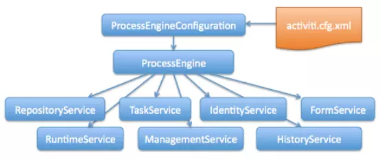
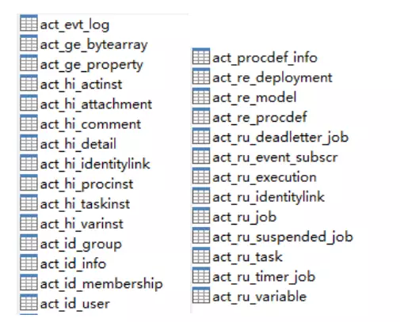
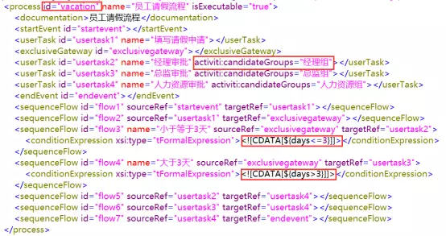
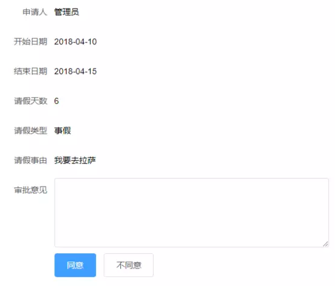

# activiti
[官网](https://www.activiti.org/)

## 核心7大接口，28张表
**7大接口**

- RepositoryService：提供一系列管理流程部署和流程定义的API。
- RuntimeService：在流程运行时对流程实例进行管理与控制。
- TaskService：对流程任务进行管理，例如任务提醒、任务完成和创建任务等。
- IdentityService：提供对流程角色数据进行管理的API，这些角色数据包括用户组、用户及它们之间的关系。
- ManagementService：提供对流程引擎进行管理和维护的服务。
- HistoryService：对流程的历史数据进行操作，包括查询、删除这些历史数据。
- FormService：表单服务。

**28张表**

- act_ge_ 通用数据表，ge是general的缩写
- act_hi_ 历史数据表，hi是history的缩写，对应HistoryService接口
- act_id_ 身份数据表，id是identity的缩写，对应IdentityService接口
- act_re_ 流程存储表，re是repository的缩写，对应RepositoryService接口，存储流程部署和流程定义等静态数据
- act_ru_ 运行时数据表，ru是runtime的缩写，对应RuntimeService接口和TaskService接口，存储流程实例和用户任务等动态数据

## 创建BPMN业务流程模型
1. 将Activiti提供的流程设计器应用activiti-app.war部署到Tomcat的webapps目录。
2. 创建新的MySql数据库。修改activiti-app\WEB-INF\classes\META-INF\activiti-app目录下的activiti-app.properties配置文件，默认使用H2内存数据库，创建的模型重启后会丢失，改成使用MySql数据库。作者：jessehua
3. 浏览器访问http://localhost:8080/activiti-app，登录账户：admin：test
4. 创建一个请假审批流程图

给每个用户任务指派候选组（有权限执行当前任务的角色）


排他网关设置条件分支表达式


导出流程图为.bpmn20.xml文件


## Spring Boot与Activiti 6.0整合
1. pom文件中添加依赖
```
<dependency>
    <groupId>org.activiti</groupId>
    <artifactId>activiti-spring-boot-starter-basic</artifactId>
    <version>6.0.0</version>
</dependency>
```

2. 将导出的.bpmn20.xml文件拷贝到项目文件夹/resources/processes下
3. application.properties文件添加配置项
`spring.activiti.database-schema-update=true`
databaseSchemaUpdate配置项可以设置流程引擎启动和关闭时数据库执行的策略。
databaseSchemaUpdate有以下四个值：
- false：false为默认值，设置为该值后，Activiti在启动时，会对比数据库表中保存的版本，如果没有表或者版本不匹配时，将在启动时抛出异常。
- true：设置为该值后，Activiti会对数据库中所有的表进行更新，如果表不存在，则Activiti会自动创建。
- create-drop：Activiti启动时，会执行数据库表的创建操作，在Activiti关闭时，执行数据库表的删除操作。
- drop-create：Activiti启动时，执行数据库表的删除操作在Activiti关闭时，会执行数据库表的创建操作。

4. 启动应用，会在数据库里创建28张表，表创建好之后停止应用。application.properties文件修改配置项
#每次应用启动不检查Activiti数据表是否存在及版本号是否匹配，提升应用启动速度
`spring.activiti.database-schema-update=false`

5. application.properties文件增加配置项
#保存历史数据级别设置为full最高级别，便于历史数据的追溯
`spring.activiti.history-level=full`
对于历史数据，保存到何种粒度，Activiti提供了history-level属性对其进行配置。history-level属性有点像log4j的日志输出级别，该属性有以下四个值：
- none：不保存任何的历史数据，因此，在流程执行过程中，这是最高效的。
- activity：级别高于none，保存流程实例与流程行为，其他数据不保存。
- audit：除activity级别会保存的数据外，还会保存全部的流程任务及其属性。audit为history的默认值。
- full：保存历史数据的最高级别，除了会保存audit级别的数据外，还会保存其他全部流程相关的细节数据，包括一些流程参数等。

6. 完成以上步骤，就可以在程序中使用自动注入的方式，使用Activiti的7大接口。
```
@Autowired
private RuntimeService runtimeService;
@Autowired
private TaskService taskService;
@Autowired
private IdentityService identityService;
@Autowired
private RepositoryService repositoryService;
@Autowired
private ProcessEngine processEngine;
@Autowired
private HistoryService historyService;
```

## 项目中的用户、角色与Activiti中的用户、用户组整合
每个项目都有自己的用户、角色表，Activiti也有自己的用户、用户组表。因此项目中的用户、角色与Activiti中的用户、用户组要做整合。
```
//项目中每创建一个新用户，对应的要创建一个Activiti用户
//两者的userId和userName一致
User admin=identityService.newUser("1");
admin.setLastName("admin");
identityService.saveUser(admin);

//项目中每创建一个角色，对应的要创建一个Activiti用户组
Group adminGroup=identityService.newGroup("1");
adminGroup.setName("admin");
identityService.saveGroup(adminGroup);

//用户与用户组关系绑定
identityService.createMembership("1","1");
```
## 请假审批流程
1. 请假申请和请假审批数据库表设计
表设计原则：流程数据和业务数据相分离。Activiti相关表只负责流程的跳转、走向等。流程中产生的业务表单数据、审批意见、附件等存储在开发人员定义的业务表中。流程数据和业务数据之间通过processInstanceId(流程实例ID)和业务数据主键相互关联。
为什么不使用Activiti相关表来存储表单数据和附件？

Activiti为了应用的灵活性和通用性采用了纵表的方式存储表单数据。假设一条请假申请表单数据有10个字段，那就需要10条记录存储原本横表只需要一条记录存储的数据。采用纵表的方式会有如下问题：
+ 会有大量的冗余数据并且数据量会急剧的增长
+ 查询语句复杂，查询效率低
+ 尤其不适合做后期的统计报表分析


Activiti存储附件使用Blob数据格式，文件存储在数据库里，数据库的数据文件会变得超大，不利于数据库备份和迁移。

请假申请表：

|字段|类型|空|注释|
|-|-|-|-|
|form_id|varchar(32)|否|表单id|
|process_instance_id|varchar(64)|否|activiti流程实例id|
|user_id|int(11)|否|用户id|
|days|tinyint(3)|否|请假天数|
|begin_date|datetime|否|开始日期|
|end_date|datetime|否|结束日期|
|vacation_type|tinyint(3)|否|请假类型：0带薪假，1病假，2事假|
|reason|varchar(200)|是|请假原因|
|process_status|tinyint(3)|否|流程状态：0申请，1审批中，已完成|
|create_time|datetime|否|创建时间|
|update_time|datetime|否|更新时间|

请假审批表：

|字段|类型|空|注释|
|-|-|-|-|
|audit_id|varchar(32)|否|审批id|
|process_instance_id|varchar(64)|否|activiti流程实例id|
|task_id|varchar(64)|否|activiti任务id|
|user_id|int(11)|否|用户id|
|audit_result|tinyint(3)|否|审批结果：0不通过，1通过|
|comment|varchar(500)|是|审批意见|
|audit_time|datetime|否|审批日期|

2. 填写请假申请表单，启动流程实例

```
//启动流程实例，字符串"vacation"是BPMN模型文件里process元素的id
ProcessInstance processInstance = runtimeService.startProcessInstanceByKey("vacation");
//流程实例启动后，流程会跳转到请假申请节点
Task vacationApply = taskService.createTaskQuery().processInstanceId(processInstance.getId()).singleResult();
//设置请假申请任务的执行人
taskService.setAssignee(vacationApply.getId(), req.getUserId().toString());

//设置流程参数：请假天数和表单ID
//流程引擎会根据请假天数days>3判断流程走向
//formId是用来将流程数据和表单数据关联起来
Map<String, Object> args = new HashMap<>();
args.put("days", req.getDays());
args.put("formId", formId);

//完成请假申请任务
taskService.complete(vacationApply.getId(), args);
```

3. 待审批列表

```
//查出当前登录用户所在的用户组
List<Group> groups = identityService.createGroupQuery()
        .groupMember(String.valueOf(userId)).list();
List<String> groupNames = groups.stream()
        .map(group -> group.getName()).collect(Collectors.toList());

//查询用户组的待审批请假流程列表
List<Task> tasks = taskService.createTaskQuery()
        .processDefinitionKey("vacation")
        .taskCandidateGroupIn(groupNames)
        .listPage(pageNum - 1, pageSize);

//根据流程实例ID查询请假申请表单数据
List<String> processInstanceIds = tasks.stream()
        .map(task -> task.getProcessInstanceId())
        .collect(Collectors.toList());
List<VacationApplyBasicPO> vacationApplyList = 
        vacationRepository.getVacationApplyList(processInstanceIds);
```

4. 请假审批功能

```
//查询当前审批节点
Task vacationAudit = taskService.createTaskQuery()
        .taskId(req.getTaskId()).singleResult();

if (req.getAuditResult() == 1) {//审批通过
    //设置流程参数：审批ID
    Map<String, Object> args = new HashMap<>();
    args.put("auditId", auditId);

    //设置审批任务的执行人
    taskService.claim(vacationAudit.getId(), req.getUserId().toString());
    //完成审批任务
    taskService.complete(vacationAudit.getId(), args);
} else {
    //审批不通过，结束流程
    runtimeService.deleteProcessInstance(vacationAudit.getProcessInstanceId(), auditId);
}
```

5. 查看流程图功能

```
//controller层代码
@RequestMapping(value = "/image", method = RequestMethod.GET)
public void image(HttpServletResponse response,
 @RequestParam String processInstanceId) {
    try {
        InputStream is = vacationService.getDiagram(processInstanceId);
        if (is == null)
            return;

        response.setContentType("image/png");

        BufferedImage image = ImageIO.read(is);
        OutputStream out = response.getOutputStream();
        ImageIO.write(image, "png", out);

        is.close();
        out.close();
    } catch (Exception ex) {
        logger.error("查看流程图失败", ex);
    }
}

//service层代码
@Override
public InputStream getDiagram(String processInstanceId) {
    //获得流程实例
    ProcessInstance processInstance = runtimeService.createProcessInstanceQuery()
            .processInstanceId(processInstanceId).singleResult();
    String processDefinitionId = StringUtils.EMPTY;
    if (processInstance == null) {
        //查询已经结束的流程实例
        HistoricProcessInstance processInstanceHistory =
                historyService.createHistoricProcessInstanceQuery()
                        .processInstanceId(processInstanceId).singleResult();
        if (processInstanceHistory == null)
            return null;
        else
            processDefinitionId = processInstanceHistory.getProcessDefinitionId();
    } else {
        processDefinitionId = processInstance.getProcessDefinitionId();
    }

    //使用宋体
    String fontName = "宋体";
    //获取BPMN模型对象
    BpmnModel model = repositoryService.getBpmnModel(processDefinitionId);
    //获取流程实例当前的节点，需要高亮显示
    List<String> currentActs = Collections.EMPTY_LIST;
    if (processInstance != null)
        currentActs = runtimeService.getActiveActivityIds(processInstance.getId());

    return processEngine.getProcessEngineConfiguration()
            .getProcessDiagramGenerator()
            .generateDiagram(model, "png", currentActs, new ArrayList<String>(),
                    fontName, fontName, fontName, null, 1.0);
}
```
[参考地址](https://www.jianshu.com/p/701056e672a4)

[其他学习activiti的博文](https://www.cnblogs.com/runtimeexception/p/8961395.html)
[其他学习activiti的博文](https://www.jianshu.com/p/33085a975e47)
[其他学习activiti的博文](https://www.cnblogs.com/handsome1013/p/9681288.html)
