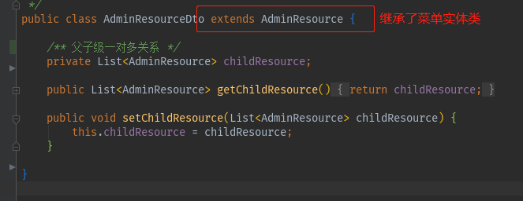
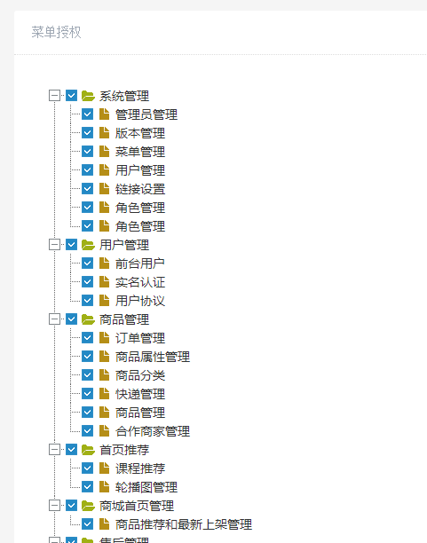

### 后台添加角色后，需要给角色授权菜单，不同的角色有不同的菜单。
两个点：
1.菜单表结构，父子级在一个表中。dto的使用
2.树状图插件zTree的使用，以及角色菜单的回显

### 1.涉及到的表
admin_resource   菜单表
admin_role   角色表
admin_role_resource  角色与菜单中间表
admin_user   管理员表
admin_user_role  用户-角色关联表
```
CREATE TABLE `admin_resource` (
  `id` int(10) unsigned NOT NULL AUTO_INCREMENT COMMENT '主键',
  `name` varchar(20) NOT NULL COMMENT '资源名称',
  `style` varchar(255) DEFAULT NULL COMMENT '资源样式',
  `description` varchar(255) DEFAULT NULL COMMENT '资源描述',
  `url` varchar(255) DEFAULT NULL COMMENT '资源访问的url',
  `parent_id` int(11) NOT NULL DEFAULT '0' COMMENT '父资源ID，0-无父资源',
  `status` int(2) NOT NULL DEFAULT '1' COMMENT '启用状态 0-未启用 1-启用',
  `sort` int(2) NOT NULL DEFAULT '1' COMMENT '排序位置',
  `type` int(2) NOT NULL DEFAULT '0' COMMENT '资源类型 0-未知类型 1-菜单 2-按钮 3-图片',
  `code` varchar(255) NOT NULL COMMENT '资源标识代码',
  `create_time` datetime DEFAULT NULL COMMENT '创建时间',
  `update_time` datetime DEFAULT NULL COMMENT '更新时间',
  PRIMARY KEY (`id`) USING BTREE
) ENGINE=InnoDB AUTO_INCREMENT=234 DEFAULT CHARSET=utf8 ROW_FORMAT=DYNAMIC COMMENT='菜单表';
```
```
CREATE TABLE `admin_role_resource` (
  `role_id` int(10) unsigned NOT NULL COMMENT '角色id',
  `resource_id` int(10) unsigned NOT NULL COMMENT '资源id',
  `create_time` datetime DEFAULT NULL COMMENT '创建时间'
) ENGINE=InnoDB DEFAULT CHARSET=utf8 ROW_FORMAT=DYNAMIC COMMENT='角色资源关联表';
```
这里只列出关键的两张表。

### 2.sql编写以及dto的使用
我们希望获取一对多的菜单，数据结构是这样的

sql如下
```
<!--获取一对多子菜单-->
    <select id="getResourceList" resultMap="resourceMap" parameterType="com.tubitu.model.AdminResource">
        select
        a.id,
        a.name,
        a.parent_id,
        a.status,
        b.id as sId,
        b.name as sName,
        b.url as sUrl,
        b.parent_id as sParentId
        from admin_resource a
        LEFT JOIN admin_resource b ON a.id = b.parent_id
        <where>
            a.status = 1
            and a.parent_id = 0
            <if test="name != null and name != ''">
                and a.name like concat('%',#{name,jdbcType=VARCHAR},'%')
            </if>
        </where>
    </select>
```
resultMap 如下
```
<resultMap id="resourceMap" type="com.tubitu.model.dto.AdminResourceDto" extends="BaseResultMap">
        <collection property="childResource" ofType="com.tubitu.model.AdminResource" javaType="java.util.List" >
            <id column="sId" property="id" jdbcType="INTEGER" />
            <result column="sName" property="name" jdbcType="VARCHAR" />
            <result column="sUrl" property="url" jdbcType="VARCHAR" />
            <result column="sParentId" property="parentId" jdbcType="INTEGER" />
        </collection>
    </resultMap>
```
注意resultMap是继承了BaseResultMap的
此处的resultMap的type是dto,结构如下

dto继承了我们需要属性的实体类，amdinResource。
这样dto就有了一些基本的属性，然后加上我们需要的属性，父级对子级的list，我们就可以通过此dto来映射了。
dto的使用，避免了实体类的污染，当我们需要一些数据库字段之外的属性的时候，或者需要映射的字段很复杂，我们完全可以使用dto来映射。

注意因为这是表自己连自己，所以取得相同的字段还需要起别名，resultMap里也需要注意。
controller中还需要把角色相关的菜单list查出来

### 3.页面的处理

使用了zTree插件，此处的核心方法，只有下面一段
```
$(document).ready(function(){
        //回显当前角色菜单
        var zNodes =[];
        <#if list??>
            <#list list as i> //所有父级菜单
                <#assign flag1 = false>  //父级勾选标识
                <#list i.childResource as j> //所有子级菜单
                    <#assign flag2 = false>  //子级勾选标识
                    <#list idList as k>   //当前角色菜单
                        <#if k == j.id > //若  子级菜单id == 角色菜单id
                            zNodes.push({id:${j.id},pId:${i.id},name:"${j.name}",isSon:1,checked:true}); //勾选
                            <#assign flag1 = true>
                            <#assign flag2 = true> //标识为true
                        </#if>
                    </#list>//角色菜单list之外
                    <#if flag2=false> //若标识为true,则不勾选
                        zNodes.push({id:${j.id},pId:${i.id},name:"${j.name}",isSon:1});
                    </#if>
                </#list>
                <#if flag1=true>//子级菜单之外，标识为true，说明有子级菜单勾选，则勾选父级
                       zNodes.push({id:${i.id},pId:0,name:"${i.name}",open:true,checked:true});
                <#else>//否则不勾选
                        zNodes.push({id:${i.id},pId:0,name:"${i.name}",open:true});
                </#if>
            </#list>
        </#if>

        //初始化zTree
        $.fn.zTree.init($("#treeDemo"), setting, zNodes);
    });
```
刚开始一直想不通怎么用三层循环遍历显示，后来换了思路，通过flag来标识勾选状态，问题迎刃而解。
能回显了，就剩下提交了。提交的难点在于，如何把复杂类型数组提交到后台。
```
var zNodes =[
        {id:1, pId:0, name:"[core] 基本功能 演示", open:true},
		{id:101, pId:1, name:"最简单的树 --  标准 JSON 数据",checked:true},
		{id:102, pId:1, name:"最简单的树 --  简单 JSON 数据",checked:true},
        ]
```
数组内容是对象，对象中包含数字、字符串、布尔值等类型。
ajax提交是可以的，后台如何接收？答案是不知道，我试了半天，后台也不知道如何接收。
最后还是又把id遍历出来，后台用integer数组接收的。
jQuery的ajax提交数组，有一个比较坑逼的地方，会在你提交的时候，在你的key值后面加上个[]，
这样你后台必须在接收的参数后边也写上中括号
```
@ResponseBody
    @RequestMapping("/modifyRoleResource")
    public int modifyRoleResource(@RequestParam(value = "idList[]")Integer[] idList,
                                  @RequestParam(value = "roleId")Integer roleId){
        return roleManageService.batchinsert(idList,roleId);
    }
```
完~