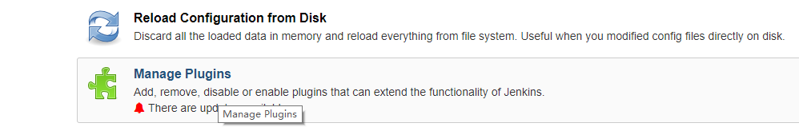
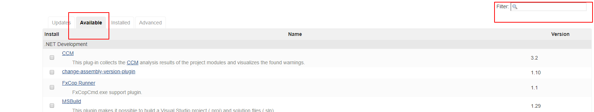
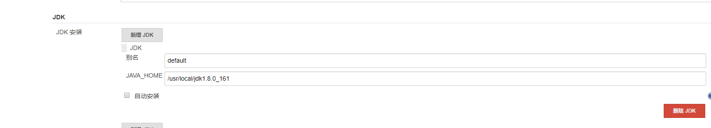
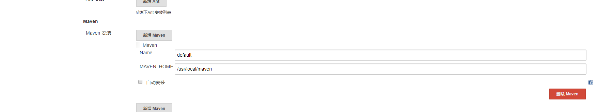
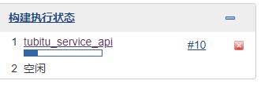
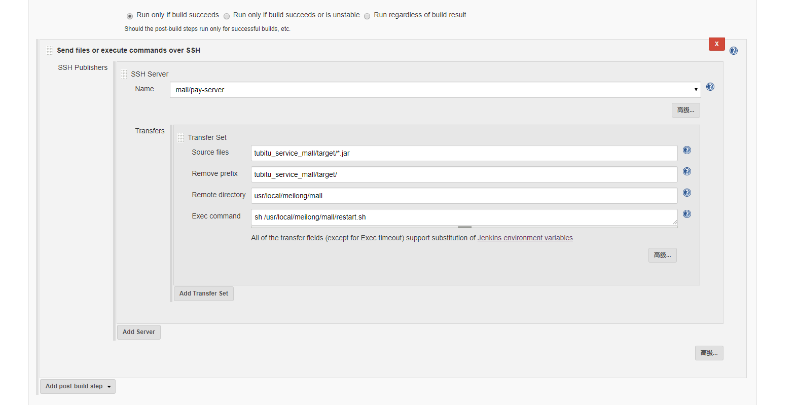

# 简介
Jenkins是一个开源的自动部署服务器，提供了上百个插件用于自动构建、部署、发布任意项目。
本文描述的是Jenkins本地部署以及远程部署等功能的实现。

# 安装部署
Jenkins几乎可以在任何平台（包括docker）上运行，我们采用比较熟悉的方式进行安装，即将Jenkins部署在Tomcat容器中，使用默认的8080端口，无需任何配置，直接启动tomcat即可。
下载步骤，请参考：http://www.jenkins.org.cn/821.html

# Jenkins配置
访问Jenkins地址，初次进入会要求输入密码，密码已经显示在页面中。
一般情况下，Linux上的位置：
/root/.jenkins/secrets/initialAdminPassword
windows下密码的位置：
C:\Users\liuhuijun\.jenkins\secrets\initialAdminPassword

找到该文件复制里面的内容，进入到初始化页面，然后安装插件，我们选择默认的插件安装，
Install suggested plugins

然后进入到Jenkins首页，然后安装中文插件。

选择Jenkins配置


选择管理插件Manage Plugins:


选择可用插件Avaliable，并在右侧Filter框搜索插件名：

这里我们需要安装的插件如下：
1.maven集成插件：Maven Integration plugin;
2.Jenkins语言插件（可选）：Locale plugin;
3.远程部署插件：Publish Over SSH;

然后选择install without restart。然后点击左上角的Jenkins图标返回主页，再次进入Jenkins配置页面，选择系统设置Configure System,找到local配置，输入：ZH_cn

简体中文为ZH_cn，英文为EN_us，然后勾选Ignore brower preference and force this language to all users。

# 持续集成配置
首先需要进行一系列环境的安装或配置，例如git/svn，maven，jdk，远程server等，本文默认以上环境都是安装好的。

进入系统设置，选择全局工具配置，填入本机相关安装路径：
jdk:


git:


maven:


## 本地部署
本地部署是指：部署运行在本机的服务，若项目部署在其他服务器，则需要远程部署。

在Jenkins主页选择新建任务，选择构建一个maven项目。需要说明的是，由于公司项目结构为父子项目

所有的子项目都在tubitu_project一个代码仓库里，如果配置了webhook(作用是接收远程仓库push的提交信息)的话，任何一个子项目的代码推送，都会导致所有服务的自动重启，而由于公司没有正规的代码提交审查流程，所以如果提交错误代码，会导致所有服务一同崩溃，因此，推荐每一个服务都是一个单独的部署任务，提交代码后只需要更新提交代码的服务即可。最终结果如下：


配置流程：
首先新建一个任务，选择构建一个maven项目，输入名称，然后进入配置页面。
在General里勾选旧的构建，可选1：保持构建天数 2.保持构建的最大个数，Jenkins会自动删除[可选1]之前的安装包，节约服务器空间。

源码管理选择git，选择远程仓库地址，添加个人远程仓库的账户密码：
(注：这里建议使用公司公用的账户密码，避免员工离职或更改密码带来不必要的麻烦)


构建触发器勾选：Build whenever a SNAPSHOT dependency is built
构建环境选择：Add timestamps to the Console Output（非必选）
Build：第一框填写：pom.xml
Goals and options里填写：
`clean install -pl tubitu_service_api -am`
说明：
-pl：打包指定module，可以-pl module_name -pl module_name指定打包多个项目
-am：打包指定module所依赖的模块

Post Steps：勾选Run only if build succeeds，点击Add post-build step选择执行shell，脚本如下：
```
#首先停止项目
pid=`ps -ef | grep tubitu_service_api-1.0.0.jar | grep -v grep | awk '{print $2}'`
if [ -n "$pid" ]
then
   kill -9 $pid
fi
#删除旧的项目
rm -rf /usr/local/meilong/api/tubitu_service_api-1.0.0.jar
#复制Jenkins工作空间里的项目到指定目录下
cp $WORKSPACE/tubitu_service_api/target/tubitu_service_api-1.0.0.jar /usr/local/meilong/api/
#授权，该步骤可以省略
chmod u+x /usr/local/meilong/api/tubitu_service_api-1.0.0.jar
BUILD_ID=donKillme nohup java -jar -Dlogging.file=/usr/local/meilong/api/logs/tubitu.log /usr/local/meilong/api/tubitu_service_api-1.0.0.jar &
```

PS：BUILD_ID=dontKillme 指的是不要杀死最后一步启动项目产生的子进程。官网说明如下
https://wiki.jenkins.io/display/JENKINS/ProcessTreeKiller
`To reliably kill processes spawned by a job during a build, Jenkins contains a bit of native code to list up such processes and kill them. This is tested on several platforms and architectures, but if you find a show-stopper problem because of this, you can disable this feature by setting a Java property named "hudson.util.ProcessTree.disable" to the value "true".`
译：为了可靠地终止构建过程中滋生出来的进程，Jenkins包含了一系列的本地代码去查出这些子进程并且杀死它们。这个已经在一些平台上进行了测试，如果你发现由此引发的停止显示的问题，你可以设置名为“hudson.util.ProcessTree.disable" 的java property为true来禁止使用ProcessTreeKiller自动杀死。

通常情况下，我们保持官方默认配置，所以推荐使用BUILD_ID=dontKillme 表示该进程不是由Jenkins来生成，也就不会被ProcessTreeKiller杀死。

配置完成以后，返回到Jenkins首页，在刚刚配置的任务点击最后一个按钮，或者点击任务名旁边的倒三角，选择立即构建，构建执行队列即会显示构建进度：

#10代表第十次构建，鼠标移到10旁边，即可查看控制台输入的构建和启动信息。当Finshed：SUCCESS，
构建完成。

此时返回到Jenkins主页，可以看到S下的一列圆形图标，
蓝色：成功
灰色：尚未构建
红色：构建失败
黄色：不稳定构建(Jenkins不确定状态)

W下有天气图标，代表近期构建状态：
小太阳：近期成功
多云：少数失败，以此类推


## 远程部署
远程部署是由于项目所有的服务并不都部署在本机，有可能部署在其他服务器，所以需要远程部署。

远程部署需要配置远程服务器的ip地址和用户凭证。
返回主页，点击系统管理，然后点击系统设置，在Publish over SSH下找到SSH Servers，点击新增，分别配置好IP地址和用户名密码：


这里Remote Directory为Jenkins默认远程根目录，点击高级，勾选使用用户密码，并输入密码，然后点击Test Configuration测试是否连接成功：


新建一个任务tubitu_service_mall，前面基本保持一致，但是在Post Steps时，不再选择执行脚本，而是选择send files or execute commands over SSH。

name选择上一步配置好的远程服务器，Source files默认会以本地当前任务的Jenkins工作空间+任务名为根路径，所以Source files只能配置相对路径，而Jenkins每一个任务默认的工作空间为/root/.jenkins/workspace/任务名，所以高i任务在本文中的工作空间全路径即为：/root/.jenkins/workspace/tubitu_service_mall，而由于构建依赖的pom文件又是父项目的pom文件，所以Source files为tubitu_service_mall/target/*.jar，*代表所有的jar包。

Remove prefix代表传输到远程时需要移除的前缀：即移除到远程时会自动移除tubitu_service_mall/target/，只保留文件名。Remote directory代表传输到的目标路径。

注意：这个目标路径也是相对路径，相对的是你在一开始配置SSH server时Remote Directory的目录，由于本文配置的是/，所以实际传输的远程目录为/usr/local/meilong/mall，如果一开始配置的是/usr/local/meilong，那么这里只需要配置Remote directory为mall。 

Exec command执行的脚本内容为：
```
#restart.sh
#!/bin/bash
APP_PATH=/usr/local/meilong/mall
APP_NAME=tubitu_service_mall-1.0.0.jar
LOG_FILE=$APP_PATH/logs/tubitu.log
echo "Restarting $APP_NAME SpringBoot Application"
pid=`ps -ef | grep $APP_NAME | grep -v grep | awk '{print $2}'`
source /etc/profile
if [ -n "$pid" ]
then
   kill -9 $pid
   echo "关闭进程："$pid
fi
 
echo "授予当前用户权限"
chmod u+x $APP_PATH/$APP_NAME
echo "执行....."
nohup java -jar -Dlogging.file=$LOG_FILE $APP_PATH/$APP_NAME >> /dev/null &
respid=`ps -ef | grep $APP_NAME | grep -v grep | awk '{print $2}'`
if [ -n "$respid" ]
then
    echo "启动成功，进程号：$respid" 
    exit 0
else
    echo "启动失败"
    exit 1
fi
done
```

需要注意的是第8行，之所以要执行第8行，是因为Jenkins在执行远程脚本时，它是不会携带本机环境变量的，所以执行java会报command not found的错导致构建失败，解决办法有两个：

执行java命令时输入java的全路径，本文为/usr/local/jdk1.8.0_161/bin/java;
执行该脚本时，脚本内调用source /etc/profile，当然前提是在profile里配置java的环境变量。
如果没有遇到command not found的错，那么可以不加第8行。

推荐在Transfers里的高级选项里勾选[Flatten files]，代表扁平化传输文件，即只传输文件而不建立远程目录，避免创建一堆杂乱目录，前提是远程目录自己已经手动创建。

3.综合部署
综合部署：建立一个公共服务，其中包括项目中所有的模块，实现一键部署、启动所有模块。
本地部署+远程部署，基本步骤与前面两种应用一致，不再赘述，只贴出配置。


# 权限分配
考虑到Jenkins中的模块可能需要交给不同的人去维护，例如h5、后台系统、api等等，我们可以给不同的账号分配不同的角色，实现权限分配。

安装插件：Role-based Authorization Strategy
进入到全局安全配置，启用该插件：


然后进入到系统管理，此时出现了Manage And Assign Roles的选项，首先选择manage roles。比如我想新增一个前端的角色，这个前端角色只能看到前端的构建任务，输入h5，点击新增，然后勾选全部/overall里的Read选项，该选项必选，否则会提示该角色没有所有的读取权限。

然后新增一个项目权限，也命名为h5，Pattern里写正则，h5_.*代表显示所有以h5_开头的构建项目，选择任务里的Build，Configure，Read，启用该角色对于任务的构建，配置和读权限，点击save。

然后在Jenkins的用户管理里新建一个用户，命名为h5，我这里的全名为tubitu_h5：


最后返回到Manage And Assign Roles主界面，选择Assign roles分配角色。


User/group to add框里输入h5（不需要输入全名，Jenkins会根据userId来找，userId=h5），然后点击Add，并勾选刚刚新建的h5的角色。

注销当前用户，使用h5用户登录，只能看到h5_的任务。

如果不小心分配错了权限，可以到jenkins的主目录下，例如Linux上的/root/.jenkins/目录下有一个config.xml文件，修改authorizationStrategy为hudson.security.FullControlOnceLoggedInAuthorizationStrategy，即可禁用基于角色的权限策略：
```
<useSecurity>true</useSecurity>
  <authorizationStrategy class="hudson.security.FullControlOnceLoggedInAuthorizationStrategy">
    <denyAnonymousReadAccess>true</denyAnonymousReadAccess>
  </authorizationStrategy>
  <securityRealm class="hudson.security.HudsonPrivateSecurityRealm">
    <disableSignup>true</disableSignup>
    <enableCaptcha>false</enableCaptcha>
  </securityRealm>
```
