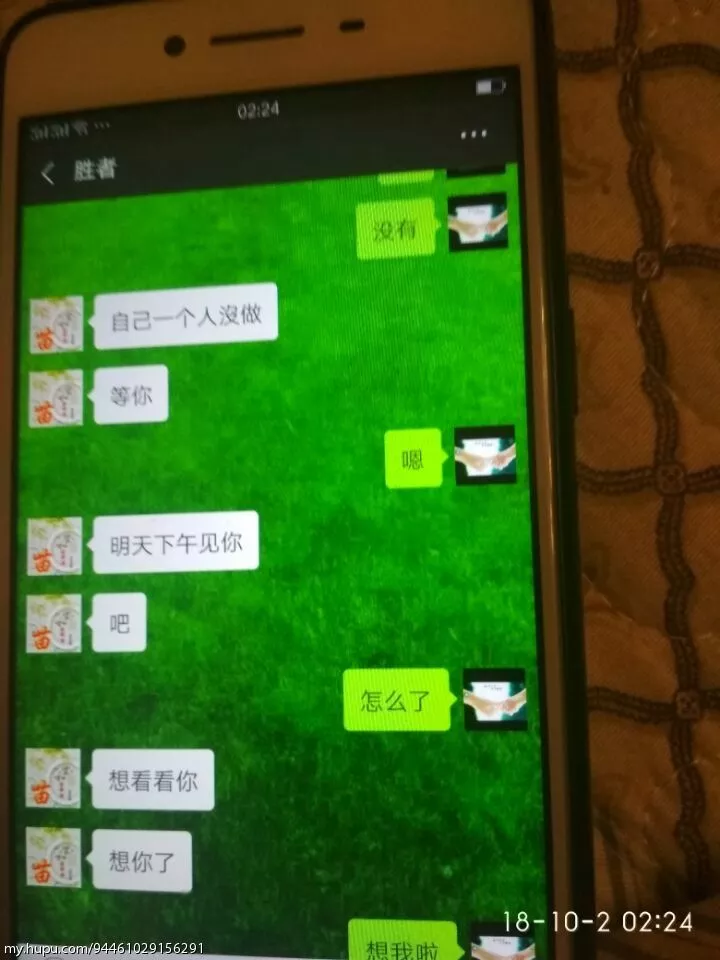
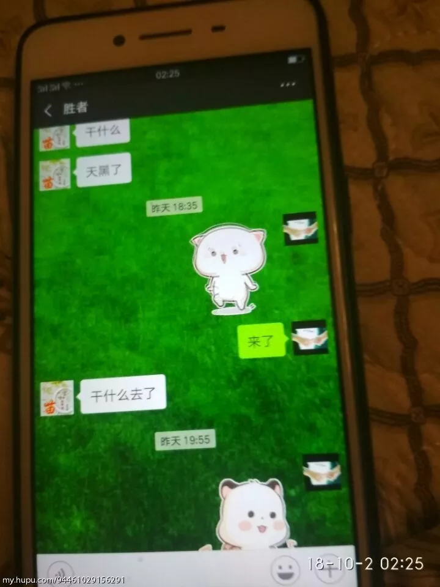
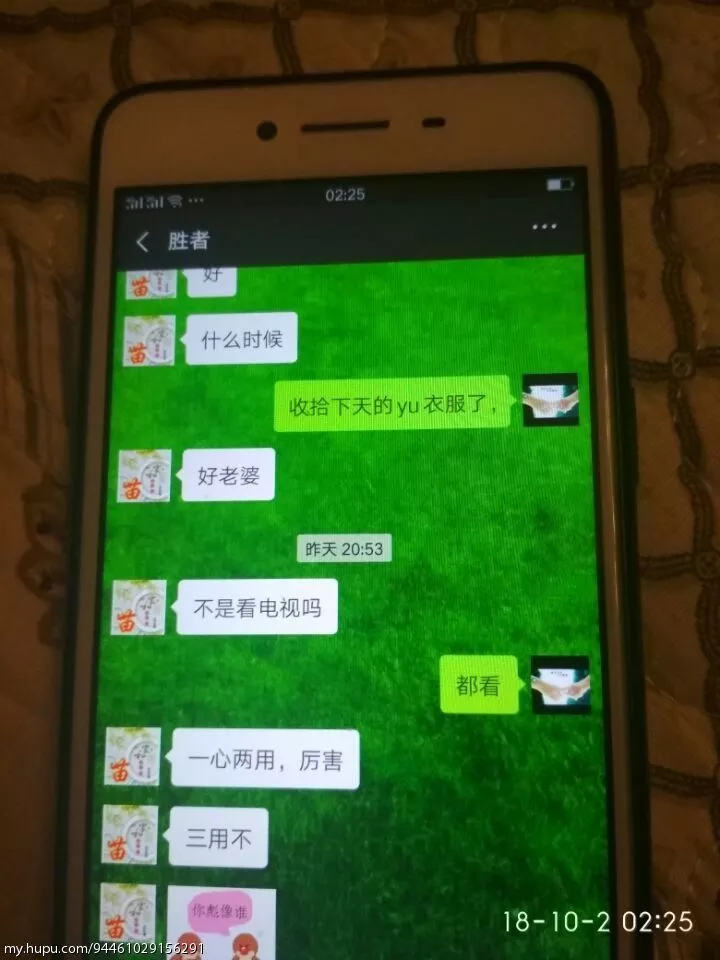
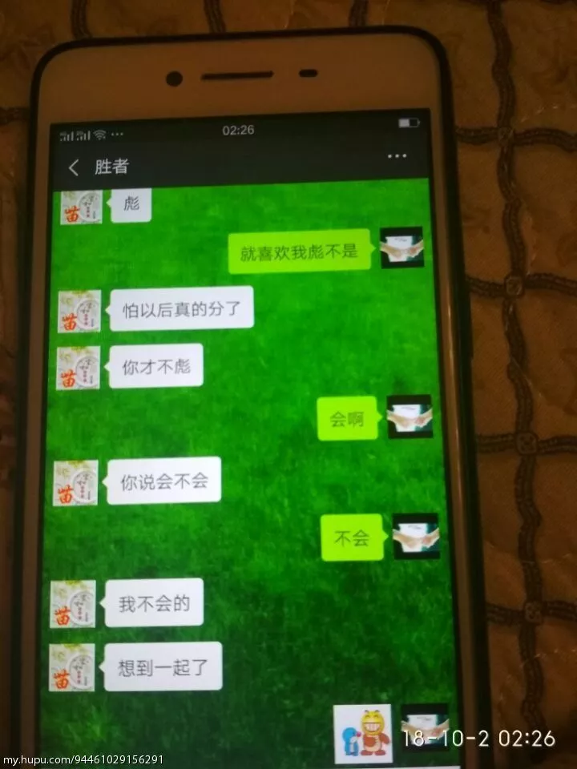
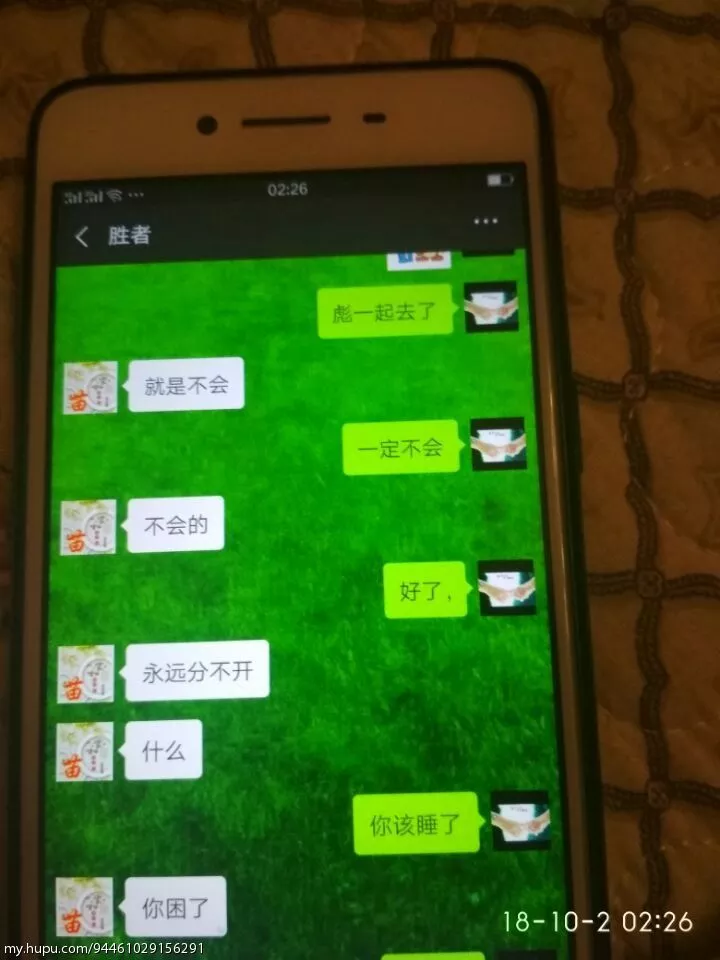
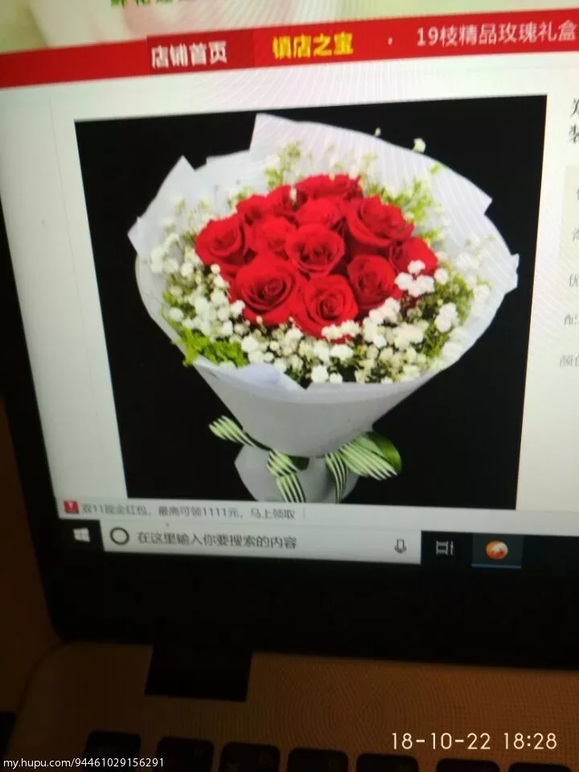
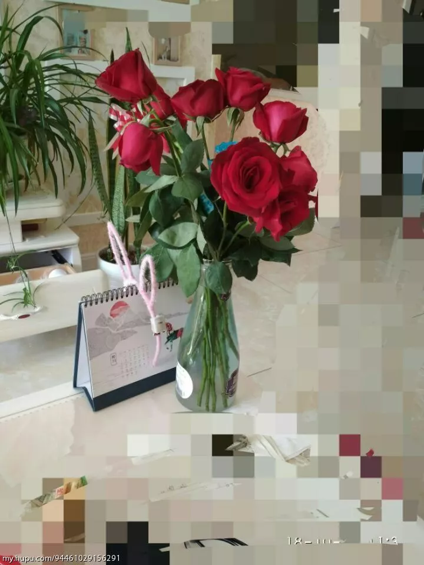
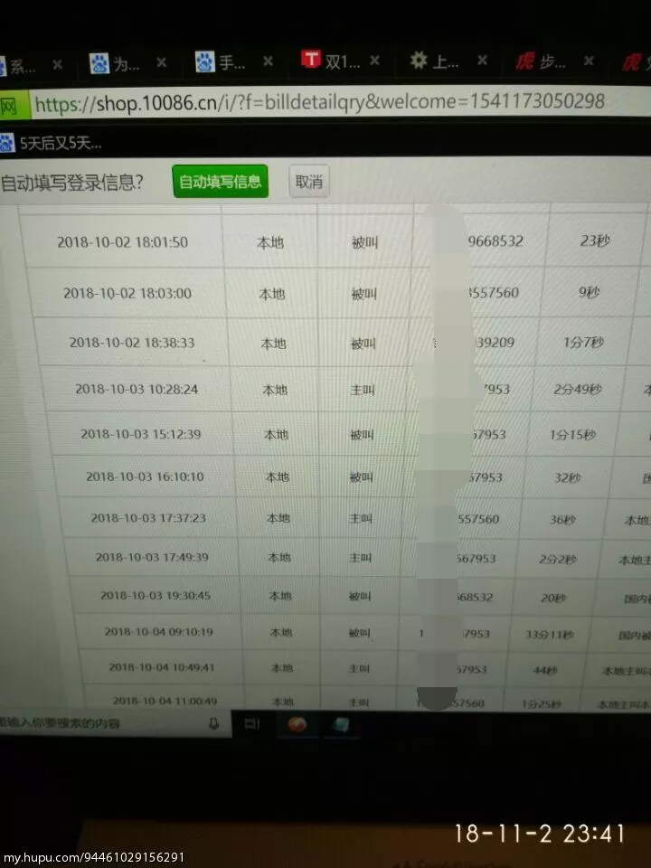
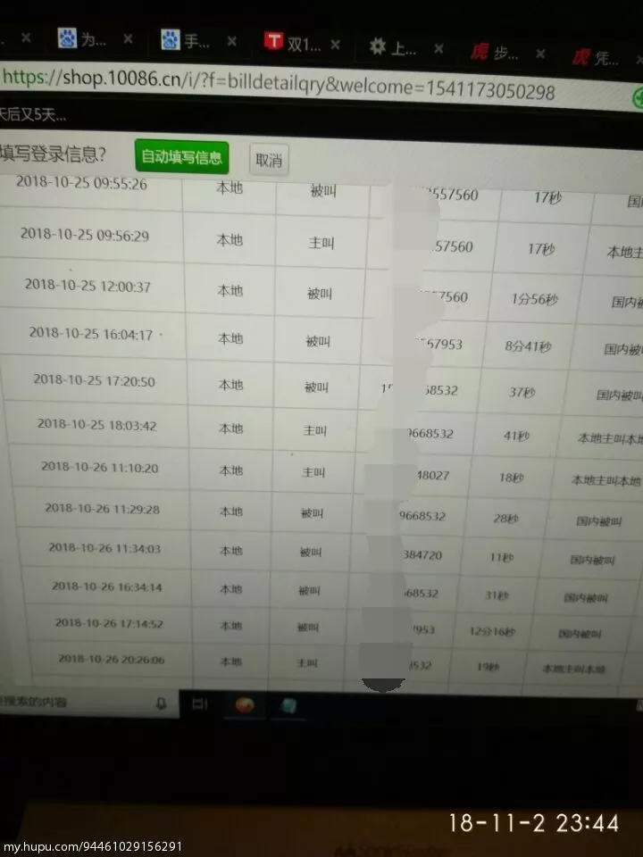

[原帖地址](https://bbs.hupu.com/24236799.html)
写的真是太好了，怕帖子被删掉，故记录在此。

# 第一部分
我从来没想到这样的事情会落到我头上，我15年来到步行街的，每天看绿光一条街各种被绿的故事，帮忙出主意的同时暗自庆幸自己有个好媳妇，有个可爱的女儿，有个不很富裕但很幸福的家庭，当时我的是这样以为的。
发现她不对劲的时候是今年中秋回她家，路上她拿着手机不停在笑，我凑近，她迅速将正在聊的微信变成照相机，装作拍照。
过完中秋我回到40公里外的单位上班，我住单位，每周回家一次，这是前提。
国庆节放假我回家，晚上我在客厅上网，她在厨房做饭，蒸包子，炸鱼，一边做一边玩手机，微信的铃声一直响个不停，中间她还接了个电话，出去了，然后回来拿了个袋子，里面是两件给我买的衣服。让我试试合不合适，圆领衫还可以，外套我没看好。她说那明天上午一起逛街再给我买。我说好。
她睡之前有个习惯就是将手机放在床边的凳子上充电，为了方便在她睡觉之后拿手机，我特地先上床占了靠凳子的位置，假装睡着。然后她上床玩了会手机，睡之前却也没有将手机放在凳子上充电，也没有放在她那边的床头柜上，而是压到了枕头下。
我一直想等她睡着，没想到一直等到我先睡着，最后一直折磨了我两年多的神经衰弱让我在凌晨两点多钟醒来。我起床绕到她那边拿出枕头下的手机，打开微信，我看到了里面长长的聊天记录，顿时全身冰凉，心脏揪成一团，手不停的在抖。

我彻夜未眠，感觉天都塌了。心脏像被一把刀捅了进去，拔出来，那血就从洞里流出来，无声无息，无休无止。

早上起来，她在厨房做南瓜饼，我在镜子前给女儿梳头
吃过早饭（不是南瓜饼，那时还没烤好），她穿上外套说要把女儿送到我妈家里，我心念一闪，立刻从沙发上站起来说，我去送吧。
下了楼，我搂着她问她，宝贝，爸爸问你个问题，从中秋我们去你姥姥家之后，你有没有在你奶奶家里睡过觉？
女儿摇了摇头说，没有。
“那从你放暑假之后，你有没有在你奶奶家里睡过觉？”
女儿点了点头，有。有过一次。妈妈说她要加班到很晚，就让我在奶奶家里睡了。
周围的人来来往往，依旧像往常那样匆匆忙忙，我站在路上，忽然感觉清晨的阳光是如此的刺眼，刺得我觉得整个世界都漆如墨染。
走到小区门口，我问她，XX，你喜欢爸爸还是喜欢妈妈？
女儿说，我都喜欢。
我说，那如果爸爸妈妈离婚了，你要跟谁？
女儿忽然停住脚步，看了我一眼，不说话。然后慢慢的在我怀里的那个小小的胸膛开始抽动起来。
我顿时心如刀绞，紧紧抱住她，安慰她，哎哎，别哭别哭，爸爸跟你开玩笑呢!逗你玩呢!
把女儿哄好送到我父母家，然后回到家里，我发现南瓜饼已经装在袋子里了。走到卧室我看见她正在换衣服，刚洗的头发蓬松而柔软，小巧白皙有些许皱纹却遮盖不了美丽的脸上画着淡淡的妆，喷了香水，昨天新买的衣服穿在身上竟然让我有种怦然心动的感觉，她好几年都没有这么用心打扮了。平常急着上班都是素面朝天，就算出去聚会，走亲戚也不过就洗洗头发，换件衣服。
“你今天怎么穿这么漂亮？”
“有吗？”她淡淡的说。
“有，你今天真的很漂亮啊，干吗这么特意打扮啊。”
“没有特意打扮啊，我以前也这样啊。你都没注意罢了。“她语气有些冷淡。”走吧。“
“去哪儿啊？”
“去给你买衣服啊！”
“下午再去吧。”
“干吗下午去，说好了上午去的，你这人怎么老是这么拖拖拉拉的？”
我跟在她后面走到客厅，在沙发上坐了下来。
她站在玄关回头看看我，瞪着眼睛问，“你怎么又坐下了？！”
“买衣服不急，我们说会话吧。
“说什么？”
我沉默片刻，抬起头问她，“XXX，我们结婚这么多年，你是不是一直对我挺失望的。“
“是，”她几乎不假思索地回答到，“结婚这么多年，我一直感觉都挺累的，你每次回家不是上网，就是玩手机，家里的活都是我干。你也很少来关心我”
“你说错了，结婚的头几年我是那样的，可是这些年我改变了很多，家里的活你要求我干的我一样也没少干，你说我不关心你，可但凡你提出的要求大大小小我都满足你，就这个房子你说要买，我起初那么反对，可是你说为了换个好的生活环境，最后我也同意买了，你说我对你差吗？”
“你对我不是很差，但是你觉得你对我很好吗？”、
我压了口气，问她，“XXX，我问你，结婚这么多年，我有没有做过对不起你的事？”
“没有。”她抬了抬头。
我深吸一口气，看住她的眼睛，问，“那你有没有做过对不起我的事？“
“没有。”她垂下眼睛。
“那你告诉我胜者是谁？
她一愣，“你看我手机了？”
“胜者是谁？”
她喉咙动了动，“就是我微信上认识的一个人。”
“你们没有给我戴绿帽子是吧？“
“你胡说些什么？”
“我给你个机会，你坦白，这事我就不追究。”
“没有！你让我坦白什么？”
我怒气膺胸，“没有是吧？把你的手机给我！”
我站起来一把抢过她手里的手机，打开微信，我发现聊天记录已经被清空；了
“你清空聊天记录干吗？”
“我习惯清空聊天记录，别人的我也清啊！”
“你放屁！这些你怎么都不清！你到底说不说！？“
“我跟他又没怎样，你让我说什么？“她脸色依然很平静。
我气炸了，“我操你吗，你就是不见棺材不掉泪是吧！”我掏出手机把那些照片放到她鼻子底下。“你看看，这是不是你的聊天记录！”
她脸色一下变了，转瞬间又故作镇静的笑了笑，“怎么了啊？就是跟他开开玩笑，有什么呀？”

“开尼玛比的玩笑！”我把聊天记录一张张往下翻，“开玩笑？这是开玩笑？草泥马， 你想干什么？你为什么要这么做？为什么？！”我怒火攻心已经彻底失去理智了，摔了手机，暴跳如雷。“你他妈还想不想要这个家了？想不想了？草你吗！你知道今天早上我问XX，她是怎么说的吗？”我含着眼泪把今天早上女儿的反应咆哮着告诉她，最后我没忍住，扇了她一个耳光。这是我第一次动手打她，她的反应也很强烈，“你打我？”立刻跳起来，架住我的手想反击，我把她摁在沙发上，让她动弹不得，捏着她的脸发疯一样质问她为什么要这么做？她不说话，也不反抗，，我哭了，一边哭一边骂她，然后告诉她，其实这么多年我心中一直感觉欠她的，还有那些藏在我心底她做的让我感动的所有事都告诉了她，我哭得不行，我想不通她为什么要这么做。
“我知道错了，你原谅我好吗？”她低声下气的说。
“你告诉我他是谁？”
她又不说话了，

“说！他是谁？”

“没有意义的，你别问了。“

“草泥马，他是谁?”到这时，她还护着他。我怒火烧天。

“我错了，你别问了好吗？”

“告诉我！草泥马，到现在你还护着他吗？”
“我不是护着他，我只是不想把事情闹大。”

我平静了片刻，坐了下来，拿出手机给女儿打电话，让她回来。
她忽然紧张起来，“你干吗？你让XX回来干吗？”
“让她回来看看她愿意跟谁？”

她害怕起来，一把抓住我的手，眼泪刷地流了出来，“我不离婚！不离婚，XX回来你不要告诉她好不好？求求你，好不好？别让她知道。我错了，我知道错了。”
我深吸一口气，“好，我可以不告诉她，只要你告诉我他是谁？“
“你别问这个了，对谁都没有好处的。”
“操！”我甩开她的手，把茶几上的果盘，茶杯，相框，全部摔倒地上，满屋子的碎片。
我一边疯狂的摔，一边用恶毒的语言骂她，发泄我心中的怒气。她流着眼泪也不吭声。然后女儿回来了，她看到满地的碎片，满脸怒火的我，在一旁啜泣的妈妈，她一下哽咽了，
“爸爸妈妈，你不要吵架啊，有什么事好好说，好不好，别吵架。好不好？”
看到强忍眼泪的女儿，我的泪水再次夺眶而出。

她跑上前抱起女儿，走出门外，开了电梯下了楼。

我独自到天台上，站了很久，下定决心离婚。
回到家里，碎片已经被收拾干净，她正在厨房做饭，那袋子南瓜饼也被摆在了盘子里。我走到卧室拿出结婚证，发现上面的日期是十月二十二号，正好十周年，我心酸不已，真是讽刺，这操蛋的生活就他妈像是一个笑话。
“出来，我们去把婚离了。”我平静地对她说。

她不说话打开水龙头，一直在洗手，
“你聋吗？给我出来！”

“我不离婚！”、
我进去揪住她的衣服把往外拽，她扒着门框，不肯出来，“不管你说什么，我都不离婚！”
“我草泥马，他是谁？”

“你别问了，求求你别问了，我错了，你原谅我好吗？以后我做牛做马来补偿你。
·”
我怒火攻心，大骂着把餐桌上的餐具全部砸碎，碎片割开了我的脚踝，我竟然没有知觉，她看见地上的血，急忙蹲下给我擦血，我一把把她给推开，“滚~！！！”

没多久，我爸来了，他开门看到满地的碎片，眼角含泪的她，怒气立刻在眼睛里燃烧起来，，跨上来就要打我，她拦住了爸爸，说，“爸，不是他的 错，是我不好。”

我爸之所以有这个反应，是因为他这十年对这个儿媳妇一直都很满意，平心而论，站在他的角度，确实这个儿媳妇挑不出任何毛病来。

再大致了解事情的原委之后，我爸开始教训我，其实每一句话都是说给她听的，他的态度就是不同意离婚，无论怎么样都不能离婚，不为我们考虑，也为孩子考虑。在他的调节下，我们暂时言好。

现在已经分居，这几天我几乎都睡不着觉，本来就有神经衰弱，加上这次，更是痛苦万分，想了很多很多，我不知道该怎么办，我恨她，恨她的不忠，她的背叛，我恨她的自私，她的脑残，恨她把男人带到这个新家来。恨她在我心头捅刀，恨她对女儿造成无法弥补的伤害。可是我也忘不了十二年前初次见面那个在仲夏的阳光里对我低眉浅笑的美丽少女，忘不了她起早贪黑任劳任怨对这个家的默默付出，忘不了笑点极低的她总是感染着我们父女，洒下许多欢笑，忘不了勤劳的她总是把家里收拾的井井有条，一尘不染，让我一回家就感觉到幸福的气息扑面而来。忘不了我们一家三口出去游玩时那些甜蜜的瞬间。我也忘不了她火热的唇，滚烫的身体，贪婪的索要。一边是万般不舍，一边是万箭穿心，这些最终交织成一场无比煎熬的人间炼狱，永远无法入轮回。
她这次真的伤我伤的特别深，我到现在都难以相信，难以接受，总幻想着这是一场梦该有多好，没经历过这种事的真的难以了解这种痛苦，那些保存在我手机里的聊天记录早已把我的心扎的鲜血淋漓，感觉心就像一块砧板，任那些刀枪剑戟如狂风骤雨般在其上肆虐，那排山倒海汹涌而来的巨大疼痛席卷过全身，周而复始，无休无止，就连每一声呼吸都带着心脏撕裂的爆响。

我从没有想过我的人生会到今天这种地步。两年多的神经衰弱让我有过自杀的念头，我不知道能不能撑过这一次。

# 第二部分
开始前，想对那些没有任何证据，嘴皮动动说我编瞎话水经验的人说，不是所有人都跟你一样把经验当爹的。那些说我写小说编故事的，请你尊重一下这个职业，哪个作家编剧会把绿帽子扣在自己头上，带入角色乐在其中，沾沾自喜，你是不是以为别人都跟你一样黔驴技穷一样没用？在经过这件事让我看到这个曾经让我满怀热忱与憧憬的世界忽然原形毕露变得如此面目可憎之后，你们那些冷嘲热讽已经根本无法再伤我一分一毫，都歇会儿吧。

这件事发生以来我没有和身边任何人说，各种极端的想法在我千疮百孔的内心此消彼长，汹涌激荡，我怕它们会汇流成海最终将我吞噬，所以我选择了释放，选择了倾诉，你我素不相识，此生永无交集，再合适不过。
最后我要谢谢那些安慰我，鼓励我费心费力打字给我出主意的JRS，我没办法一一回复，但那些温暖的话语我都铭记在心，是你们让我在这个忽然狰狞丑陋的世界的撕咬之下，在绝望之中，看到一丝温暖，一丝善意，谢谢你们。

关于他们到底有没有发生关系这件事，其实不用问她我反复看聊天记录已经猜到了，
（记录见第一部分）
他们之前肯定在我家一起吃过饭，孤男寡女共处一室，他们都不是圣人。还有这句，只是看看你，言外之意，我们不上床。包括上回我问我女儿有没有去奶奶家睡觉更坚定了我的想法。还有另一个更让我感到心冷的佐证是，我们已经有3个月没河蟹了，结婚十年，老夫老妻了，我对这方面的兴趣不是很大，她也是，这次的中空期也太长了，有几次我撩拨她她也冷冷的说累说困没什么兴趣。、
这些都是我的猜测，我心里还是抱着十分渺茫的希望，希望我猜错了。
后来我想到一件事，是在我女儿放暑假之后，她要把女儿送回姥姥家和她侄子一块玩，那天我刚休完班返回单位，她打电话来说这件事，我说，那我跟领导请假送你们吧。然后当天晚上她说不用我请假了，她单位一个同事要去外地正好路过，她们要搭顺风车，因为同行的有我女儿有她嫂子和她侄子，所以我就没有多想，就同意了。当时我还担心人家要绕路送她们，给人家添麻烦，就再次说要请假送她们，我老婆赶忙说，不用不用，不麻烦，真的顺路。

想起这件事来，我就出门给女儿打了电话，问她记不记得有个叔叔送他们回姥姥家这件事，女儿张口就说，那不是个叔叔，是个伯伯，妈妈说他是厂子里修机器的，他家里有两个姐姐，一个20岁，一个13岁。我问她那你之前见过这个伯伯吗？她说没见过。我问他长什么样子，她说高高的。然后她说他们傍晚到的，吃过了晚饭后，妈妈和伯伯就开车走了。

10月2号那天下午我爸走了之后，我问她整个事情的来龙去脉，酝酿了良久之后，她跟我说了那个男人的大体情况，家住在距此十公里的镇上， 具体哪个单位哪个村子的，她说她不知道，45岁有两个女儿，开一辆面包，他们是6月份在一家超市的微信群里认识的，相聊甚欢，好感渐生。说他来过三次，送了些农产品，没进家门，放下东西就走了，后来又说仅仅进家吃过一次饭，但没有发生关系，仅仅止于拥抱。我问她那次送她们回娘家的是谁，她承认是他，我问，你们在车上或者回来之后有没有发 生关系，她大声反驳我说，不要把她想的那么龌蹉下贱。我问她他的名字，她又变成了哑巴，我再次气到炸裂，气急败坏抓住她脖子揪着她衣服吼着让她滚，她哭着收拾了衣服皮包，在门口站了很久，最后还是走了。，晚上，女儿打电话给她，我爸打电话给她，她才回的家。、

分居后，我在痛苦的煎熬中挣扎了几天，觉得还是放不下她，虽然知道她依然在骗我。我想起我们过去那些许许多多甜蜜美好的点点滴滴，相识相恋，相偎相知，那些风花雪月，柴米油盐，往事一幕一幕在我心中翻涌，直至模糊了我的双眼。

我永远记得我们初次见面的那天，是在介绍人的家里，她坐在客厅靠窗的沙发上，正午的阳光落在她黑色的长发形成一片金色的光晕，白色的亚麻上衣，浅色的牛仔短裙，白皙俏丽的脸庞上徐徐绽放开的微笑，如同暖风中纷扬的花瓣。

我记得我们第一次约会，她身上醉人的香气以及那件性感迷人的修身长裙，记得我们第一次在拥挤的人群中牵手，第一次在树荫下接吻。第一次在她宿舍里河蟹。我记得，我第一次带她去我家，从她厂子里出来，我伸手拦了辆出租车，门都开了，她硬拉着我不让上，对司机说对不起，我们不坐。司机也不气恼，反而看着我直笑，那意思好像在说，哟呵，你小子可以啊，找了个这么个好媳妇。那天，我们拉着手走了三公里回了家，十八线小城市，公交也没几辆。

那时我从事矿山工作，被调到一个偏僻的山区勘测，晚上经常是留我一个人值班，我也就经常把她骑自行车带来。有一天下午，我发了条短信给她，结果她误以为我让她来陪我值班，待到她坐班车到那个老地方，却没有发现我，打电话也打不通，山里信号不好。于是她走了十几里山路，从太阳西沉走到伸手不见五指，仅靠着手机那一点亮光来到半山腰我的房子。那路上还有一片坟地，每次路过那里我都觉得阴风阵阵，路上她还摔了一跤，白嫩的手上擦了一块皮。当我听到狗子在门外狂叫，拿起手电出了门，迎着手电的光芒，出现在面前的是她那张满是汗水俏丽的脸，头发贴在上面，外套系在腰间，手里拿了根棍子，一脸担惊受怕的样子。我惊喜交加，又感动又心疼，差点哭了出来，飞奔上前紧紧抱住了她。
那一夜，我们拥抱在一起，看着窗外璀璨的星斗，温柔的夜风，静谧的大山，山间的小屋，我们躺在床上就如同躺在贝壳里的两粒珍珠。
谈了两年多，我们一次架也没吵过，一次不愉快也没有过，有一天我对她说，我们结婚吧，我不想找了，就算从天上找仙女下来，也就你这样了。2008年10月22号，我们登记了。结婚后那些鸡毛蒜皮的琐碎也没有磨灭我们的恩爱与甜蜜。我记得在寒风刺骨的冬天，她去我单位门口等着下班一起回家，等我出来她鼻子冻的通红，却依然很高兴，哈着气问我冷不冷。我骑着摩托载着她，她依偎在我身后，穿过萧瑟的街道，昏黄的路灯。
我记得那年家里的热水器坏了，晚上我们去浴池洗澡，她穿着厚厚的羽绒服，头上戴着顶毛线帽子，上面还有一个绒球，随着她的动作东摇西晃，橘黄色的路灯下，飘洒着纷扬的雪花，我们搂着对方的腰，在结冰的路面上一步三滑，嘻嘻哈哈。在浴池里我要做，她死活不同意，抬起头来四处看，说这里有摄像头，但最终还是拗不过我。女儿出生后，家里的欢乐气氛更是达到了顶点，我每天最期盼的事情就是早早下班回家逗女儿，听她咿咿呀呀含糊不清的叫妈妈妈妈，老婆说XX，叫爸爸，她依然还是妈妈妈妈。
这些许许多多的回忆就如同那年冬天许许多多的雪花，纷纷扬扬，悄无声息，抬起头来，就洒了我一头一脸，消融了，就再也无迹可寻。
隔天，我打电话给她，把这些往事都说给她听，虽然她大部分细节都记不太清了，却依然津津乐道。之间的气氛变得空前的温馨，那时候只要她说一句，对不起老公，我不该那么做，你原谅我吧，你回来吧，我们好好过日子。我愿不计前嫌，飞奔回家，紧紧抱住她，让一切重新开始。

结果随后她忽然说了一句话让气氛骤然冷却凝固，形势急转直下，她说，我们都有缺点，你的缺点就是阅历经历太少了，你也不出门不交际，人情世故方面你太幼稚，像个孩子。
我怔住了，十多年来她从未对我说起这个词，“孩子”，然而今天她忽然发明了这个新词，唯一的能解释的原因就是那个45岁的男人，我愤怒到了极点，却反而冷静下来，我按下了录音键，打断了她的话，冷冷的问她，你为什么要把那个男人带到家里来睡觉？
她愣住了，显然还没从刚才温馨的气氛中转换过来，我继续问，他来过几次，你们做过几次？
那边是长久的沉默，然后说，“老公，这件事是我错了，我一时，”
“你给我闭嘴，我问你你们干过几次？”
“这件事我脑袋昏，我不该那么，”
“闭嘴，几次？回答我几次？”
那边沉默了，我的心提了起来，我多希望她能大声反驳我说，你给我滚！我们没有发生关系！
她越是沉默，我的心就越是不安。最终她用几不可闻的声音说，我们睡过一次觉。
那细若蚊呐的微弱声音却如天雷般在我耳边炸裂，登时让我感觉天旋地转，心中那一丝丝明明灭灭一息尚存的希望终于彻底粉身碎骨，万劫不复。我手脚冰凉，心向一个无底深渊不停的坠落。我怒不可遏，破口大骂，滔滔不绝，那边一声不吭，骂了很久，我累了，感觉也对这个女人死心了。我平静下来，开始问她细节，在家吃过饭没有？吃过。做完之后有没有过夜？没有。什么时候走的？上半夜。你们用什么姿势做了多长时间？她忽然哽咽恼怒起来，你这是在侮辱我，拿我寻开心是不是？

我瞬间又炸了，“你他妈要脸吗？是我侮辱你还是你侮辱我？我在外面挣钱养家还贷款，你把奸夫领到家里来鬼混！我每天在外面最想的事就是休班回家，看看你看看孩子，刚买了新房子，生活也有了奔头，我想着努力赚钱早早把贷款还死，然后好好孝敬双方父母，把孩子抚养长大，曹尼玛，你他妈就是这么对我的？！”我说这话时，眼泪一直在眼眶打转。我想象中美好而平凡的一生就让她这么给毁了。
那边哭的更厉害，“我错了，真的知道错了，你打我也好骂我也好，但你千万不要和我离婚。我辜负了你，但我心里真的有你，我保证和他一刀两断，我永远不会再犯了。你给我一次机会，我后半辈子做牛做马来报答你。”

“曹尼玛！滚！”
我怒不可遏挂了电话，极度的愤怒反而让我冷静下来，我想了很多报复他们，搞得他们身败名裂的方法，然而感觉还是不解气，因为我只要一想到他们在我家里翻云覆雨的画面我就抓狂，万箭穿心，痛苦难当。我也开始后悔自责，如果那天我坚持去送她们回娘家，也许他们就不会感情升温滚到一起，如果我能多多回家早早觉察出她出轨的苗头，把这一切终结于聊骚就好了。

第二天我下井作业，等上井之后我发现手机里有十几通未接来电，都是我爸打的。接通后，他张嘴就骂，“你他妈的想干什么？你想气死我是不是？我和你妈这些天都没有睡好觉你知道吗？她做了什么十恶不赦的事了，你要逼死她吗？非要搞得家破人亡吗？”
我们家里是兄弟两个，我从小就跟身上长着逆鳞似的，从来都没做过一件令他感到满意的事情，唯一一件令他满意的事估计就是娶了这个儿媳妇了。我无奈地叹了口气说，爸，你不知道，她都跟人睡了啊。
我爸愣住了，然后也叹了口气，“哎，事情都已经发生了是吧，啊，是吧，既然都已经这样了是吧，哎，你就别老想它了，就让它过去吧，日子还要过啊，你想想这么多年她除了这件事还有什么对不起你的吗？没有啊，是吧，她很好啊，对不对？至少比你嫂子强太多太多了是吧？你应该知足啊，你离婚上哪去找这样的，她只要能改过，你就原谅她吧，依我说啊，”巴拉巴拉。。。。。
我知道他的脾气，也就不跟他犟，他无论说什么我都点头说是说好，直至挂了电话。
当晚，我开车回到家，平日里因工作劳累一回家就满腹怨念呼之欲出的她变得各位低声下气，小心翼翼的看着我，问我晚上吃什么。

吃过了晚饭，我们平心静气的谈了谈。在经过这几天的交锋，我发现了她一个BUG，就是她不善于说谎，她只要一说谎，我立马就能察觉。她说谎时心虚，底气不足，声音会突然变得特别低且含糊其辞。然而她要是没做过的事你硬按在她身上，她反应就会特别激烈，几乎要跳起来大声反驳你，一副“你凭什么污蔑我清白的样子”看她这副样子我又气又恨又好笑，你他妈就这智商就别出轨了呗！所以我把可疑的问题全部抬出来对她进行地毯式轰炸，是真是假，一炸便知。

他们仅睡过一次是真，没有再家里过夜是假；他们那晚没在车上做是真，她不认识他姐姐是假；他不是她厂里的同事是真，不知道他的住址是假。这些天他们断了联系是真，她没对他动感情是假。
“最后剩下三个问题，”我跟她说，“你说出来，咱们继续好好过，一，他的名字，二，他的手机号，三，他的住址。”
空气突然安静起来，只剩下墙上的挂钟在轻轻走动的声音。
“我问你话呢！你哑巴了？”
“老公，你别问了，我把他号删了也记不得他的手机号，他也没跟我说他住在哪里。”
“好，那他叫什么？”
又是一阵沉默，我抬起她的下巴，扭过她的脸看着她的眼睛，问，“我是不是认识他？”她没有回避我的眼神，“你不认识他。”
“那你他妈给我说他叫什么？”：

“你为什么偏要问，有什么意义？事情都过了，我也不再跟他联系了，你就别问了。”

“你到底是在担心什么？你是担心我还是担心他？”
“我不是担心谁，就是觉得这件事没有意义。”
“那在你心中觉得是我重要，还是他重要？”
“当然是你重要！”她抓住我的手。
“他叫什么？”
沉默了很久，我开始踹她，几下把她踢下床去，“滚，滚出去，老子不要你了，你去找他去吧，还是你们谈的来，你们每天都开心，你们他妈才是天生一对，我就是个孩子，滚，有多远滚多远。”

我一路推搡拉扯她，她扒着床角，门框，拐角，无力的抵抗着。到了门口，她脚上只剩一只拖鞋，我转身拿起沙发上她的手机，扔给她，“走走走，出去，打电话给他让他来接你，滚蛋。”
她泪眼婆娑的望着我，张张嘴想说些什么，被我一把推出了门外，关上门，我满腔的愤恨无处发泄，特别想砸东西泄愤，但又怕吵醒了女儿。我想不通她为什么到现在还在袒护着他。我在床上翻来覆去，越想越恨，满腔的怒火和戾气。我越痛苦就越坚定了想找出他的想法，我要把我所遭受到的痛苦统统悉数返还于他。
大约一个小时之后，我起来，打开房门，门被挡了一下，然后门后传来一声哎呀，坐在门后的她一下摔倒滚在地上。她爬起来，一边揉着肩膀一边低眉顺眼的看着我。单薄的睡衣挡不住秋夜的寒气，身体轻轻的抖着，光着的一只脚沾满灰尘。那一瞬间，我的心竟然软了下来，我冷冷的看着她，“你到底说不说？”
她不回答，
我一手拉着门，开始倒计时，“3，2，”
“好！我说，我告诉你！”她斩钉截铁似的下定决心，说的同时眼泪噙在眼眶。

进门，她坐到沙发上，告诉了我一个名字，，miao zhong bo，这是读音，她不知道怎么写。这个名字和他微信号的缩写相吻合。这个人我确实不认识。、
但此时她的态度却急转直下让我出乎意料，从之前的唯唯诺诺，低声下气，委曲求全变得愤然，决然，无所畏惧，好像受了莫大的冤枉和委屈，泪水滚滚而下，并拒绝我递过去的纸巾，这让我十分费解，在我上个帖子里有个JR回复我说，这就好像是《廊桥遗梦》的情节，他给了她一段美好的感情，支撑了她的世界，如果说出了他的名字就是出卖了他，这是我觉得能说的通的解释，但同时这个解释也让我万念俱灰，十多年感情的相濡以沫到头来竟然抵不过短短4个月的干柴烈火。我不知道自己究竟做错了什么，事情会发展到这种地步。

这些天来，女儿变得懂事了很多，我常常会在家里怔住，发呆，走神，叹气，自言自语。女儿看到就会走过来，抱住我或拉着我的手问我，“爸爸，你怎么了？”“爸爸你没事吧？”“爸爸，你不要紧吧？”“爸爸，等下妈妈回来你不要和她吵架啊。”
女儿不够聪明，学习不好，她刚上三年级，经常考试考个80几分，一道题反复给她讲她还是听不懂，所以常常挨骂。
直到现在我才发现她竟然有如此懂事的一面。私下里我问过她，离婚她要跟谁，她沉默许久，留着眼泪告诉我，妈妈。这并不出乎我的意料，她天天跟她妈在一起，这份感情是谁也不能代替的。

可是我舍不得她。

这些天老婆依然像个在赎罪的人，低眉顺眼，委曲求全，什么都抢着做。她说她跟他完全切断了联系，但我看他们的那些暧昧的聊天记录，完全就是热恋男女深陷其中，情难自拔的那种状态，她叫他大叔，他叫她丫头，他说喜欢看她化妆，结果那天约定下午见面之前她就为他化妆，他给她带南瓜，她给他做南瓜饼送给他吃。她从前用的是女儿的照片做头像，出轨后改成现在这执子之手的图片。
我觉得他们不可能断干净，但看在她对这个家十年付出的份上，我愿意给彼此一个机会。如果她对我还有一丝愧疚，对女儿还有一丝怜悯，对这个家还有一丝责任，愿意悔过自新的话，我会把沙子揉碎在眼睛里既往不咎。如若不然，我会收集好证据让她净身出户。

这件事其实最严重的后果，不是能不能原谅，而是借用某位JR的话说，你对我最大的伤害不是你背叛了我，而是我无法再相信你了。

我这一生最悲痛的事，有两件，一件是我的姨夫因工厂破产负债累累而选择投湖自尽，留下从小对我无比疼爱的大姨一个人风烛残年。
另一件事就是我的大舅子因车祸意外去世。他是一个很和气善良的矮壮汉子，脸上总挂着和善爽朗的笑容，这笑容特别感染人，让人一见如沐春风。心情瞬间开朗。在三年前我接到那个噩耗赶到岳母家中，那个爱笑的男人已经变成一具冰冷的尸体，岳母的哭声撕心裂肺。我看着他，根本难以接受眼前的事实，那张曾经对我笑的脸变得苍白僵硬，再也无法对我说出，来呀，小C，我们一起喝酒。

我问过我老婆，我说如果你哥还在的话，他要是知道这件事会怎么做。
她黯然的说，我哥肯定会揍我。
我记得我们谈恋爱那会=儿，她常常说，你可不要欺负我啊，你要是欺负我，我哥可是会揍你的。
那一夜，我没有梦到他，可是我记得有泪水含在我的眼窝。

他是个好人，但却没有好报。

我记得那是12年的冬天，我们回老家参加表弟的婚礼，我和她在寒风料峭中爬上积雪未融的坪坊（北方农村把房顶做成平的，以方便晒粮食用），她看着远处山坡上被枯草和积雪覆盖的一大片坟地，指着对我说，你说以后我们能不能埋在那里。此时隆冬的寒风吹起她的头发，盖住了她美丽的脸庞，她用手拢了拢头发，那上面的笑容天真而又无瑕。那时的她，我知道是全心全意爱着我的，从头到脚，每一根头发，每一个眼神，每一个笑容，都是属于我的，。6年的光阴一晃而过，那一幕依然清晰如昨。世间万物，那些鲜活的，热烈的，喧嚣的，沉默的，饱含热泪的，热血沸腾的，心如火烫的，刻骨铭心的，那些执子之手，相濡以沫，生死契阔，都不会永远，唯有死亡才会永远。

这就是我的前半生，如此平凡，如此幸运，如此幸福。如此不幸，如此痛苦，如此心酸。
**我是个好人，也没什么好报**

# 第三部分
事情发生以来，网上那么多关心这件事情的网友给我出主意，其实我还是倾向于原谅她，因为十多年的感情已经融入我的骨血之中，要切割的那种痛我还无法忍受，我不习惯没有她，虽然有根刺在心里一直扎着我。在家中目光所及之物便是伤痛来源之处，门口的脚垫，拖鞋，沙发，他们吃饭的餐桌，酒柜里的酒，走廊，莲蓬头，双人床，窗帘，对面墙上的挂钟，床头柜的纸巾盒，床头的结婚照。这是一个男人最大的屈辱，我能接受他们出去开房，我不能接受他们在这个5月份刚搬进的新家里。但我忍下来了，因为我心里还有她。既然选择原谅她，发生的一切就此打住翻篇。她不说他住在哪里我也就不问了，虽然在心里依然存着查清了一定要搞他的念头。

那天晚上我坐在沙发上搂着她，跟她说，我在单位周围村子里赶集，看到一个老头开着三轮电瓶车，后兜子里做着老太太，我看到就哭了，因为我就想着等我们老了退休了，我就开着车拉着你到处去转转看看。我说着说着眼泪止不住的流下来，我心里很疼很难受，因为我不知道我们还能不能有那一天，。她扑在我胸口上，紧紧抱住我，说，你原谅我吧老公，我爱你。我们好好过。
那天晚上，平时千般万般不愿意的她也给我口了，她很投入很尽兴，达到巅峰时不管不顾的把我的胸口抓的伤痕累累，被领子磨着着实疼了好几天，事后我还拍下来笑说，这是你对我jiabao的证据。

第二天晚上，我们在床上开始谈心，我问她我有什么缺点，大到不世故不成熟小到乱扔东西，她说了一大堆，总结起来只有两个，不成熟，懒撒，我听后告诉她说，除非工作和生活环境改变，不多待人接物我是改变不了的，但其实你理解的那种成熟和我理解的成熟是有差别的，二你说我懒的这个毛病2013年后我一直都在改，如果之前我只有60分，那我现在已经有80分了，你认可吗？，她点点头。然后我问她我有什么优点，她忽然卡住了，琢磨了半天说了句，这么些年我无论提出什么要求，你都没反对。

说真的，我有些失望，我搂了搂她，开始说她的优点，那些让我感动的，让我依赖的，让我深爱的，然后我说了她一个最大的缺点，乱发脾气，在我的印象中，很少有我回来她不发脾气的时候，不是对我就是对女儿，只要对一个发，另一个就会有池鱼之殃，女儿还行早就习惯了，也不当回事.。发完脾气一扭脸，她该怎么乐怎么乐。我不行我每次心里都是提着的。

她说她能改，我说你改不了，她说我改给你看看。我在心里叹了口气，她说我不了解她，其实她自己也不了解自己。
后来我们聊到那个男的，具体是怎么认识的，见过几次面，一起逛街一起撸串等等，一切都是心平气和的，直到她忽然说到，其实我觉得他的性格脾气挺像我哥的，这一下让我立刻火冒三丈，张嘴就骂，你给我闭嘴，你知道我多喜欢你哥吗？你知道他在我心目中的地位吗？你还有脸提你哥，那个奸夫像你哥，亏你好意思说，你哥会去破坏别人家庭？他什么东西，能和你哥比，曹尼玛，你这是再侮辱你哥！
她不再做声。
事后我冷静下来我明白她说的都是真心话，只是我无法理解她的心理。我单位附近一个村子商店的店主是一个瘫子，面容跟我大舅子神似，第一次去冷不丁被吓了一跳，胸口热热的堵着很难受。然后再去了一次就没敢再去了，因为我怕难过。因为你清楚的知道他不是他，
他是永远不可代替的。

生活似乎变的更和谐了，每两天我都会回家一次，回来像往常那样先熬粥，蒸饭，洗菜切菜，等她回来炒。晚上会紧紧抱在一起，早晨醒来她会亲吻我。这是我最喜欢的，过去我跟她说过很多次
，她一直都没有做到。她不在会因为我忘记洗碗或乱扔东西而发脾气，对我温言细语，嘘寒问暖。她的表现让我无可挑剔，我那时认为这就是真心悔过的表现，如果后半生都能如此这般，那出轨也值了。虽然她一直不肯告诉我他的地址仍让我心有介怀，但我觉得这个人不足以成为我们之间的障碍。

很快就到了10月22号，我们十周年结婚纪念日，虽然在这值得纪念欢庆的日子发生这件糟心的事，但既然选择重修于好就该把它强行遗忘，而且说不准这也是一个契机，能让我们的感情修补断壁残垣变得更加牢固。

她当然不会记得今天，因为她连我们第一次约会都不记得在哪里，更讽刺的是我们第一次约会的湖边现在已拆迁改造成我们居住的小区，缘，如此妙不可言。

早晨起来的时候我跟她说晚上下班早点回家，她似乎是没听见，我于是又说了一遍，她还不吱声，一直摆弄着手机，我推了推她，她也不说话，我最后说了一遍之后，躺下就睡了。
中午她回来吃饭的时候我又跟她提起这件事，她有些敷衍，说，哎呀，你要干嘛呀，今天厂里挺忙的，有点活儿要加班干。

我沉下了脸，算了，你爱回来不回来！
她看我生气了，赶忙换上一副笑脸，哎呀哎呀，怎么还生气了，要我回来干嘛？是要给我点好处吗？

我还在气头上，随便你吧，不回来拉鸡倒。

吃完饭，我想用她的手机开个爱奇艺会员，因为新账号有优惠。手机拿过来，绑定银行卡开完了会员，然后我顺手翻了翻她的通话记录，最上面的名字是一个姓宫的人，点开来，倏然一道惊雷从我心中滚过，因为这个号码我太熟悉了，我急忙打开我手机相册翻出了那个男人的微信号，一对照，我手忙脚乱的赶紧截了图。把手机还给她。

等她上班走了之后，我对着这张截图看了半个多小时，这个

宫是我女儿的班主任，可是他的号码怎么能和那个奸夫前面的数字一样。这难道只是个巧合？后面的不一样？上面只有23秒的通话，应该不会有什么吧？可是今天早上她一直装聋作哑是什么意思。

我胡思乱想了一个下午，到了傍晚我去市场买了排骨，黄花鱼，花哈，顺道去接了女儿放学。路上我说宝贝，今天我们去买一束花送给你妈好不好？女儿立刻拍手跳了起来，好！我妈最喜欢花了！我带着她进了一家花店，买了一支百合和一束红玫瑰。
女儿抱着花喜滋滋地说，我妈看了一定超级高兴！
我问你怎么知道？
女儿说，上回母亲节，我叠了一朵花送给我妈，我妈开心的不得了，还亲了我呢！这么一大束花她不超级高兴才怪！
我搂着她，她抱着花，我们喜气洋洋的穿过华灯初上的街道，穿过如织的人群。

回到家，我炖上排骨，腌上黄花鱼，然后和女儿商量如何送花，我说了一个方案，她说不行，她说了一个方案，我说不行，最后我们折中定了一个方案。然后我俩就开始排练，嘻嘻哈哈，快乐无比。然后我们还上网选好了下个周年的花，就是这一束。

我说不要告诉你妈呀，女儿连连摇手，我不说我不说，这是我们之间的秘密。
临近老婆下班的时间，女儿激动坏了，又蹦又跳的。到了下班时间她还没有回来，女儿开始着急了，频繁从房间跑出来，问我妈妈回来了吗？你听到她的摩托声了吗？
这样焦急等待了50分钟，女儿忽然从房间里探出头来，说，爸爸，妈妈回来了，我听到她的摩托车声了！
嗯，好，你快躲起来，到时候听我口令！
遵命！老大！
老婆进了门，换了鞋，我从玄关的柜子里那出百合花送到她面前，说，亲爱的，送给你一支花。
她满脸喜色，“”呀！你还送我花，今天是什么日子啊？
“”让你闺女告诉你今天是什么日子，来，闭上眼睛，你闺女有礼物要送给你。
她不肯闭眼，什么呀？还神神秘秘的。
我捂住她的眼睛，然后女儿从房间里跑出来，把玫瑰花递上去，说，爸爸妈妈，祝你们结婚十周年快乐！
老婆睁开眼，看到花也很高兴，亲了姑娘一口，接过花，问，谁买的呀？
女儿说，是爸爸呀，妈妈，你亲亲他吧！
老婆转过来在我脸上亲了下。我一下把她们两个都抱了起来，此时此刻我真是快乐极了，世间所有的愁苦在这一瞬间烟消云散。
她把花拿出来插进了水瓶里，然后开始拍照，女儿问，妈妈，你要发朋友圈里吗？
她说，我不发朋友圈，我发掰掰群里。
后来我发现她果然没有发朋友圈，但她是连这种都会发朋友圈的人。

我们开了瓶酒，晚饭吃的其乐融融。那天晚上兴之所至，我想让她口，她不干，说累不愿动。她是对口一直很反感的，结婚这么多年，给我口的次数两只手数的过来。
我说你看这么多年，你给我口的时候都是值得纪念的日子，我们第一次做你给我口，结婚那天你给我口，我本命年过年那天，去浴池那次，黑灯瞎火你摸进我宿舍那次 ，还有你家小狗怀孕那次，都是普天同庆的盛大吉日啊，这次是十周年咱们怎么也得纪念一下吧，她说你给我滚，老娘不爱动弹。我说那我给你口，她说本宫不需要，我说那朕降贵纡尊与你共修69大法 ，她说6你奶奶。

烘托了一晚上的欢乐氛围就此告一段落。冷静下来，我又想起了那个通话记录。忽然灵机一动。等她熟睡之后，我拿起了她的手机，加了那个男人的微信，开始翻看他的朋友圈。看过之后我终于明白他们为什么会互相看对眼了，他的朋友圈和我老婆的朋友圈如出一辙，都是些乱七八糟的心灵鸡汤，各种光怪陆离的奇闻，抖音快手的低俗恶搞视频，很多自拍的视频和照片，拍的没头没尾，有价值的不多，我看了半宿，只找到一张车牌号 和他小女儿的照片，以及他外甥女结婚时村子广场的照片。有一家他常去的冷藏库，但是招牌上的字脱落了。

我和我老婆都是初中毕业我们刚谈恋爱那会儿，乡村爱情第一部正播的如火如荼，我抱着她坐在宿舍椅子上看的津津有味，还有共同爱好就是郭老师的相声，在单位大山值班时我们躺着床上一人一根耳机线，听的乐不可支。她害怕听鬼故事，但我爱讲给她听，吓得她花枝乱颤，出去撒尿都要我唱歌给她听，还有一次更夸张，用线绑住我，让我一直抖线。那时她的笑点真低啊，看到地上两条虫子沿着一条直线爬啊爬最后碰到头，她都能笑半天，跟她在一起真的无比快乐。结婚后，乡村爱情越拍越烂，郭老师也不是那么好笑了，我们的爱好就此背道而驰，她看她的快手抖音，抠图古装剧，我逛我的知乎，虎扑，看我的权游，毒师。于是我们之间的话题渐渐变少了。

说出来怕大家见笑，我们都只有初中文凭，）（她还没读完）我热爱文学，喜欢阅读，她一点也不喜欢，女儿像她，一看书就犯困，胸无点墨都不足以形容她，连保证书都不会写，还是我起草的她签字。
她唯一看过的国外电影就是泰坦尼克号，我们之间的共同语言不多，维系我们这么多年感情的就是相濡以沫的默契和习惯。她的勤劳与温存让我甘之如饴，我能给她的是安稳与宽容。她的那些任性，毛病，言而无信，x恃宠而骄，听风就是雨等等诸多，我选择了包容，因为我天生觉得男女不可能平等。她说她但凡提出要求我都没有反对，很多都是无理的要求，我也都满足了她，这不仅仅是物质，还有我的体谅和宽容。
这些我以为她都知道，但出了这事之后我发现她其实一直都不知道。

她总体来说是个好女人，但不是个会站在对方立场思考的人，从来不会。

其实想想，她不是我父亲心中，左邻右舍眼中，也不是我心中完美的妻子，只是我对她的痴迷神化了她，年轻时的她是那么美好，单纯，无瑕，像一块晶莹剔透的水晶能净化治愈人的心灵，让我有了铠甲，也有了软肋。我甚至一直都庆幸当初没有去读高中才能与她相遇。我过得一直不好，应该是花光了所有的运气。
其实，她只是个普通人，有自私，算计和心底那些为人所不知的阴暗。

25日上午，我拉开女儿书桌抽屉，我发现里面的保证书不见了，起初我以为是女儿当垃圾给丢了，但后来发现不是，因为抽屉里杂七杂八的垃圾很多，唯独那张，【如若再次出轨，自愿净身出户】的保证书不见了。这一刻，她在我心中的形象瞬间坍塌，像一座坚固华丽的城堡顷刻之间灰飞烟灭，不留一丝痕迹。

中午她回来，我还没来得及热饭，她有一点恼，说了句，唉，你没热饭呐？
我说，我这就热。
我们一起进厨房，我不动声色，但一直心神不宁。
午饭她炸了虾，做了鱼，炒了包心菜。女儿吃了几口就不吃了，要拿遥控器看电视，但被老婆喝止了，夹了块鱼放她碗里，命令她吃完。
这时，我把筷子停在半空中，然后叹了口气，我完全是无意识的，因为这些天我一直都在不停叹气。我叹气时女儿会过来抱着我说，爸爸，你怎么了。
但接下来老婆的反应却让我错愕不已 ，比我发现保证书不见了还领我心灰意冷。
她沉下脸，把筷子拍在桌子上，冷冷的说，我做这么好的饭菜都没有人愿意吃是吗？
女儿看了她一眼，又看了我一眼，赶紧低下头往嘴里扒饭。
此刻其实我心里是极度失衡的，你出轨给了我无尽的痛苦，我原谅你不计前嫌买花送你主动修好，难道就换来你这种态度？

我笑了笑，“没人不愿吃啊”我夹了只虾放进嘴里嚼着，一遍嚼一边转头去看茶几上水瓶里十周年的玫瑰花，灿然如初，殷红如血。

吃过饭，她去了卧室，侧身躺着床边上，我上了床，拉起被子盖到我身上和她的半个身上，被子宽带已经达到了极限，她只要一转身就能盖到，但她的身体一直都是僵硬的。

”生气呢？”我把手搭在她身上。
她甩开了我的手”“我上班那么累回来做饭给你吃，你还要唉声叹气，你知道吗？我最膈应的就是你动不动就叹气。”
“我唉声叹气不是我愿意的，我控制不了，我一想到那个男人踏遍这个家里的角角落落我就会叹气。”
“你不是答应这个事已经翻篇了吗？你怎么还提，没完没了了是吗？”
“我没有提，你问我为什么叹气，我就告诉你原因。”
“你知不知道我心里也很难受，你老是戳我，你不要再说那件事了好吗？”
“我给讲一个故事吧，一个人被另一个人捅了一刀，这个人住进医院包扎好了伤口，默默躺倒床上，并没有指责谩骂另一个人，但是他实在忍不住疼痛，就哼哼了几声，结果加害人不干了，大声说，你闭嘴，别给我哼哼，我听着难受。你说，天下有这样的道理吗？”
她自知理亏，拉过被子，心虚的说了声，好了，我们不说了，睡觉吧。

女人的愧疚心真的维持不了几天，@牛栏二那位兄弟说的很对 ，但是她也没有把伤害返还于我，因为她不是个心肠很坏，眦崕必报的人。

那她是个善良的人吗？不太好说，对于她的家人，女儿，侄子，那些她真正爱的人（包括那个老男人）她是无比善良的，对于我的家人，我，她的善良是有所保留的。

在我大舅子去世后，她跟我说过，为什么死的不是她，而是她哥，她家没了她可以，没了她哥真的塌天了，她爸妈几乎再没怎么笑过。
我问她，那你愿意为我而死吗？
她不假思索的回到，不愿意，随后有补充到，我死了，女儿怎么办？
我说，嗯，我也不愿意。
她默然，然后笑了笑，”“人嘛，都是自私的。”
我说，“我不愿意你替我死，也不愿意替你哥去死，我宁愿我死你哥死，都不愿意你死。”

她没说话，一脸淡然。她不相信，一直不信。

我得了神经衰弱，那种痛苦折磨的我痛不欲生，失忆，失眠，反应迟钝，大脑锈死，智商不在线，整个世界暗淡无光。我跟她说了我的病情，告诉她我的痛苦，不能再受刺激。她并不了解这种病的可怕，说到，没什么事的，你别太放在心上，看开一点就好了，我平时也记不住事儿，睡不好觉，多休息休息就好了。

直到有一天，她加班到很晚回到家，发现她交代我熬的粥没熬，冻的鱼没化，瞬间就爆炸了，开始骂我。
我说，我忘了，记不住，我神经衰弱，我不是故意的。
她不依不饶，“你就是懒！总拿那点破病当借口，在家里什么事也不做，我每天上班那么累，回来还要伺候你！”
喋喋不休，滔滔不绝。
那一刻，我崩溃了，人到中年，事业，理想都处于最后的冲刺阶段，一旦错过，再无翻身的可能，在这个节点上，这个病将我一拍到底，哀莫大于心死，绝望垂死挣扎之中，我以为这个家是我最后的依靠和寄托，可是连我最亲爱的人都不理解我相信我，还要恶语中伤。那一瞬间，万念俱灰，悲愤欲绝，酸楚绝望种种情感如浩浩倒海之水汹涌而来，将我彻底压垮。
我眼含泪水疯了一样大吼大叫，“你以为我愿意得这个病吗？我记不住，我什么都记不住！每天像个白痴一样活着，为什么要让我得这个病？！为什么要把我生出来？！为什么要让我活着？！为什么小时候从坪坊上摔下来没把我给摔死？！我就该死！我就不该活着！我死就好了！”

我冲进厨房，拿起菜刀开始砍砍自己的胸口，她吓坏了，赶紧上来抢我的刀。冬天衣服穿的的多，刀也不快，砍破了衣服，伤了皮肉。

她说，对不起，对不起，我错了，我错了，你别这样。
我坐到地上，放声大哭，她蹲下来抱着我，擦着染红衣服的献血一直对我说，对不起。

事后想想，我当时的行为真的很傻很幼稚，吓着了她和女儿，可是无法控制自己，因为这个病的症状之一就是，易怒易哭易冲动。

这个病曾经让我无比绝望，就像被一道魔法封印了大脑，无法深入的思考问题，什么都做不成，前途一片黑暗。我不明白世界上怎么会有种病，怎么会降临到我身上年纪轻轻就跟得了老年痴呆一样。去神衰吧看看，里面十年，二十年都不能治愈的人比比皆是，这让我心如死灰，一个人经常在上夜班的路上，在四下无人昏暗的街道里放声大哭。

2017年，矿上发生了一起事故，乙方单位的一对炮工父子下井作业时，父亲被落下的巨石砸成一摊肉泥，老板要私了，儿子不同意，最后报警走程序赔了一百多万。（这是第一起人命事故，当时单位里沸沸扬扬，总说纷纭，疑点很多，父子都是新来的，炮响了还回去看不符合操作规程和常理，父亲死的这么惨，儿子还镇定异常的与老板讨价还价，所以有一种猜测获得大多数的赞同，父亲是舍身以命换钱）

这件事让我耿耿于怀，以我的工资余生也挣不了那么多，我得了病，活着也是痛苦，不如自己寻求解脱，也能给她们母女留下一笔丰厚的赔偿金，下半辈子衣食无忧，不用起早贪黑那么辛苦，我死也值了。

我想好了所有实施细节，善后事宜，遗产分配，连同支付宝，银行卡密码一并告诉了她。

她说，你胡说些什么，好好把病治好，不要再想这些了。

她不信，依然不信，不信我爱她如命，她要信了应该就不会出轨了。

在10月2号下午，我把她赶出门之后，我就后悔开始担心她，打电话给她也不接。然后我就打电话给丈母娘，是老丈人借的电话，老丈人有心肌梗塞，这些一直吃药，我怕会刺激到他，就问，“爸，我妈呢？”
“你妈去河里洗衣服了，你有什么事啊？”
“我有点事要跟她说，”
“那我去叫她，回来给你打回去。”

等了半个多小时也没打回来，我打过去，接通后，她直接喊她女儿的名字，
“不是啊，妈，是我啊。”
“哦，是你呀”
“xx给你打过电话吗？”
“没有，没有啊。”
“嗯，妈，我跟你说个事。”
“嗯，你说。”
“xx外面有人了。”
“不能吧?”
“确实有人了。”
“你抓住了?”
“嗯，她承认了，就是那天去你们家那个男的。”
丈母娘下面说的话让我始料不及，“哦，那个人啊，好人儿啊！（一表人才）”
“事就是这么个事，我跟你说一声，你知道就行，千万别跟我爸说，他有心肌梗塞。”
“嗯，好，等我问问xx。”
时至今日，她也没有再给我打电话，没有替她女儿说声对不起。

从这可以看出，她对出轨这事看的没那么重，什么样的教育就会出什么样的孩子。

丈母娘一直都不怎么喜欢我，我沉默寡言，不善交际，做不到左右逢源，八面玲珑
第二次去她家，我在窗外听到她对女儿说，小c也不爱说话，一点不招人喜欢。
我丈人说，孩子踏踏实实，本本分分的挺好的。

结婚头一天，两家还发生了争执，她家是农村的，两地婚俗不同，她要求接亲路上，每过一座桥都要下车贴喜字，一百多公里，大大小小的桥不下二十座，都要下来贴，恐怕十二点之前赶不回来，这很不吉利。争执一番过后，还是按照她的意思办，结果那天果然十二点之前没赶回来。

虽然按了她的意思办，她依然不称心。接亲时，我老婆几乎全程黑脸，令我百思不得其解，上车后，我问她，她开始礼数我家的种种不是，我妈被子缝薄了，礼品少了，送喜的时候我坐车去的，没有租车，让她家没面子等等。

这些我老婆在之前一个字也没跟我提过，我一下就明白是我丈母娘昨晚在嚼耳朵根了。（这是我第一次发现老婆的耳朵根是这么软。）

她们家一分钱嫁妆都没给，我家给的彩礼，首饰，按照习俗都是老婆带回来给小两口用，她家也没带回来（首饰带回来了，后来老婆说丢了，我也没去追问，另外她结婚之前所有的工资都上交）

这些我爸都没有计较，按他的意思，能娶到这么漂亮贤惠的媳妇，你还要啥自行车?

他们一辈子的积蓄（包括老婆没经过我同意私自借的两万，到现在还没）给我大舅子买了楼（婚后财产），如今我大舅子撒手人寰，我所能继承的只有给他们花钱治病，养老送终。

当时看着他们二老在我大舅子遗体前哭的撕心裂肺，令人肝肠寸断，我那时就想着哪怕将来万一我老婆也出了意外，我一一定会尽我所能给他们养老送终。当时的场景实在凄楚难当，即便是铁石心肠的人都会心生怜悯。

但是人不善于表达就会吃这个亏，她不喜欢一个沉默寡言却对他们满腔赤诚的女婿，却喜欢一个巧舌如簧，能说会道，满嘴甜言蜜语只为了骗他们女儿炮打的老男人。

这是他们母女的家族遗传疾病，我治不了，只能离开。

至于我老婆，作为妻子她最大的缺点是乱发脾气，对爱情不忠贞。作为女人她最大的缺点就是耳朵根软，没有主见，所以才会中那个老男人的花言巧语。所以才会藕断丝连继续勾搭成奸。

我办了个电信卡，（移动太jb坑），用这新号拨打那个电话，
“喂，您好，您是宫老师吗？”
那边迟疑了一下，“你说谁？”
“您不是宫老师吗？”
“不是，你打错了。”
“那你贵姓？”
“你打错了。”
电话挂了，再打就不通了。
收起电话后，我数日来心痛的夜不能寐的感觉消失的无影无踪，心情变得无比平静，竟翻不起一丝波澜，对她也没有一点恨意，因为从此刻开始，她对于我不过是一个最熟悉的陌生人。

婚肯定要离，只是暂时不能离，有些事情需要做，我得尽快多亲近女儿，多建立她对我的好感，以争取她的抚养权。
她看得很重要销毁的那张保证书，在我看来，没一点用处。
我用新号加了她微信的各种群，同事群，朋友群，同学群，亲戚群。以方便后面的操作。

27号是周六晚上我回来，老婆在厨房做饭，女儿穿着棉衣蜷缩在沙发上玩着手机一副萎靡不振的样子，问她怎么了，她说感冒了，我问她那今天没有出去玩啊？她说没有，妈妈下午自己一个人去逛街了。

我拿过女儿手里的手机，发现里面的通话记录全部被清空了。加了那个男的微信，发现他的朋友圈2018年的内容也都被清空了。（我走的冲忙，把我把手机落家里，回来发现有两张截图被删了，相册里有那个男人的车牌号，他女儿照片，应该是被老婆看到给他通风报信，他清空了朋友圈。）

11月2号我回来，中午趁她睡觉，拿过手机想要上网查通话记录。结果女儿跑过去告状，妈妈，爸爸拿你的手机。

一分钟后她穿起衣服来客厅，一边说要去上班，一边坐过来要取回她的手机，这期间我赶紧关了网页，打开爱奇艺，装作拿手机发验证码的样子，她有些慌张，随口问了我一个昨天问过的问题，然后做出一副自然的样子拿回她的手机，穿外套出门了，我看看电脑里的时间，离她上班还有20分钟。

晚上我等她睡着，悄悄拿起她的手机，来到客厅上网登录了移动网站，打开了通话记录详单，那个135531的号寥寥无几，最多，通话时间最长的是尾号7953这个，我拿起手机在微信加了这个号码，这个画面映入我眼帘， 在深更半夜里如同看恐怖片。

尾号2029的是她妈的电话，还有很多我忘了截图，平常她妈很少打电话，这个月怎么频繁也不知道娘俩在合计什么。

整整十二年，看着这个明媚动人，爱说爱笑的少女慢慢变成一个腰肢臃肿喋喋不休爱发脾气的中年妇女，我对她的爱意从一而终，不减分毫。她是我生命中唯一拥有的女人，也是我唯一爱过的女人。

她是个坏人吗？，不是，她是个好人吗？，也不是，她只是个普通人，像千千万万的普通人那样，复杂多变。
，
她曾经做的那些让我感动不已地事情，换个男人，她也会做，也会为他朝朝暮暮付出辛劳，付出年华。遇到令她心动的男人，她一样会出轨，因为这是她的本性，刻在骨子里的本性。

我也一样，若是遇上别的女人，一样会爱她如命，视若珍宝，愿意为她倾其所有，因为她是我的妻子。
她以后会遇到什么样的人，或比我成熟，比我富足，我不好说，但她一定不会在遇到像我这样真爱她的人。

至于那个老男人，我一定会查出来用尽我的能力去报复他，以前会有很多理由，夺妻之恨，毁我家庭，给予我无尽痛苦。但如今理由就只剩下一个。

在他们的聊天记录里有一段，他问她再干嘛？她说在家里做饭，他问你那位在干嘛？于是她拍了一张我在客厅上网的照片发给他说，气死了，他就知道上网。
然后老男人说了一句，人家是个老实人。

就这一句我会终身不忘，人老实就该受你们这帮贼王八欺负是吗？

如果中途她敢阻止，我会连她一起报复，对一个人的爱有多深，报复起来就会有多彻底。

那些骂我的，骂完了能不能帮忙出点主意，你以为我不想离婚？你以为我不想让她净身出户滚犊子？可是法律支持我吗？我要做的是不动声色暗中观察抓住关键性证据，一步把她将死让她不得不净身出户。那些劝我不要报复的就别劝了，我本身就这个病，他们如此欺人太甚，我不让他们身败名裂出这口气，非憋出抑郁症来。

有大神知道怎么能窃听她的手机吗？没别的，只是想最后烟花爆炸时更灿烂一些，给他们一个惊喜。
