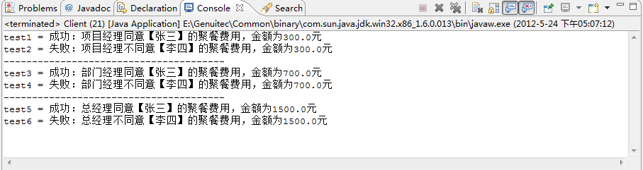
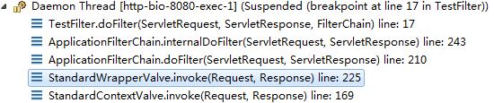

### 类型：行为型
```
责任链模式是一种对象的行为模式。
在责任链模式里，很多对象由每一个对象对其下家的的引用而连起来形成一条链。
请求在这条链上传递，直到链上的某一个对象决定处理这个请求。
发出这个请求的客户端并不知道链上的哪一个对象最终处理这个请求，
这使得系统可以在不影响客户端的情况下，
动态的重新组织和分配责任。
```

### 从击鼓传花谈起
击鼓传花是一种热闹而又紧张的饮酒游戏。在酒宴上宾客依次坐定位置，由一人击鼓，击鼓的地方与传花的地方是分开的，以示公正。开始击鼓时，花束就开始依次传递，鼓声一落，如果花束在某人手中，则该人就得饮酒。
比如说，贾母、贾赦、贾政、贾宝玉和贾环是五个参加击鼓传花游戏的传花者，他们组成一个环链。击鼓者将花传给贾母，开始传花游戏。花由贾母传给贾赦，由贾赦传给贾政，由贾政传给贾宝玉，又贾宝玉传给贾环，由贾环传回给贾母，如此往复，如下图所示。当鼓声停止时，手中有花的人就得执行酒令。


击鼓传花便是责任链模式的应用。
责任链可以是一条直线，一个环链或者一个树状结构的一部分。

### 责任链模式的结构
下面使用了一个责任链模式的最简单的实现。


责任链模式涉及到的角色如下所示：
抽象处理者(Handler)：
定义出一个处理请求的接口。
如果需要，接口可以定义出一个方法以设定和返回对下家的引用。
这个角色通常由一个JAVA抽象类或者JAVA接口实现。
上图中的Handler类的聚合关系给出了具体子类对下家的引用。
抽象方法handlerReuqest()规范了类处理请求的操作。

具体处理者(ConcreteHandler)：
具体处理者接到请求后，可以选择将请求处理掉，或者将请求传给下家。
由于具体处理者持有对下家的引用，因此，如果需要，
具体处理者可以方法下家。

### 源代码
抽象处理者：
```
public abstract class Handler {

    //持有后继的责任对象
    protected Handler successor;
    /** 示意处理请求的方法，虽然这个示意方法是没有传入参数的
     * 但实际是可以传入参数的，根据具体需求来选择是否传递参数
     * */
    public abstract void handlerRequest();

    public Handler getSuccessor() {
        return successor;
    }

    public void setSuccessor(Handler successor) {
        this.successor = successor;
    }
}
```
具体处理者：
```
public class ConcreteHandler extends Handler{

    /**
     * 处理方法，调用此方法处理请求
     */
    @Override
    public void handlerRequest() {
        /**
         * 判断是否有后继的责任对象
         * 如果有，就转发请求有给后继的责任对象
         * 如果没有，则处理请求
         * */
        if(getSuccessor() != null){
            System.out.println("放过请求");
            getSuccessor().handlerRequest();
        }else{
            System.out.println("处理请求");
        }
    }
}
```
客户端：
```
public class Client {

    public static void main(String[] args) {
        //组装责任链
        Handler h1 = new ConcreteHandler();
        Handler h2 = new ConcreteHandler();
        h1.setSuccessor(h2);
        //提交请求
        h1.handlerRequest();
    }

}
```

可以看出，客户端创建了两个处理者对象，
并指定第一个处理者对象的下家是第二个处理者对象，而第二个处理者对象没有下家。
然后客户端将请求传递给第一个处理者对象。

由于本实例的传递逻辑非常简单：
只要有下家，就传递给下家处理；
如果没有下家，就自行处理。
因此，第一个处理者对象接到请求后，会将请求传递给第二个处理者对象。
由于第二个处理者对象没有下家，于是自行处理请求。
活动时序图如下所示：


### 使用场景
来考虑这样一个功能:申请聚餐费用的管理。

　　很多公司都是这样的福利，就是项目组或者是部门可以向公司申请一些聚餐费用，用于组织项目组成员或者是部门成员进行聚餐活动。

　　申请聚餐费用的大致流程一般是：由申请人先填写申请单，然后交给领导审批，如果申请批准下来，领导会通知申请人审批通过，然后申请人去财务领取费用，如果没有批准下来，领导会通知申请人审批未通过，此事也就此作罢。

　　不同级别的领导，对于审批的额度是不一样的，比如，项目经理只能审批500元以内的申请；部门经理能审批1000元以内的申请；而总经理可以审核任意额度的申请。

　　也就是说，当某人提出聚餐费用申请的请求后，该请求会经由项目经理、部门经理、总经理之中的某一位领导来进行相应的处理，但是提出申请的人并不知道最终会由谁来处理他的请求，一般申请人是把自己的申请提交给项目经理，或许最后是由总经理来处理他的请求。

可以使用责任链模式来实现上述功能：当某人提出聚餐费用申请的请求后，该请求会在 项目经理—〉部门经理—〉总经理 这样一条领导处理链上进行传递，发出请求的人并不知道谁会来处理他的请求，每个领导会根据自己的职责范围，来判断是处理请求还是把请求交给更高级别的领导，只要有领导处理了，传递就结束了。

需要把每位领导的处理独立出来，实现成单独的职责处理对象，然后为它们提供一个公共的、抽象的父职责对象，这样就可以在客户端来动态地组合职责链，实现不同的功能要求了。


### 源码
抽象处理者角色类：
```
public abstract class Handler {
    /**
     * 持有下一个处理请求的对象
     */
    protected Handler successor = null;
    /**
     * 取值方法
     */
    public Handler getSuccessor() {
        return successor;
    }
    /**
     * 设置下一个处理请求的对象
     */
    public void setSuccessor(Handler successor) {
        this.successor = successor;
    }
    /**
     * 处理聚餐费用的申请
     * @param user    申请人
     * @param fee    申请的钱数
     * @return        成功或失败的具体通知
     */
    public abstract String handleFeeRequest(String user , double fee);
}
```
具体处理者角色：
```
public class ProjectManager extends Handler {

    @Override
    public String handleFeeRequest(String user, double fee) {
        
        String str = "";
        //项目经理权限比较小，只能在500以内
        if(fee < 500)
        {
            //为了测试，简单点，只同意张三的请求
            if("张三".equals(user))
            {
                str = "成功：项目经理同意【" + user + "】的聚餐费用，金额为" + fee + "元";    
            }else
            {
                //其他人一律不同意
                str = "失败：项目经理不同意【" + user + "】的聚餐费用，金额为" + fee + "元";
            }
        }else
        {
            //超过500，继续传递给级别更高的人处理
            if(getSuccessor() != null)
            {
                return getSuccessor().handleFeeRequest(user, fee);
            }
        }
        return str;
    }

}
```
```
public class DeptManager extends Handler {

    @Override
    public String handleFeeRequest(String user, double fee) {
        
        String str = "";
        //部门经理的权限只能在1000以内
        if(fee < 1000)
        {
            //为了测试，简单点，只同意张三的请求
            if("张三".equals(user))
            {
                str = "成功：部门经理同意【" + user + "】的聚餐费用，金额为" + fee + "元";    
            }else
            {
                //其他人一律不同意
                str = "失败：部门经理不同意【" + user + "】的聚餐费用，金额为" + fee + "元";
            }
        }else
        {
            //超过1000，继续传递给级别更高的人处理
            if(getSuccessor() != null)
            {
                return getSuccessor().handleFeeRequest(user, fee);
            }
        }
        return str;
    }

}
```
```
public class GeneralManager extends Handler {

    @Override
    public String handleFeeRequest(String user, double fee) {
        
        String str = "";
        //总经理的权限很大，只要请求到了这里，他都可以处理
        if(fee >= 1000)
        {
            //为了测试，简单点，只同意张三的请求
            if("张三".equals(user))
            {
                str = "成功：总经理同意【" + user + "】的聚餐费用，金额为" + fee + "元";    
            }else
            {
                //其他人一律不同意
                str = "失败：总经理不同意【" + user + "】的聚餐费用，金额为" + fee + "元";
            }
        }else
        {
            //如果还有后继的处理对象，继续传递
            if(getSuccessor() != null)
            {
                return getSuccessor().handleFeeRequest(user, fee);
            }
        }
        return str;
    }

}
```
```
public class Client {

    public static void main(String[] args) {
        //先要组装责任链
        Handler h1 = new GeneralManager();
        Handler h2 = new DeptManager();
        Handler h3 = new ProjectManager();
        h3.setSuccessor(h2);
        h2.setSuccessor(h1);
        
        //开始测试
        String test1 = h3.handleFeeRequest("张三", 300);
        System.out.println("test1 = " + test1);
        String test2 = h3.handleFeeRequest("李四", 300);
        System.out.println("test2 = " + test2);
        System.out.println("---------------------------------------");
        
        String test3 = h3.handleFeeRequest("张三", 700);
        System.out.println("test3 = " + test3);
        String test4 = h3.handleFeeRequest("李四", 700);
        System.out.println("test4 = " + test4);
        System.out.println("---------------------------------------");
        
        String test5 = h3.handleFeeRequest("张三", 1500);
        System.out.println("test5 = " + test5);
        String test6 = h3.handleFeeRequest("李四", 1500);
        System.out.println("test6 = " + test6);
    }

}
```


### 纯与不纯的责任链模式
一个纯的责任链模式要求一个具体的处理者对象只能在两个行为中选择一个：
一是承担责任，二是把责任推给下家。
不允许出现某一个具体的处理者对象在承担了一部分责任后，
又把责任向下传递的情况。

在一个纯的责任链模式里面，一个请求必须被某一个处理者对象所接收；
在一个不纯的责任链模式里面，一个请求最终可以不被任何接收端对象所接收。

纯的责任链模式的实际例子很难找到，一般看到的例子均是不纯的责任链模式的实现。
有些人认为不纯的责任链根本不是责任链模式，这也许是有道理的。但是在实际的系统里，纯的责任链很难找到。如果坚持责任链不纯便不是责任链模式，那么责任链模式便不会有太大意义了。

### 责任链模式在Tomcat中的应用
众所周知Tomcat中的Filter就是使用了责任链模式，创建一个Filter除了要在web.xml文件中做相应配置外，还需要实现javax.servlet.Filter接口。
```
public class TestFilter implements Filter{

    public void doFilter(ServletRequest request, ServletResponse response,
            FilterChain chain) throws IOException, ServletException {
        
        chain.doFilter(request, response);
    }

    public void destroy() {
    }

    public void init(FilterConfig filterConfig) throws ServletException {
    }

}
```


其实在真正执行到TestFilter类之前，会经过很多Tomcat内部的类。
顺带提一下其实Tomcat的容器设置也是责任链模式，注意被红色方框所圈中的类，从Engine到Host再到Context一直到Wrapper都是通过一个链传递请求。被绿色方框所圈中的地方有一个名为ApplicationFilterChain的类，ApplicationFilterChain类所扮演的就是抽象处理者角色，而具体处理者角色由各个Filter扮演。

第一个疑问是ApplicationFilterChain将所有的Filter存放在哪里？
答案是保存在ApplicationFilterChain类中的一个ApplicationFilterConfig对象的数组中。
```
/**
     * Filters.
     */
    private ApplicationFilterConfig[] filters = 
        new ApplicationFilterConfig[0];
```
那ApplicationFilterConfig对象又是什么呢？
ApplicationFilterConfig是一个Filter容器。以下是ApplicationFilterConfig类的声明：
```
/**
 * Implementation of a <code>javax.servlet.FilterConfig</code> useful in
 * managing the filter instances instantiated when a web application
 * is first started.
 *
 * @author Craig R. McClanahan
 * @version $Id: ApplicationFilterConfig.java 1201569 2011-11-14 01:36:07Z kkolinko $
 */
```
当一个web应用首次启动时ApplicationFilterConfig会自动实例化，它会从该web应用的web.xml文件中读取配置的Filter的信息，然后装进该容器。
刚刚看到在ApplicationFilterChain类中所创建的ApplicationFilterConfig数组长度为零，那它是在什么时候被重新赋值的呢？
` private ApplicationFilterConfig[] filters = new ApplicationFilterConfig[0];`
是在调用ApplicationFilterChain类的addFilter()方法时。
```
/**
     * The int which gives the current number of filters in the chain.
     */
    private int n = 0;
```
`public static final int INCREMENT = 10;`
```
void addFilter(ApplicationFilterConfig filterConfig) {

        // Prevent the same filter being added multiple times
        for(ApplicationFilterConfig filter:filters)
            if(filter==filterConfig)
                return;

        if (n == filters.length) {
            ApplicationFilterConfig[] newFilters =
                new ApplicationFilterConfig[n + INCREMENT];
            System.arraycopy(filters, 0, newFilters, 0, n);
            filters = newFilters;
        }
        filters[n++] = filterConfig;

    }
```
变量n用来记录当前过滤器链里面拥有的过滤器数目，默认情况下n等于0，ApplicationFilterConfig对象数组的长度也等于0，所以当第一次调用addFilter()方法时，if (n == filters.length)的条件成立，ApplicationFilterConfig数组长度被改变。之后filters[n++] = filterConfig;将变量filterConfig放入ApplicationFilterConfig数组中并将当前过滤器链里面拥有的过滤器数目+1。

**那ApplicationFilterChain的addFilter()方法又是在什么地方被调用的呢？**
是在ApplicationFilterFactory类的createFilterChain()方法中。
```
public ApplicationFilterChain createFilterChain
        (ServletRequest request, Wrapper wrapper, Servlet servlet) {

        // get the dispatcher type
        DispatcherType dispatcher = null; 
        if (request.getAttribute(DISPATCHER_TYPE_ATTR) != null) {
            dispatcher = (DispatcherType) request.getAttribute(DISPATCHER_TYPE_ATTR);
        }
        String requestPath = null;
        Object attribute = request.getAttribute(DISPATCHER_REQUEST_PATH_ATTR);
        
        if (attribute != null){
            requestPath = attribute.toString();
        }
        
        // If there is no servlet to execute, return null
        if (servlet == null)
            return (null);

        boolean comet = false;
        
        // Create and initialize a filter chain object
        ApplicationFilterChain filterChain = null;
        if (request instanceof Request) {
            Request req = (Request) request;
            comet = req.isComet();
            if (Globals.IS_SECURITY_ENABLED) {
                // Security: Do not recycle
                filterChain = new ApplicationFilterChain();
                if (comet) {
                    req.setFilterChain(filterChain);
                }
            } else {
                filterChain = (ApplicationFilterChain) req.getFilterChain();
                if (filterChain == null) {
                    filterChain = new ApplicationFilterChain();
                    req.setFilterChain(filterChain);
                }
            }
        } else {
            // Request dispatcher in use
            filterChain = new ApplicationFilterChain();
        }

        filterChain.setServlet(servlet);

        filterChain.setSupport
            (((StandardWrapper)wrapper).getInstanceSupport());

        // Acquire the filter mappings for this Context
        StandardContext context = (StandardContext) wrapper.getParent();
        FilterMap filterMaps[] = context.findFilterMaps();

        // If there are no filter mappings, we are done
        if ((filterMaps == null) || (filterMaps.length == 0))
            return (filterChain);

        // Acquire the information we will need to match filter mappings
        String servletName = wrapper.getName();

        // Add the relevant path-mapped filters to this filter chain
        for (int i = 0; i < filterMaps.length; i++) {
            if (!matchDispatcher(filterMaps[i] ,dispatcher)) {
                continue;
            }
            if (!matchFiltersURL(filterMaps[i], requestPath))
                continue;
            ApplicationFilterConfig filterConfig = (ApplicationFilterConfig)
                context.findFilterConfig(filterMaps[i].getFilterName());
            if (filterConfig == null) {
                // FIXME - log configuration problem
                continue;
            }
            boolean isCometFilter = false;
            if (comet) {
                try {
                    isCometFilter = filterConfig.getFilter() instanceof CometFilter;
                } catch (Exception e) {
                    // Note: The try catch is there because getFilter has a lot of 
                    // declared exceptions. However, the filter is allocated much
                    // earlier
                    Throwable t = ExceptionUtils.unwrapInvocationTargetException(e);
                    ExceptionUtils.handleThrowable(t);
                }
                if (isCometFilter) {
                    filterChain.addFilter(filterConfig);
                }
            } else {
                filterChain.addFilter(filterConfig);
            }
        }

        // Add filters that match on servlet name second
        for (int i = 0; i < filterMaps.length; i++) {
            if (!matchDispatcher(filterMaps[i] ,dispatcher)) {
                continue;
            }
            if (!matchFiltersServlet(filterMaps[i], servletName))
                continue;
            ApplicationFilterConfig filterConfig = (ApplicationFilterConfig)
                context.findFilterConfig(filterMaps[i].getFilterName());
            if (filterConfig == null) {
                // FIXME - log configuration problem
                continue;
            }
            boolean isCometFilter = false;
            if (comet) {
                try {
                    isCometFilter = filterConfig.getFilter() instanceof CometFilter;
                } catch (Exception e) {
                    // Note: The try catch is there because getFilter has a lot of 
                    // declared exceptions. However, the filter is allocated much
                    // earlier
                }
                if (isCometFilter) {
                    filterChain.addFilter(filterConfig);
                }
            } else {
                filterChain.addFilter(filterConfig);
            }
        }

        // Return the completed filter chain
        return (filterChain);

    }
```
可以将如上代码分为两段，51行之前为第一段，51行之后为第二段。
第一段的主要目的是创建ApplicationFilterChain对象以及一些参数设置。
第二段的主要目的是从上下文中获取所有Filter信息，之后使用for循环遍历并调用filterChain.addFilter(filterConfig);将filterConfig放入ApplicationFilterChain对象的ApplicationFilterConfig数组中。

**那ApplicationFilterFactory类的createFilterChain()方法又是在什么地方被调用的呢？**
是在StandardWrapperValue类的invoke()方法中被调用的。


由于invoke()方法较长，所以将很多地方省略。
```
public final void invoke(Request request, Response response)
        throws IOException, ServletException {
   ...省略中间代码
　　　　 // Create the filter chain for this request
        ApplicationFilterFactory factory =
            ApplicationFilterFactory.getInstance();
        ApplicationFilterChain filterChain =
            factory.createFilterChain(request, wrapper, servlet);
　　...省略中间代码
         filterChain.doFilter(request.getRequest(), response.getResponse());
　　...省略中间代码
    }
```
**那正常的流程应该是这样的：**
在StandardWrapperValue类的invoke()方法中调用ApplicationFilterChai类的createFilterChain()方法
-->
在ApplicationFilterChai类的createFilterChain()方法中调用ApplicationFilterChain类的addFilter()方法
-->
在ApplicationFilterChain类的addFilter()方法中给ApplicationFilterConfig数组赋值。


根据上面的代码可以看出StandardWrapperValue类的invoke()方法在执行完createFilterChain()方法后，会继续执行ApplicationFilterChain类的doFilter()方法，然后在doFilter()方法中会调用internalDoFilter()方法。

以下是internalDoFilter()方法的部分代码
```
// Call the next filter if there is one
        if (pos < n) {
　　　　　　　//拿到下一个Filter，将指针向下移动一位
            //pos它来标识当前ApplicationFilterChain（当前过滤器链）执行到哪个过滤器
            ApplicationFilterConfig filterConfig = filters[pos++];
            Filter filter = null;
            try {
　　　　　　　　　 //获取当前指向的Filter的实例
                filter = filterConfig.getFilter();
                support.fireInstanceEvent(InstanceEvent.BEFORE_FILTER_EVENT,
                                          filter, request, response);
                
                if (request.isAsyncSupported() && "false".equalsIgnoreCase(
                        filterConfig.getFilterDef().getAsyncSupported())) {
                    request.setAttribute(Globals.ASYNC_SUPPORTED_ATTR,
                            Boolean.FALSE);
                }
                if( Globals.IS_SECURITY_ENABLED ) {
                    final ServletRequest req = request;
                    final ServletResponse res = response;
                    Principal principal = 
                        ((HttpServletRequest) req).getUserPrincipal();

                    Object[] args = new Object[]{req, res, this};
                    SecurityUtil.doAsPrivilege
                        ("doFilter", filter, classType, args, principal);
                    
                } else {
　　　　　　　　　　　　//调用Filter的doFilter()方法  
                    filter.doFilter(request, response, this);
                }
```

这里的filter.doFilter(request, response, this);就是调用我们前面创建的TestFilter中的doFilter()方法。
而TestFilter中的doFilter()方法会继续调用chain.doFilter(request, response);方法，而这个chain其实就是ApplicationFilterChain,所以调用过程又回到了上面调用dofilter和调用internalDoFilter方法，这样执行直到里面的过滤器全部执行。

如果定义两个过滤器，则Debug结果如下：


end---
